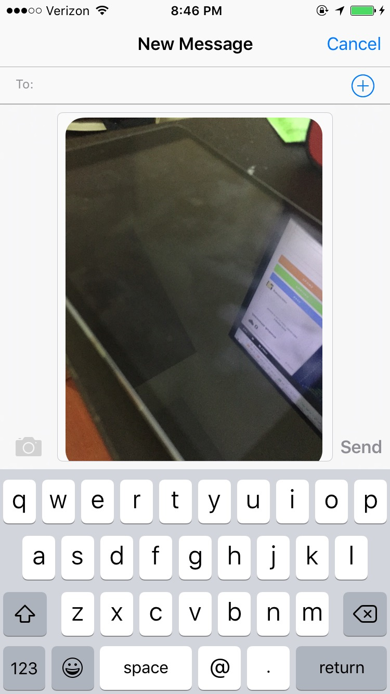
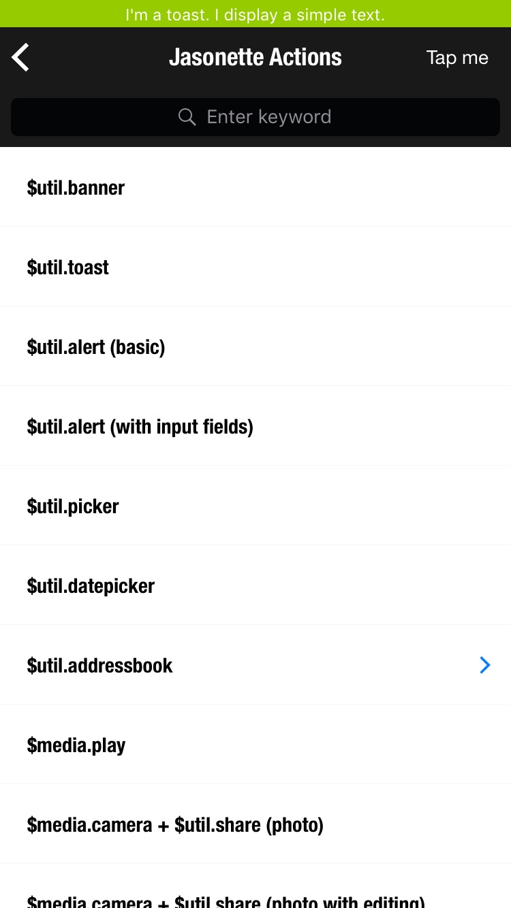
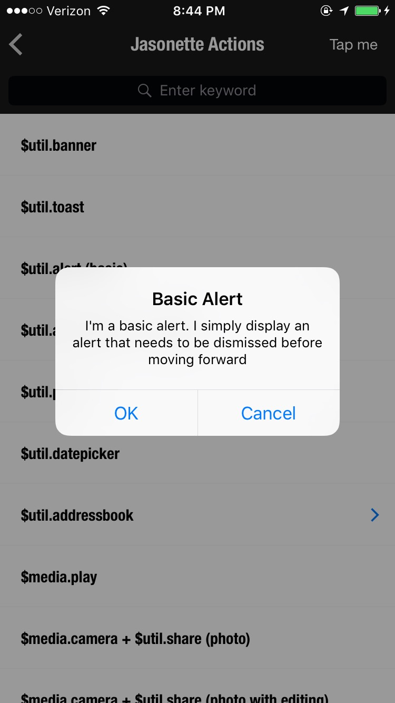
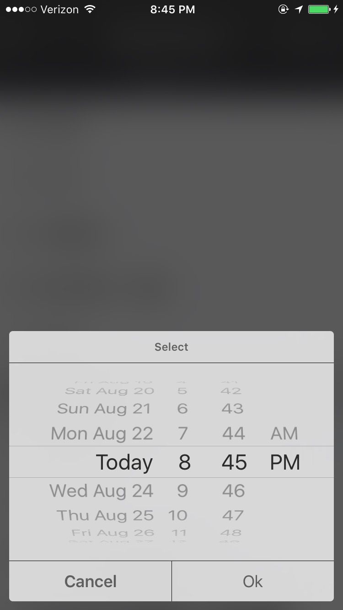
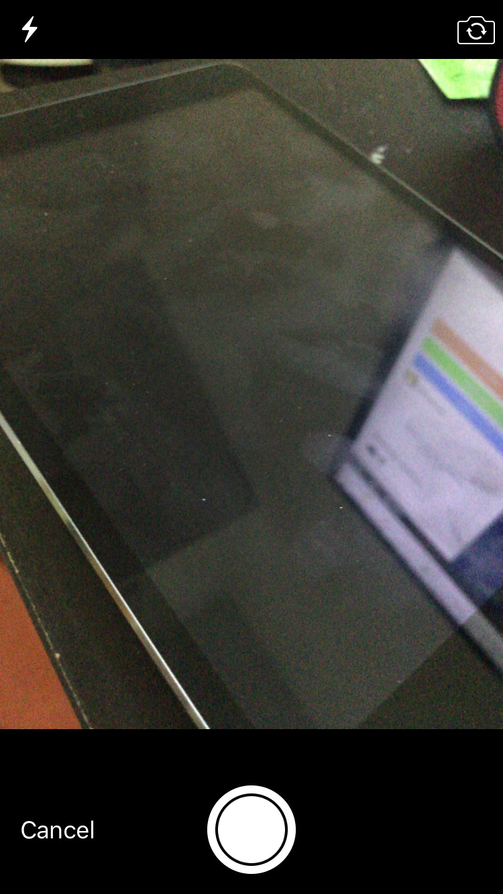
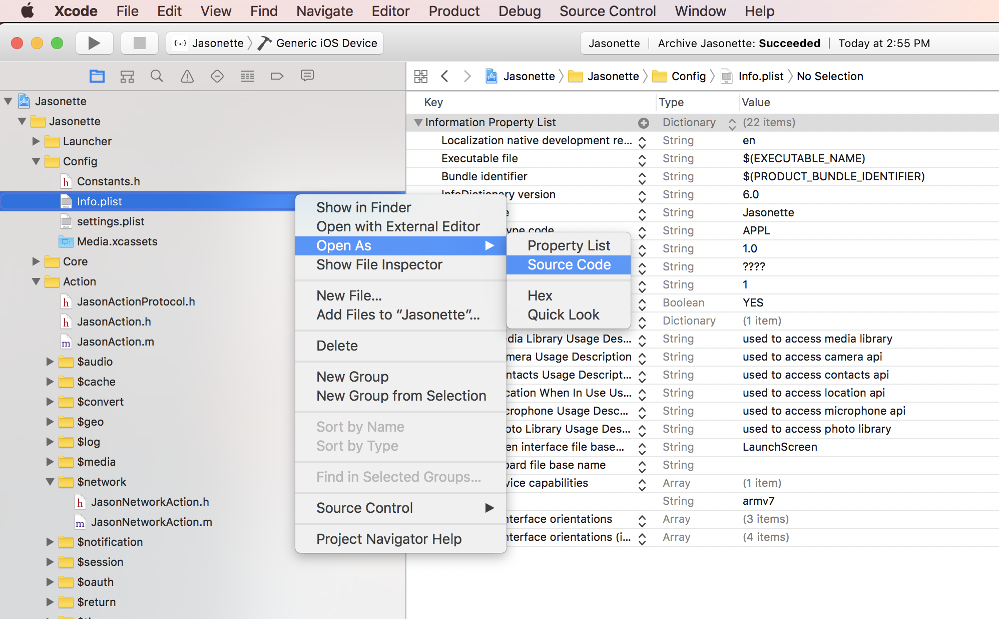
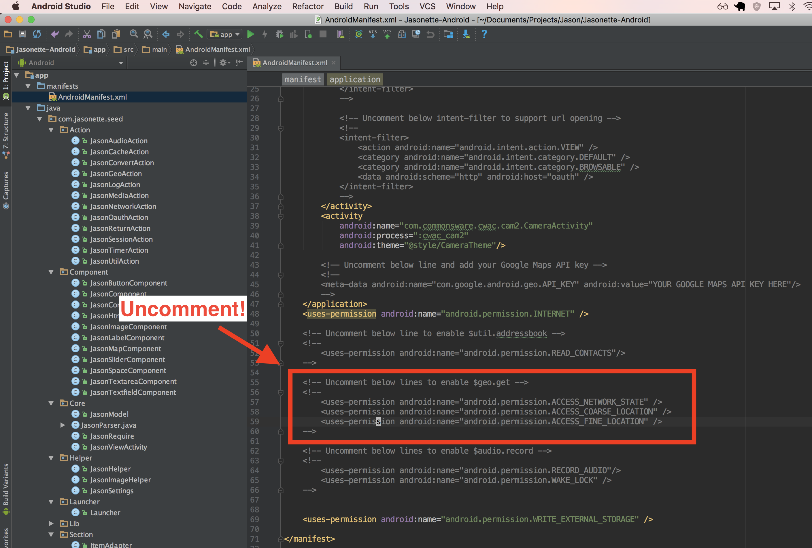

# Basics

[Expressing a view using JSON](document.md) is pretty straightforward.

However what makes Jasonette truly powerful is the ability to express **functions** that actually do something, entirely in JSON. We call it `action`.

This could be anything from accessing the device features such as camera or addressbook, to making network requests. And you can compose them to carry out any sophisticated tasks. Not to mention being able to use inline Javascript within any JSON expression.

<br>

##Syntax
Actions can take the following 5 attributes

  - `type`: Specify [action type](#api). (note: THIS CANNOT BE A [TEMPLATE EXPRESSION](templates.md) that needs to be evaluated. Use a static string.)
  - `options`: Arguments to be passed into the action (optional)
  - `success`: Another action to be called when the current action finishes. You can chain multiple actions to execute in sequence this way. (optional)
  - `error`: You can handle exceptions by attaching `error` to an action. (optional)

There are two ways of calling actions: 

1. You can directly attach actions to UI elements **inline**. In this case, the action will be executed when a user taps the element.
2. You can define an action under **actions registry** and trigger it by name. In this case you not only can attach actions to UI elements but also can trigger them based on system events or call them from anywhere.

First read through the explanation below to learn how to define actions inline.

And after that, [learn how to use `"trigger"` to trigger an action by name](#triggering-actions).

<br>

##Examples - Define Inline

### Network request and then render

Make a network request and `$render` its content when it succeeds.

    {
      "type": "label",
      "text": "refresh",
      "action": {
        "type": "$network.request",
        "options": {
          "url": "https://jasonbase.com/things/jYJ.json"
        },
        "success": {
          "type": "$render"
        }
      }
    }

### Network request and then render, with error handling

Same as above, except display a banner when the request fails.

    {
      "type": "label",
      "text": "refresh",
      "action": {
        "type": "$network.request",
        "options": {
          "url": "https://jasonbase.com/things/jYJ.json"
        },
        "success": {
          "type": "$render"
        },
        "error": {
          "type": "$util.banner",
          "options": {
            "title": "Error",
            "description": "Something went wrong."
          }
        }
      }
    }


## Return values

You can access an action's return value by using the variable `$jason` from the next action (either the `success` or the `error` action).

For example, `$geo.get` action returns the geolocation of the current device in the following format:
	
    {
      "coord": "51.5032510,-0.1278950"
    }
	
Which means we can use this return value by accessing the `$jason` variable, using a [template](templates.md) like this:
	
    {
      "type": "$geo.get",
      "success": {
        "type": "$util.banner",
        "options": {
          "title": "Your current coordinate",
          "description": "{{$jason.coord}}"
        }
      }
    }

<br>


## What kind of UI elements can have action handlers?

`action` can be attached to various UI elements to respond to touch, but not all.

<br>

## CAN be attached to: 

1. menu - `$jason.body.header.menu`
2. footer tabs - `$jason.body.footer.tabs`
3. footer input - `$jason.body.footer.input.left` and `$jason.body.footer.input.right`
4. Top level of a section item - Example: `$body.sections[0].items[0]`
5. Layer item - Example - `$body.layers[0].items[0]`
6. Button component - Normally you need to attach actions at at the item level as described above. But if you want to attach an action at a component level, you can use ["type": "button](http://docs.jasonette.com/components/#button). 

<br>

## CANNOT be attached to:

CANNOT attach actions to a label or image component unless it's at `item` level. Here's an example that DOESN'T work::


```
{
  "items": [{
    "type": "vertical",
    "components": [{
      "type": "label",
      "text": "touch me",
      "action": { ... } 
    }]
  }]
}
```

`label` and any other **non-button** type components do not respond to touch events directly.

This is why above code won't respond to touch, since it's attaching the action to the label.

However the following code WILL respond to touch:

```
{
  "items": [{
    "type": "label",
    "text": "touch me",
    "action": { ... } 
  }]
}
```

This is because the `label` is at `item` level. Jasonette automatically wraps components with a layout when they're at `item` level.

Which means, internally above code is the same as:

```
{
  "items": [{
    "type": "vertical",
    "action": { ... },
    "components": [{
      "type": "label",
      "text": "touch me",
    }]
  }]
}
```

Notice how the action is tied to the `vertical` layout, which is at `item` level. So this will respond to touch.

---

**So what if you really want to attach an action to a component, but the component is NOT at item level?**

=> Use [buttons](/components#button), like this:

```
{
  "items": [{
    "type": "vertical",
    "components": [{
      "type": "button",
      "url": "https://.....",
      "action": { ... } 
    }]
  }]
}
```


## Where to use actions?

Actions are not just for UI components. It can be triggered in various ways, and used for various situations:

- Handling user interaction
- Handling another action's result
- Handling system events

Let's go through each:

###A. Handling user interaction

#### ■ User touches an item
Attach `action` attribute to `items`, `menu`, `layers`, etc. to react to touch. (Read API documentation to see if a component supports `action` attribute)

In the example below, an `action` is attached to a `menu`, so it gets triggered when user touches it.

<pre><span style='color:silver;'>{
  "head": {
    ...
  },
  "body": {
    "header": {
      "menu": {
        "text": "Press me",
        <span style='color:black;'>"action": {
          "type": "$util.alert",
          "options": {
            "title": "Good job!",
            "description": "You know how to press a button!"
          }
        }</span>
      }
    },
    ...
  }
}</span></pre>

#### ■ User changes a form input value
There are some form input components such as [slider](components.md#slider), [search](document.md#search), etc. which trigger an action whenever its value changes. Just attach `action` attribute to handle that event.
In the example below, an `action` is attached to a `slider`, so we can display a banner with the current value whenever user changes the value.

<pre><span style='color:silver;'>{
  ...
  {
    "type": "slider",
    "name": "gauge",
    <span style='color:black;'>"action": {
      "type": "$util.banner",
      "options": {
        "title": "Current value",
        "description": "{{$get.gauge}}"
      }
    }</span>
  }
  ...
}</span></pre>

###B. Handling another action's result

All actions can have a `success` and an `error` attribute.

  - `success` points to an action to be triggered after the current action finishes.
  - `error` points to an action to be triggered if something goes wrong with the current action.

By using `success`, we can chain multiple actions.

In the example below, a `$network.request` action gets called when a user touches the label, renders the result when it succeeds (`success`), and displays an error message when something goes wrong (`error`).
	
<pre><span style='color:silver;'>{
  ...
  {
    "type": "label",
    "text": "Touch me",
    "action": {
      <span style='color:blue;'>"type": "$network.request",
      "options": {
        "url": "https://www.jasonclient.org/items.json"
      },</span>
      <span style='color:#ff0000;'>"success": {
        <span style='color:blue;'>"type": "$render"</span>
      },
      "error": {
        <span style='color:blue;'>"type": "$util.banner",
        "options": {
          "title": "Error",
          "description": "Uh oh, something went wrong."
        }</span>
      }</span>
    }
  }
  ...
}</span></pre>
	
###C. Handling system events

[System events](#system-events) are events automatically triggered by the system, instead of through user input.

You can attach any `action` to system events, such as `$load`, `$show`, `$foreground`, etc.

Here's a brief example:

    {
      "$jason": {
        "head": {
          "actions": {
            "$load": {
              "type": "$network.request",
              "options": {
                "url": "https://jasonbase.com/things/jYJ.json"
              },
              "success": {
                "type": "$render"
              }
            },
            "$show": {
              "type": "$reload"
            },
            "$foreground": {
              "type": "$reload"
            }
          }
        },
        ...
      }
    }

**[Learn more about system events](#system-events)**

---

# Triggering actions

When you define an action inline, these actions have no name. Therefore you cannot reuse them form elsewhere.

To be able to reuse actions, you need to register them under actions registry, and then trigger them by name.

## Syntax

To trigger an action, you can use the following syntax:

- `"trigger"`: Trigger an action by name, registered under the actions registry. (note: THIS CANNOT BE A [TEMPLATE EXPRESSION](templates.md) that needs to be evaluated. You must use a static string)
- `"options"` (optional): [same as inline actions](#examples-define-inline)
- `"success"` (optional): executed when the triggered action returnes via `$return.success` action
- `"error"` (optional): executed when the triggered action returns via `$return.error` action

They look similar to inline action definition except that you use `trigger` instead of `type`.
<br>

### 1. Define an action under the actions registry

First, you need to define the action inside `head.actions`. In this case we name it `refresh_view`:

    {
      "$jason": {
        "head": {
          "actions": {
            "refresh_view": {
              "type": "$network.request",
              "options": {
                "url": "https://jasonbase.com/things/jYJ.json"
              },
              "success": {
                "type": "$render"
              }
            }
          },
      ...
    }

### 2. Trigger it by name

Second, to actually trigger it by name, just attach an action with a `trigger` attribute, like this:

    {
      "type": "label",
      "text": "Refresh",
      "action": {
        "trigger": "refresh_view"
      }
    }

Cool thing about this is, now you can trigger this action from anywhere in your code. You can trigger it manually from another action, or you could make it so that a system event automatically triggers the action.

Here's an example where `refresh_view` is triggered whenever the view comes into focus (`$show`) or comes back from background (`$foreground`):

    {
      "$jason": {
        "head": {
          "actions": {
            "$show": {
              "trigger": "refresh_view"
            },
            "$foreground": {
              "trigger": "refresh_view"
            },
            "refresh_view": {
              "type": "$network.request",
              "options": {
                "url": "https://jasonbase.com/things/jYJ.json"
              },
              "success": {
                "type": "$render"
              }
            }
          },
      ...
    }

Here's an example where an action triggers another action (`refresh` sets the cache, and then triggers `fetch`):


    {
      "$jason": {
        "head": {
          "actions": {
            "refresh": {
              "type": "$cache.set",
              "options": {
                "items": []
              },
              "success": {
                "trigger": "fetch"
              }
            },
            "fetch": {
              "type": "$network.request",
              "options": {
                "url": "https://jasonbase.com/things/jYJ.json"
              },
              "success": {
                "type": "$render"
              }
          },
      ...
    }

<br>

### 3. Return from subroutine when finished

We saw from above that actions can trigger other actions.

But so far these action call chain examples have been one-way trip only, which means once an action triggers another action its life is over.

You can't do things like making a call and waiting for it to return with its result, and then continue on where it left off, using that value.

Let's look at the `refresh` example from above:

    {
      "$jason": {
        "head": {
          "actions": {
            "refresh": {
              "type": "$cache.set",
              "options": {
                "items": []
              },
              "success": {
                "trigger": "fetch"
              }
            },
            "fetch": {
              "type": "$network.request",
              "options": {
                "url": "https://jasonbase.com/things/jYJ.json"
              },
              "success": {
                "type": "$render"
              }
            }
            ...
          }
      ...
    }

The problem with this is each action does more than one thing:

1. `refresh` resets the cache AND triggers fetch
2. `fetch` makes a network request AND renders the result.

Maybe we want to add another action that resets the cache before doing something. Then, we need to add the same `$cache.set` action again.

Maybe we want to make the network request but do something else with the result instead of rendering.

It becomes difficult to reuse these actions since one action does more than one thing.

To solve this problem, we can break these actions out into self-contained modules so that:

1. One action only does one thing.
2. Each action ends by **returning its result instead of triggering another action** using `$return.success` or `$return.error` actions.

Here's the solution:

    {
      "$jason": {
        "head": {
          "actions": {
            "reset": {
              "type": "$cache.set",
              "options": {
                "items": []
              },
              "success": {
                "type": "$return.success"
              }
            },
            "refresh": {
              "trigger": "reset",
              "success": {
                "trigger": "fetch",
                "success": {
                  "type": "$render"
                }
              }
            },
            "fetch": {
              "type": "$network.request",
              "options": {
                "url": "https://jasonbase.com/things/jYJ.json"
              },
              "success": {
                "type": "$return.success"
              }
            }
            ...
          }
      ...
    }

Here, the `reset` action only resets the cache.

And `fetch` action only makes a network request and returns its result. (No $render)

Lastly the `refresh` action functions as the main program that triggers each action one after another (triggers `reset`, then triggers `fetch`, and finally executes `$render`)


## When to use trigger vs. defining actions inline

In **most cases** it's recommended that you define your actions under [actions registry](#action-registry) and trigger them using `"trigger"`.

For example, instead of:

    {
      "$jason": {
        "head": {
        },
        "body": {
          "sections": [{
            "items": [{
              "type": "label",
              "text": "item 1",
              "action": {
                "type": "$util.banner",
                "options": {
                  "title": "Banner",
                  "description": "Pressed item"
                }
              }
            }, {
              "type": "label",
              "text": "item 2",
              "action": {
                "type": "$util.banner",
                "options": {
                  "title": "Banner",
                  "description": "Pressed item"
                }
              }
            }, {
              "type": "label",
              "text": "item 3",
              "action": {
                "type": "$util.banner",
                "options": {
                  "title": "Banner",
                  "description": "Pressed item"
                }
              }
            }]
          }]
        }
      }
    }

You may want to define the action inside `head.actions`, like this:

    {
      "$jason": {
        "head": {
          "actions": {
            "show_banner": {
              "type": "$util.banner",
              "options": {
                "title": "Banner",
                "description": "Pressed item"
              }
            }
          }
        },
        "body": {
          "sections": [{
            "items": [{
              "type": "label",
              "text": "item 1",
              "action": {
                "trigger": "show_banner"
              }
            }, {
              "type": "label",
              "text": "item 2",
              "action": {
                "trigger": "show_banner"
              }
            }, {
              "type": "label",
              "text": "item 3",
              "action": {
                "trigger": "show_banner"
              }
            }]
          }]
        }
      }
    }

###Benefit 1
As you can see above, using `trigger` lets you define a single action once and reuse it from multiple places in your view. It removes redundant code.

<br>

###Benefit 2
When you define an action inline, its behavior is fixed. For example, the `show_banner` action example above only does one thing: It displays a banner that says "Pressed item".

However in many cases we want to write one action and reuse them for various purposes. Maybe we want to display a banner that says "Pressed item 1", or "Pressed item 2".

    {
      "$jason": {
        "head": {
          "actions": {
            "show_banner": {
              "type": "$util.banner",
              "options": {
                "title": "Banner",
                "description": "Pressed item {{$jason.item}}"
              }
            }
          }
        },
        "body": {
          "sections": [{
            "items": [{
              "type": "label",
              "text": "item 1",
              "action": {
                "trigger": "show_banner",
                "options": {
                  "item": "1"
                }
              }
            }]
          }]
        }
      }
    }

<br>

---

# Declaring actions

There are two ways you can call actions:

**[1. Inline action](#inline-action)**

Attach `action` attributes directly to UI elements

**[2. Action registry](#action-registry)**

Define actions inside `$jason.head.actions` and call them by name

---

##Inline Action
Inline actions are basically what we've been talking about so far. You directly attach an `action` to events, UI components, and another action. Here's an example:

    {
      ...
      "type": "label",
      "action": {
        "type": "$util.banner",
        "options": {
          "title": "Hello",
          "description": "World"
        }
      }
      ...
    }

---

##Action Registry
We can define an action once and refer to them whenever we need to, instead of writing one for every situation.

### ■   Comparison with inline actions

For example, here's an `inline action` example. We display multiple `items`, and each item has the same `action` attribute content.

<pre><span style='color:silver;'>{
  "$jason": {
    "head": {
      ...
    },
    "body": {
      "sections": [{
        "items": [{
          "type": "label",
          "text": "This is row 1",
          <span style='color:black'>"action": {
            "type": "$network.request",
            "options": {
              "url": "https://jasonclient.org/submit",
              "method": "POST"
            },
            "success": {
              "type": "$render"
            }
          }</span>
        }, {
          "type": "label",
          "text": "This is row 2",
          <span style='color:black'>"action": {
            "type": "$network.request",
            "options": {
              "url": "https://jasonclient.org/submit",
              "method": "POST"
            },
            "success": {
              "type": "$render"
            }
          }</span>
        }, {
          "type": "label",
          "text": "This is row 3",
          <span style='color:black'>"action": {
            "type": "$network.request",
            "options": {
              "url": "https://jasonclient.org/submit",
              "method": "POST"
            },
            "success": {
              "type": "$render"
            }
          }</span>
        }]
      }]
    }
  }
}</span></pre>

Below we have the same example, but using `$jason.head.actions` instead of re-defining the same action every time inline:

<pre><span style='color:silver;'>{
  "$jason": {
    "head": {
      ...
      "actions": {
        <span style='color:black'>"submit_item": {
          "type": "$network.request",
          "options": {
            "url": "https://jasonclient.org/submit",
            "method": "POST"
          },
          "success": {
            "type": "$render"
          }
        }</span>
      }
    },
    "body": {
      "sections": [{
        "items": [{
          "type": "label",
          "text": "This is row 1",
          <span style='color:black'>"action": {
            "trigger": "submit_item"
          }</span>
        }, {
          "type": "label",
          "text": "This is row 2",
          <span style='color:black'>"action": {
            "trigger": "submit_item"
          }</span>
        }, {
          "type": "label",
          "text": "This is row 3",
          <span style='color:black'>"action": {
            "trigger": "submit_item"
          }</span>
        }]
      }]
    }
  }
}</span></pre> 

####Here's what's going on:

1. Declare an action under `$jason.head.actions` (in this case we've named it `submit_item`).
2. Then we `trigger` the action from anywhere using the name.

---

### ■   System events

Some actions are automatically triggered by the system when a certain event occurs. When you wish to take advantage of these, simply add them to `actions`. They are:

---

####1. $load
`$load` gets called once automatically when the view loads for the first time.

Here's an example where we make a network request when the view loads, and then render the response using the template.

    {
      ...
      "$load": {
        "type": "$network.request",
        "options": {
        "url": "http://jasonclient.org/req.json"
        },
        "success": {
        "type": "$render"
        }
      }
      ...
    }

---

####2. $show
`$show` gets called automatically whenever the view appears. For example when coming back from a modal view, coming back from its next view via back button, etc.

Here's an example

    {
      ...
      "$show": {
        "type": "$reload"
      },
      ...
    }

---

####3. $foreground
`$foreground` is called automatically whenever the app comes back from the background state.

    {
      ...
      "$foreground": {
        "type": "$reload"
      },
      ...
    }

---

####4. $pull
`$pull` gets called whenever user makes a pull to refresh action

    {
      ...
      "$pull": {
        "type": "$reload"
      },
      ...
    }

---

#API


##── REQUIRE ──
##$require
The `$require` action imports remote JSON files in parallel.

    {
      "type": "$require",
      "options": {
        "profiles": ["https://...", "https://...", "https://"],
        "items": ["https://...", "https://...", "https://..."]
      },
      "success": {
        "type": "$render"
      }
    }

It works similar to [$network.request](#$networkrequest) but with a few differences:

1. It can fetch multiple remote JSON files in parallel.
2. It is only for making simple `GET` requests. No POST/PUT/DELETE requests, etc.

<br>

### ■ options
The `options` object defines what the return value should look like. For example, the following `$require` action would fetch the contents of `https://hello.world/1.json` and then attach it to the `profile` attribute.

    {
      "type": "$require",
      "options": {
        "profile": "https://hello.world/1.json"
      }
    }

When you chain this action with another action, you should be able to access the contents of `https://hello.world/1.json` via `{{$jason.profile}}`.

The value in the key/value pair can take the form of:

1. a single url: `"profile": "https://..."`

2. an array of urls: `"profiles": ["https://...", "https://...", "https://..."]`


<br>

### ■ return value
returns the constructed `options` object.

For example, let's say `https://blahblah.blah/1.json` and `https://blahblah.blah/2.json` each contained the following JSON files respectively:

    {
      "items": ["abc", "def", "ghi"]
    }

    {
      "items": ["cba", "fed", "ihg"]
    }

We can fetch them in parallel like this:

    {
      "type": "$require",
      "options": {
        "items1": "https://blahblah.blah/1.json",
        "items2": "https://blahblah.blah/2.json"
      },
      "success": {
        "type": "$render"
      }
    }

As a result, when we are ready to `$render`, the `$jason` value will be:

    {
      "items1": {
        "items": ["abc", "def", "ghi"]
      },
      "items2": {
        "items": ["cba", "fed", "ihg"]
      }
    }

### ■ note
Unlike `$set` or `$cache.set`, the `$require` action on its own doesn't persist the data in any way.

So if you want to persist them to a local variable or a cache variable, you will need to chain the result to these actions and take care of assignment that way. Here's an example:

    {
      "type": "$require",
      "options": {
        "profiles": ["https://...", "https://...", "https://"]
      },
      "success": {
        "type": "$set",
        "options": {
          "profiles": "{{$jason.profiles}}"
        }
      }
    }
  


---


##── FUNCTIONAL ──
Just like functions in any other programming language, you can call an action from an action, wait for it to return, and use the return value to continue where it left off.

---

##$lambda
Call another action by name (This is how [trigger](#triggering-actions) is implemented internally)

    {
      "type": "$lambda",
      "options": {
        "name": "refresh",
        "options": {
          "url": "https://jasonbase.com/things/3nf.json"
        }
      },
      "success": {
        "type": "$render"
      },
      "error": {
        "type": "$util.banner",
        "options": {
          "title": "Error",
          "description": "Something went wrong"
        }
      }
    }

Above code is the same as:

    {
      "trigger": "refresh",
      "options": {
        "url": "https://jasonbase.com/things/3nf.json"
      },
      "success": {
        "type": "$render"
      },
      "error": {
        "type": "$util.banner",
        "options": {
          "title": "Error",
          "description": "Something went wrong"
        }
      }
    }

In most cases you may want to use [trigger](#triggering-actions) but sometimes it's useful to use **$lambda** directly, for example if you want to dynamically trigger different actions. Example:

    {
      "type": "$lambda",
      "options": {
        "name": "{{action_name}}",
        "options": {
          "url": "https://jasonbase.com/things/3nf.json"
        }
      },
      ...
    }

<br>

### ■ options
- name: the name of the action to trigger, registered [under actions registry](#triggering-actions)
- options: [options object](#syntax) to pass to the next action

<br>

### ■ return value
- Whatever the triggered action returns via [$return.success](#returnsuccess) or [$return.error](#returnerror)

---

##$return.success

Unless you explicitly call `$return.success` or `$return.error`, all triggered actions terminate when they reach the end of the call chain.

To return to the action which called the current action with a `success` state, we need to use `$return.success`.

Then the caller action will resume where it left off and keep executing its `success` action.

<br>

### ■ options
- The return value to pass back to the caller action.  If not specified, it automatically returns the current `$jason` value

<br>

### ■ no `success` or `error` of its own
- `none` : Since `$return.success` is an action solely designed for returning the control back to the caller action, `$return.success` itself does not have `success` or `error` actions.

<br>

### ■ example
In the example below, the `display_banner` triggers `fetch`, and then displays a banner using the return value `$jason`.

Notice how the `$lambda` action's `success` takes over after the `fetch` action returns via `$return.success`.

    {
      "display_banner": {
        "type": "$lambda",
        "options": {
          "name": "fetch"
        },
        "success": {
          "type": "$util.banner",
          "options": {
            "title": "The number of items:",
            "description": "{{$jason.items.length}}"
          }
        }
      },
      "fetch": {
        "type": "$network.request",
        "options": {
          "url": "https://jasonbase.com/things/3nf.json"
        },
        "success": {
          "type": "$return.success",
          "options": {
            "items": "{{$jason}}"
          }
        }
      }
    }

Again, this is the same as using `trigger`:

    {
      "display_banner": {
        "trigger": "return_homer_simpson",
        "success": {
          "type": "$util.banner",
          "options": {
            "title": "The number of items:",
            "description": "{{$jason.items.length}}"
          }
        }
      },
      "fetch": {
        "type": "$network.request",
        "options": {
          "url": "https://jasonbase.com/things/3nf.json"
        },
        "success": {
          "type": "$return.success",
          "options": {
            "items": "{{$jason}}"
          }
        }
      }
    }

<br>

---

##$return.error

Pretty much the same as [$return.success](#returnsuccess), except that it returns the control back to the caller action's `error` action.

---


##──── VIEW ────
Actions related to drawing views

---

##$reload

Refreshes the view completely by re-fetching content from the current URL.

    {
      "items": [{
        "type": "label",
        "text": "Refresh",
        "action": {
          "type": "$reload"
        }
      }]
    }

### ■ options
- none

### ■ return value
- none

This will reload the page when a user taps on the [item](document.md#items).

---

##$render

Renders a [template](templates.md) with data

### ■ options
- `data`: Data to render. If not specified, it's the `$jason` value at the point `$render` was called.
- `template`: [Template](templates.md) name to render. If not specified, it will look for `$jason.head.templates.body`
- `type`: `"html"` | `"json"` (Default is `json`. See [html templating](templates.md#html) to learn more about how to render an HTML string natively using Jason)

### ■ return value

- none

### ■ example

####Rendering return value from the previous action

By default `$render` renders the data returned from its previous action. 

    {
      "type": "$network.request",
      "options": {
        "url": "https://jasonbase.com/things/gbe.json"
      },
      "success": {
        "type": "$render"
      }
    }

For example, let's say the network request returns the following result:

    {
        "name": "Mr. Fisherman",
        "image": "http://i.giphy.com/OmK8lulOMQ9XO.gif",
        "status": "Busy fishing on the iPhone"
    }

All Jasonette actions store their return values under `$jason` object when they return.

So we can access above value using the `$jason` variable.

<br>

Here's how we would write the `body` template:

    {
      "$jason": {
        "head": {
          ...
          "templates": {
            "body": {
              "sections": [{
                "items": [{
                  "type": "image",
                  "url": "{{$jason.image}}"
                }, {
                  "type": "label",
                  "text": "{{$jason.text}}"
                }, {
                  "type": "label",
                  "text": "{{$jason.status}}"
                }]
              }]
            }
          ...
      }
    }

####Specifying data when rendering

In most cases you will use the above method--rendering data passed in as a return value from the previous action. 

However, you can also use `$render` as standalone, by manually specifying its data, like this (You rarely need to use this method):

    {
      "type": "$render",
      "options": {
        "data": [{
          "name": "Ethan",
          "id": "1"
        }, {
          "name": "Jason",
          "id": "2"
        }, {
          "name": "Jasonette",
          "id": "3"
        }]
      }
    }


####Rendering the body template

In most cases you will use `$render` without manually specifying the template, because it will assume you're rendering the `body` template. For example, a typical `$render` looks like this:

    {
      "type": "$network.request",
      "options": {
        "url": "https://jasonclient.com/req.json"
      },
      "success": {
        "type": "$render"
      }
    }

If no `template` option is specified, `$render` will look for a `body` template inside `$jason.head.templates` and use that to render the data. For example, from the following JSON,

    {
      "$jason": {
        "head": {
          "templates": {
            "body": {
              "sections": [{
                "items": {
                  "{{#each $jason}}": {
                    "type": "label",
                    "text": "{{text}}"
                  }
                }
              }]
            }
          ...
      }
    }

When `$render` runs, it will take the JSON markup inside `$jason.head.templates.body`, render it using the data, onto the view.

####Manually specifying the template to render

But sometimes you can also specify the template name. For example, we may want to render a template named `empty` instead of the default `body` template:

    {
      "$jason": {
        "head": {
          "templates": {
            "body": {
              ....
            },
            "empty_template": {
              "sections": [{
                "items": [{
                  "type": "label",
                  "text": "Empty view"
                }]
              }]
            }
          ...
      }
    }

In this case we could pass `{"template": "empty_template"}` as an option, like this:

    {
      "type": "$network.request",
      "options": {
        "url": "https://jasonclient.com/req.json"
      },
      "success": {
        "type": "$render"
      },
      "error": {
        "type": "$render",
        "options": {
          "template": "empty_template"
        }
      }
    }

###How is `$render` different from `$reload`?
`$render` redraws an existing template you already downloaded, using dynamic data. `$reload` completely refreshes the current URL. Here's an example scenario:

1. Jason view loads and fetches a JSON markup from the server (`main.json`)
2. `main.json` makes an API request to Twitter to fetch Tweets. (https://api.twitter.com/1.1/statuses/user_timeline.json)
3. Then it renders the result using its `body` template, which is under `$jason.head.templates.body` in `main.json`.
4. From this point on, calling `$render` simply takes the `$jason.head.templates.body` we have in memory, and renders whatever data we pass in.
5. However calling `$reload` will make a full refresh, going back to step 1.

###Conclusion
- In most cases, you call `$render` at the end of an action call chain, rendering the `$jason` return value from its preceding action.
- Also, in most cases `$render` is used without specifying `template` or `data` options.
	- Just don't forget to have a template under `$jason.head.templates.body`, since `$render` will automatically render that.
- Also, remember that you can access the return value using `$jason` from the template.

---

##$snapshot

Takes a snapshot of the currently visible screen

### ■ options
- none

### ■ return value

The return value is in this format:

    {
      "data": "....",
      "data_uri": "....",
      "content_type": "image/jpeg",
    }

- Returns the snapshot as raw data under `data` attribute.
- Also returns `data_uri` attribute, which contains the [data-uri](https://en.wikipedia.org/wiki/Data_URI_scheme)
- You can utilize the `data` by passing it to another action using [success](#b-handling-another-actions-result)
- The `content_type` is `"image/jpeg"`


### ■ example

Take a snapshot and share

    {
      "type": "$snapshot",
      "success": {
        "type": "$util.share",
        "options": {
          "items": [
            {
              "type": "image",
              "data": "{{$jason.data}}"
            }
          ]
        }
      }
    }

 Share sheet | SMS example
 ------------|------------
  | 

---

##$href
- An action version of [href](href.md). Works the same way, but just another way to invoke href.
- Use this when a component doesn't support `href` attribute directly but supports an `action`.
- Sometimes it's useful when you want to invoke `href` without displaying a disclosure indicator. (href comes with a disclosure indicator by default)

### ■ options

It's the same set of attributes as [href](href.md) since it simply invokes the href when triggered.

  - `url`
    - the url to transition to
  - `view`
    - can be `"web"` | `"app"` | `"jason"` (default)
  - `options`
    - Works the same way as the [options object for href](https://docs.jasonette.com/href/#options) 
  - `transition`
    - can be `"modal"` | `"fullscreen"` | `"push"` (default)
  - `preload`
    - A preload JASON markup to render before the next view renders.

### ■ "success" callback

Normally when using the `$href` action, it just transitions to the next view.

However you can use the `success` callback to the `$href` action **along with [$ok](#ok) action to implement a 2-way communication between views. To learn more, read the [$ok action](#ok).

* Note: Not supported for a regular [href](https://docs.jasonette/href). Only supported for `$href` action.


### ■  return value

- none

### ■ example 1

    {
       "type": "label",
       "text": "trigger href",
       "action": {
         "type": "$href",
         "options": {
           "url": "...",
           "transition": "...",
           "view": "..."
         }
       }
    }

is same as:

    {
       "type": "label",
       "text": "trigger href",
       "href": {
         "url": "...",
         "transition": "...",
         "view": "..."
       }
    }

 The only difference is: in case of [items](document.md#items) the second option displays a disclosure indicator since we're directly using [href](href.md)

### ■ example 2

This example opens Instagram app using its URL scheme

    {
      "$jason": {
        "head": {
          "title": "Take a photo on instagram"
        },
        "body": {
          "sections": [
            {
              "items": [
                {
                  "type": "label",
                  "text": "Take a photo on Instagram",
                  "action": {
                    "type": "$href",
                    "options": {
                      "url": "instagram://camera",
                      "view": "app"
                    }
                  }
                }
              ]
            }
          ]
        }
      }
    }

---

### ■ example 3. Using `preload`

Preload lets you specify a JSON markup for the next view **before** the next view loads. This helps with smooth transition.

Here's an example:

{
  "type": "$href",
  "options": {
    "url": "https://www.jasonbase.com/dhen3",
    "preload": {
      "background": "#ff0000",
      "layers": [{
        "type": "image",
        "url": "file://loading.gif",
        "style": {
          "top": "50%-25",
          "left": "50%-25",
          "width": "50",
          "height": "50"
        }
      }]
    }
  }
}

Notice that 

- the `preload` contains an entire view representation of a view.
- it **DOES NOT** contain the `head` part. preload is purely for displaying a temp view until the real view loads.

## $close

Close a modal (works when the currently view is a modal)

### ■ options
- none

### ■ return value
- none

---

## $back
Transition one step back from the current view

- If the current view is a modal, it closes the current view
- Otherwise it slides back to the previous view

### ■ options
- none

### ■ return value
- none

---

## $ok

Similar to [$back](#back), however allows for a return value. This means you can send back a return value to the previous view using `$ok`.

Here's how to get it to work:

<br>
<br>

### 1. Close the current view using `$ok`

Remember to attach the return value payload under `options`. Otherwise it's the same as `$back`.

```
{
  "type": "$ok",
  "options": {
    "selection": "Americano"
  }
}
```

### 2. The previous view processes the return value using the `success` callback

<br>

Two points:

1. The caller view must have opened the closing view with an `$href` action.
2. The `$href` action must have a `success` callback (Otherwise how would you process it?)

```
{
  "type": "$href",
  "options": {
    "url": "file://selection.json"
  },
  "success": {
    "type": "$util.alert",
    "options": {
      "title": "Selected",
      "description": "You have selected {{$jason.selection}}"
    }
  }
}
```

Notice that the `options` payload from the previous `$ok` action is accessible as `$jason` in the success callback.

---

## $scroll

Programmatically scroll to `top` or `bottom` of a view

### ■ options

- `position`: `top` or `bottom`

### ■ return value
- none


### Example

```
{
  "type": "$scroll",
  "options": {
    "position": "bottom"
  }
}
```

### Functional example

- Github Search with scroll feature: [https://jasonbase.com/things/1KQB](https://jasonbase.com/things/1KQB)


---


##── NETWORK ──

---

##$network.request
Make GET/POST/PUT/DELETE network requests

### ■ options
- `url`: The url to access.
- `method`: `"get"` | `"post"` | `"put"` | `"delete"` | `"head"` | `"patch"` .
- `data`: Parameters to send along with the url (optional)
- `header`: Headers to attach to every request if any (optional)
- `timeout`: network request time out in seconds (optional).
- `data_type`: Specifies how the fetched response will be processed. Can be `json`, `html`, `rss`, or `raw`. `json` assumes that the return value will be in JSON format, whereas `raw` expects a plain text. You can use `raw` type when fetching a plain text or CSV. `html` is for fetching HTML content and especially required when you need to utilize HTML requests associated with cookies/sessions. `rss` is used to fetch RSS. The default is `json`.
- `content_type`: Specifies which format the parameters will be sent as. By default it's sent as a form object, but in case you specify `{"content_type": "json"}` the data will be submitted as a JSON string.

### ■ return value
- Whatever the server returns

### ■ examples

#### Example 1. Simple JSON GET request
Here's a simple example of GET request, fetching JSON. We don't need to specify `{"type": "get"}` here since the default type is `"get"`

    {
    	"type": "$network.request",
    	"options": {
    		"url": "http://plasticfm.herokuapp.com/things/3.json"
    	},
    	"success": {
    		"type": "$render"
    	}
    }

---

#### Example 2. More complex JSON requests
This time we're going to make a POST request, with all the data and header

    {
      "type": "$network.request",
      "options": {
        "url": "http://www.jasonbase.com/messages.json",
        "method": "post",
        "data": {
          "user_id": "fI9",
          "message": "Hello there"
        },
        "header": {
          "auth_token": "fnekfla98dls9sNFK0nf3"
        }
      },
      "success": {
        "type": "$render"
      },
      "error": {
        "type": "$util.alert",
        "options": {
          "title": "Error",
          "description": "Uh oh, something went wrong"
        }
      }
    }

---

#### Example 3. HTML GET request
You can also make HTML type requests. Here's a request with `html` data_type.

    {
    	"type": "$network.request",
    	"options": {
    		"url": "https://news.ycombinator.com/newest",
    		"dataType": "html"
    	},
    	"success": {
    		"type": "$render",
    		"options": {
    			"type": "html"
    		}
    	}
    }

It fetches the url as `html` type, and then renders it using the `html` type parser. See templates for more details on how to render HTML content in Jasonette.

---

#### Example 4. HTML POST request with cookies
Dealing with cookies is simple. All you need to do is make the request to create a session. Jason will automatically store the returned cookie, and then attach it to all subsequent requests.
Here's an example of signing into a website by making an HTML data_type `$network.request` call:

    {
      "type": "$network.request",
      "options": {
        "url": "https://news.ycombinator.com/login",
        "method": "post",
        "data": {
          "acct": "{{$get.username}}",
          "pw": "{{$get.password}}"
        },
        "data_type": "html"
      },
      "success": {
        "type": "$network.request",
        "options": {
          "url": "https://news.ycombinator.com/saved?id={{$get.username}}",
          "data_type": "html"
        },
        "success": {
          "type": "$render",
          "options": {
            "type": "html"
          }
        }
      }
    }

1. It first signs into the site by making a `POST` request of `{"data_type": "html"}`. Then it stores the cookie returned from the server.
2. Once the login succeeds, it makes a `GET` request of `{"data_type": "html"}` to an actual content API. The cookie from the previous step is automatically applied to the request.

---

##$network.upload
Upload data to cloud providers. Currently supports S3, but [feel free to extend](advanced.md)

### ■ options
- `type`: `"s3"` (Currently only supports s3)
- `bucket`: s3 bucket name
- `path`: the s3 path to upload the file
- `sign_url`: To upload files to s3, you need to acquire a signed url from S3 first, and then upload it to that URL.

### ■ return value

  - `file_name`: a randomly generated filename. When `$network.upload` is called, it automatically generates a random, hashed filename to ensure uniqueness, and then stores the file onto the cloud provider with that name.
    - We need this attribute to keep track of the data we've just uploaded. For example, we may want to store the filename somewhere so we can access this file later.

### ■ example

This example takes a photo and uploads to S3.

    {
      "type": "$media.camera",
      "options": {
        "quality": "0.4"
      },
      "success": {
        "type": "$network.upload",
        "options": {
          "type": "s3",
          "bucket": "fm.ethan.jason",
          "data": "{{$jason.data}}",
          "path": "",
          "sign_url": "https://imagejason.herokuapp.com/sign_url"
        },
        "success": {
          "type": "$network.request",
          "options": {
            "url": "https://imagejason.herokuapp.com/post",
            "method": "post",
            "data": {
              "bucket": "fm.ethan.jason",
              "path": "/",
              "filename": "{{$jason.filename}}"
            }
          },
          "success": {
            "type": "$reload"
          }
        }
      }
    }

Here's what's going on above:

####1. The client takes a photo using the `$media.camera` action and passes the raw data to `$network.upload` as `$jason`.
####2. The `$network.upload` first looks at `options.sign_url` and makes a request to get the signed url.
####3. The server should return a signed url for S3.

>The `sign_url` attribute is the URL to your server, and your server should generate a signed url and return the result in the following format:

>    **{ "$jason": "https://s3.amazonaws.com/...../...?AWSAccessKeyId=.....&Expires=.....&Signature=....."}**
>
>**[See the full server side code](https://github.com/Jasonette/s3-upload-example)** to learn how to generate signed urls.
####4. The client then uploads the content passed in as `data` to the just generated signed url, using a randomly generated filename.
####5. Once the upload finishes, the `$network.upload` returns the filename generated from step 3.
####6. Then it stores the filename to our server by making a POST `$network.request` to `https://imagejason.herokuapp.com/post`

<br><br>
Check out the full code on Github:

**[s3-upload-example](https://github.com/Jasonette/s3-upload-example)**

---

##── SESSION ──

---

Check out a functional demo app with backend server, with user accounts

**[session-example](https://github.com/Jasonette/token-authentication-example)**

---

##$session.set
- `$session.set` takes care of **token authentication** to authenticate into any mobile API.
- You need to call `$session.set` **after** a `$network.request` action to an authentication endpoint, which returns an authentication token.
- Sessions are tied to domain, which means as long as you authenticate with a domain, all other URLs under the same domain will use the same token therefore you won't need to re-authenticate for every URL under the same domain.
- For cookie based HTML authentication, see [Example 4 from `$network.request` above](#example-4-html-post-request-with-cookies).

### ■ options
- `domain`: the domain to set the session for (example: "jasonbase.com")
- `header`: headers to attach to every future `$network.request` to the specified domain.
- `body`: body parameters to attach to every future `$network.request` to the specified domain.

### ■ return value
- none

### ■ example
Here's an example:

    "action": {
      "type": "$network.request",
      "options": {
        "url": "https://sessionjason.herokuapp.com/users/sign_in.json",
        "method": "post",
        "data": {
          "user[email]": "{{$get.email}}",
          "user[password]": "{{$get.password}}"
        }
      },
      "success": {
        "type": "$session.set",
        "options": {
          "domain": "sessionjason.herokuapp.com",
          "header": {
            "X-User-Email": "{{$jason.email}}",
            "X-User-Token": "{{$jason.authentication_token}}"
          }
        },
        "success": {
          "type": "$href",
          "options": {
            "url": "https://sessionjason.herokuapp.com/posts.json",
            "transition": "replace"
          }
        }
      },
      "error": {
        "type": "$util.banner",
        "options": {
          "title": "Enter credentials",
          "description": "Please enter both email and password"
        }
      }
    }

Let's walk through each step.

The first action is `$network.request`. It makes a POST request to **https://sessionjason.herokuapp.com/users/sign_in.json**, to which the server returns the following JSON as a response:

    {
      "id":2,
      "email":"ethan@ethan.fm",
      "created_at":"2016-10-14T22:55:00.664Z",
      "updated_at":"2016-10-15T05:22:41.730Z",
      "authentication_token":"fnekz4hf7ghw95m6ks0rf01j"
    }

Next, we proceed to the next action, which is `$session.set`. Here we use the return value from the `$network.request` and set the header.

<br>

This stores the `header` object for the specified `domain` (session.herokuapp.com), and this stored header will be attached to all future `$network.request` to this domain. The header to be stored will look like this:

    {
      "header": {
        "X-User-Email": "ethan@ethan.fm",
        "X-User-Token": "fnekz4hf7ghw95m6ks0rf01j"
      }
    }

<br>

After the `$session.set`, it goes to the next action `$href`. This transitions to **https://sessionjason.herokuapp.com/posts.json**.

<br>

This time, the network request will automatically attach the stored header to the request.

<br>

The server will recognize the authentication token and respond with the actual `posts.json`.


---


##$session.reset
This action lets you clear sessions for a specified domain. Can be used for both [token authentication](#sessionset) and [web authentication via cookies](#example-4-html-post-request-with-cookies)

- For token authentication, it clears your headers and body parameters objects tied to the domain, created through [$session.set](#sessionset).
- For web requests (html), it clears your cookie tied to the domain, created through `html` type `$network.request`, [as described here](#example-4-html-post-request-with-cookies).

### ■  options
- `url`: The url from which to sign out.
- `domain`: The domain from which to sign out (used for APIs)
- `data`: Parameters to send along with the url (optional)
- `type`: `"html"` | `"json"` (Default is "json")

### ■ examples
#### Example 1. Signing out of token authentication
No need to specify `type`, since it's `json` by default.

    {
    	"type": "$session.reset",
    	"options": {
        "domain": "sessionjason.herokuapp.com"
    	},
    	"success": {
    		"type": "$reload"
    	}
    }

### ■ return value
- none

#### Example 2. Signing out of a website by clearing cookies

Just set the `options.type` as `html`.

    {
    	"type": "$session.reset",
    	"options": {
    		"domain": "http://news.ycombinator.com",
    		"type": "html"
    	},
    	"success": {
    		"type": "$reload"
    	}
    }

---

Check out a functional demo app with backend server, with user accounts

**[session-example](https://github.com/Jasonette/token-authentication-example)**

---


##── VARIABLE ──
Use $set and $get to set and get local variables.

Local variables are valid only within the current view and only stays on the memory.

---

## $set
Set local variables.

### ■ options

- key:value pairs. The key is the variable name, and the value is the variable's value.

### ■ return value
- none

### ■ example
In the following example, the `$set` action sets the value of the two local variables `firstname` and `lastname` as `ethan` and `gliechtenstein`, respectively.

    {
      "type": "$set",
      "options": {
        "firstname": "ethan",
        "lastname": "gliechtenstein"
      }
    }

This is how you set a variable. We are setting local variables `firstname` and `lastname` to `ethan` and `gliechtenstein` respectively.

###do something after setting the local variable

If you're using a local variable in your body template and wish to update the view to reflect the updated local variable, you need to call `$render`. 

For example you can add a `success` attribute to above action to redraw the view after update, like this:

    {
      "type": "label",
      "text": "{{$get.firstname}} {{$get.lastname}}",
      "action": {
        "type": "$set",
        "options": {
          "firstname": "ethan",
          "lastname": "gliechtenstein"
        },
        "success": {
          "type": "$render"
        }
      }
    }

## $get
You can access local variables by using a template expression `{{$get.VARIABLE_NAME}}`

- Normally, the usage flow is:
	1. Set a variable using `$set` action
	2. Use the variable from template through `{{$get.VARIABLE_NAME}}` expression.

### ■ example

Once you set `firstname` and `lastname` like we did above, we can use them like this:

    [
      {
        "type": "label",
        "text": "{{$get.firstname}}"
      },
      {
        "type": "label",
        "text": "{{$get.lastname}}"
      }
    ]

Here's a full usage example using both `$set` action and `$get` expression.

    {
      "$jason": {
        "head": {
          "actions": {
            "$load": {
              "type": "$set",
              "options": {
                "bar": "#"
              },
              "success": {
                "type": "$render"
              }
            },
            "$pull": {
              "type": "$set",
              "options": {
                "bar": "{{$get.bar+'#'}}"
              },
              "success": {
                "type": "$render"
              }
            }
          },
          "templates": {
            "body": {
              "sections": [{
                "items": [{
                  "type": "label",
                  "text": "{{$get.bar}}"
                }]
              }]
            }
          }
        }
      }
    }

####Here's what's going on:

1. When the view loads (`$load` system event), it sets the local variable `bar`'s value as "#", then renders the template with a label that displays the variable `bar` (`{{$get.bar}}`).
2. When the user makes a pull to refresh gesture (`$pull` event), it appends another "#" to `bar` and then renders again.

---

##── CACHE ──
Cache lets you persist and retrieve content. Unlike local variables, it will stay even when you close the app and come back.

---

## Cache vs. Local variable
- Cache and local variables are both sandboxed per view url. Therefore anything you store to cache and local variable is stored just for that view.
- Local variables are only on memory so will go away when the view refreshes. But cache is stored persistently and stays until you overwrite or reset it, even if the app is killed and restarted.

---

##Write

`$cache.set` action is used to store to cache.

### ■  options

- key:value pairs. The key is the cache variable name, and the value is the variable's value.

### ■ return value
returns the updated `$cache` object, which looks like this:

    {
      "items": [...]
    }

### ■ examples
#### Example 1. Set cache
In the following example, it first makes a `$network.request`, and then takes its return value `{{$jason}}` and stores it to cache using the `$cache.set` action.

    {
      "type": "$network.request",
      "options": {
        "url": "http://jasonclient.org/api/items.json"
      },
      "success": {
        "type": "$cache.set",
        "options": {
          "items": "{{$jason}}"
        }
      }
    }


#### Example 2. Set cache and use the updated value
Simply setting the cache doesn't update the view. Let's try to render the updated result.

    {
      "type": "$network.request",
      "options": {
        "url": "http://jasonclient.org/api/items.json"
      },
      "success": {
        "type": "$cache.set",
        "options": {
          "items": "{{$jason}}"
        },
        "success": {
          "type": "$util.alert",
          "options": {
            "title": "Items fetched",
            "description": "{{$cache.items.length}}"
          }
        }
      }
    }

---

##Read
Directly access `$cache` variable from a template expression, for example `{{$cache.items}}`.

### ■ example
For example, you could store a `tracking_keyword` value locally and automatically perform a search whenever the document loads.

    {
      "type": "$oauth.request",
      "options": {
        "url": SEARCH_URL,
        "data": {
          "search_query": "{{$cache.tracking_keyword}}"
        }
      }
    }

---

## Reset
Use `$cache.reset` action to reset the cache associated with the current url.

### ■ options
- none

### ■ return value
- none

### ■ example
The following will wipe out all the cache values associated with the current view url.

    {
      "type": "$cache.reset"
    }

---

## ── GLOBAL ──
In most cases it is recommended to use `$cache` to persist data, because they are sandboxed per URL and it's secure. 

But sometimes you may want to store variables globally so they're accessible from all the views.

This is what global variable does. Just like `$cache`, it will stay even when you close the app and come back later.

---

## Global vs. Cache vs. Local Variables
- Cache is sandboxed per URL, but Global variables are global to the entire app.
- Both Global and Cache persist data so they will stick around unless you delete the app or explicitly delete them using `$cache.reset` or `$global.reset`.

---

## Write

`$global.set` action is used to write to global variables.

### ■  options

- key:value pairs. The key is the global variable name, and the value is the variable's value.

### ■ return value
returns the updated `$global` object, which looks like this:

    {
      "key1": [...],
      "key2": ...
    }

### ■ examples
#### Example 1. Set global
In the following example, it first makes a `$network.request`, and then takes its return value `{{$jason}}` and stores it to global using the `$global.set` action.

    {
      "type": "$network.request",
      "options": {
        "url": "http://jasonclient.org/api/items.json"
      },
      "success": {
        "type": "$global.set",
        "options": {
          "items": "{{$jason}}"
        }
      }
    }


#### Example 2. Set global and use the updated value
Simply setting the global doesn't update the view. Let's try to render the updated result.

    {
      "type": "$network.request",
      "options": {
        "url": "http://jasonclient.org/api/items.json"
      },
      "success": {
        "type": "$global.set",
        "options": {
          "items": "{{$jason}}"
        },
        "success": {
          "type": "$render",
          "success": {
            "type": "$util.alert",
            "options": {
              "title": "Items fetched",
              "description": "{{$global.items.length}}"
            }
          }
        }
      }
    }

## Read

Just like [$cache](#read), you can read global variables using template expressions:


### ■ example
For example, you could store `$get.message` (local variable) into a global variable named `url`, and then display a `$util.alert` with the global variable we just set, like this:

    {
      "$jason": {
        "head": {
          "actions": {
            ...
            "store": {
              "type": "$global.set",
              "options": {
                "url": "{{$get.message}}"
              },
              "success": {
                "type": "$util.alert",
                "options": {
                  "title": "Current global 'url' variable",
                  "description": "{{$global.url}}"
                }
              }
            },
            ...
          },
          ...
        }
      }
    }

#### Example: Use a modal to set global and render the result

The following JSON opens `file://2.json`.

    {
      "$jason": {
        "head": {
          "title": "Global Test 1",
          "actions": {
            "$show": {
              "type": "$render"
            },
            "$pull": {
              "type": "$reload"
            }
          },
          "templates": {
            "body": {
              "sections": [
                {
                  "type": "vertical",
                  "items": [
                    {
                      "type": "button",
                      "text": "{{$global.something || 'Set Global'}}",
                      "action": {
                        "type": "$href",
                        "options": {
                          "url": "file://2.json",
                          "transition": "modal"
                        }
                      }
                    }
                  ]
                }
              ]
            }
          }
        }
      }
    }

Here's the contents of `2.json`.

    {
      "$jason": {
        "head": {
          "title": "Global Test 2",
          "actions": {
            "$show": {
              "type": "$render"
            },
            "$pull": {
              "type": "$reload"
            },
            "save": {
              "type": "$global.set",
              "options": {
                "something": "{{$get.something}}"
              },
              "success": {
                "type": "$close"
              }
            }
          },
          "templates": {
            "body": {
              "header": {
                "menu": {
                  "text": "Reset",
                  "style": {
                    "size": "15",
                    "font": "Helvetica",
                    "color": "#4f8ff7"
                  },
                  "action": {
                    "type": "$global.reset",
                    "options": {
                      "items": ["something"]
                    },
                    "success": {
                      "type": "$close"
                    }
                  }
                }
              },
              "sections": [{
                "type": "vertical",
                "items": [{
                    "type": "label",
                    "text": "Global value is: {{$global.something || ''}}"
                  },
                  {
                    "type": "vertical",
                    "style": {
                      "padding": "10"
                    },
                    "components": [{
                      "type": "textfield",
                      "name": "something",
                      "value": "{{$global.something || ''}}",
                      "placeholder": "Add something here"
                    }]
                  },
                  {
                    "type": "button",
                    "text": "Save Global Variable",
                    "action": {
                      "trigger": "save"
                    }
                  }
                ]
              }]
            }
          }
        }
      }
    }

---

## Reset

Use `$global.reset` action to remove global variables by name

### ■ options
- `items` : An array of global variable names to remove

### ■ return value
- The resulting `$global` object after removing the variables

### ■ example
The following will wipe out all the global variables named `key1` and `key2`.

    {
      "type": "$global.reset",
      "items": ["key1", "key2"]
    }

---

## ── SCRIPT ──

Jasonette lets you use simple inline JavaScript code inside template expressions. Here's an example where we use `JSON.stringify`:

```
{
  "items": [
    {
      "type": "label",
      "url": "Full JSON string"
    },
    {
      "type": "label",
      "text": "{{JSON.stringify($jason)}}"
    }
  ]
}
```

However sometimes you may want to import an entire JavaScript library, just like you do with HTML using the `<script>` tag.

---

## $script.include

Include remote/local JavaScript file into the template context.

### ■ options
- `items`: An array of include objects, each of which has the following attributes:
  - `url`: load from a url. You can use both remote (http:// or https://) or local (file://) urls
  - `text`: inline JavaScript code to import

### ■  return value
- none

### ■  example

In the following example, we:

1. import [underscore.js](http://underscorejs.org/),  [crypto.js](https://github.com/brix/crypto-js), [he.js](https://github.com/mathiasbynens/he), as well as inject an inline JavaScript code into the context via `text` attribute.
2. Use it by accessing the `$root` context. The JavaScript libraries get injected into the global context (`$root`) after running `$script.include`.

Note that these JavaScript libraries referenced by `url` are downloaded in parallel just like how [$require action](#require) works.

```
{
  "type": "$script.include",
  "options": {
    "items": [
      { "url": "https://cdnjs.cloudflare.com/ajax/libs/underscore.js/1.8.3/underscore-min.js" },
      { "text": "var randomcolor = function() { return '#'+Math.floor(Math.random()*16777215).toString(16); }" },
      { "url": "https://cdnjs.cloudflare.com/ajax/libs/crypto-js/3.1.9-1/crypto-js.min.js" },
      { "url": "https://rawgit.com/mathiasbynens/he/master/he.js" }
    ]
  },
  "success": {
    "type": "$render",
    "options": {
      "data": {
        "raw": "no man&#38;s land",
        "decoded": "{{$root.he.decode('no man&#39;s land')}}",
        "unique": "{{$root._.uniq([1,2,3,3,3,4,4,4,4,5])}}"
      }
    }
  }
}
```

---

## $script.clear

Clears out the global context of the JavaScript template engine.

### ■ options
- none

### ■  return value
- none

### ■  example

```
{
  "type": "$script.clear"
}
```

---


##── UTIL ──
Utility and widget methods

---

## $util.banner
Displays a banner notification with title and description.


### ■ options
- `title`
- `description`
- `type`: `"error"` | `"success"` | `"info"` (default)

### ■  return value
- none

### ■  example

    {
    	"type": "$util.banner",
    	"options": {
    		"title": "Hello World",
    		"description": "I'm a banner. I display a title and a description",
    		"type": "info"
    	}
    }

---

## $util.toast
Displays a toast notification with a simple text



### ■ options
- `text`: The text to display
- `type`: `"error"` | `"info"` | `"warning"` | `"dark"` | `"default"` | `"success"` (default)

### ■ return value
- none

### ■ example

    {
    	"type": "$util.toast",
    	"options": {
    		"text": "I'm a toast. I display a simple text.",
    		"type": "warning"
    	}
    }

---

## $util.alert

- Displays an alert.
- Alerts can also have form input fields users can fill in.
  - When you use the form input, `$util.alert` returns the resulting key/value pairs wrapped with `$jason`.

### Types of alerts
- **Basic** : You can just display a simple alert that has an **ok** and a **cancel** button.
- **Form** : You can also add input fields to the alert and use it to receive user input.

<br>

Basic Alert   |   Form Alert
--------------|-----------------------------
 | 

### ■ options
  - `title`: title of the alert
  - `description`: description caption
  - `form` (optional): Array of input elements. Each input can have the following attributes:
    - `name`: name of the field. Use this name to retrieve the value filled out by the user
    - `value`: set this attribute to preset the value inside the input field.
    - `placeholder`: placeholder text
    - `type` (optional) : `secure` to hide keystrokes with *

### ■  return value
 - if the `form` attribute is used, returns the filled out `$jason` object
 - if the `form` attribute is NOT used, no return value
 - If `ok` button was clicked, it triggers the `success` callback.
 - If `cancel` button was clicked, it triggers the `error` callback.

### ■ examples
####Example 1. Simple notice alert
Just a simple alert with an OK and a Cancel button

    {
      "type": "$util.alert",
      "options": {
        "title": "Basic Alert",
        "description": "I'm a basic alert. I simply display an alert that needs to be dismissed before moving forward"
      },
      "success": {
        "type": "$render"
      }
    }

####Example 2. Form Alert
Here's an example of an alert that lets users fill out a form and return the value.

    {
      "type": "$util.alert",
      "options": {
        "title": "Demo alert with input",
        "description": "Try entering values and press OK",
        "form": [{
          "name": "username",
          "placeholder": "Enter username"
        }, {
          "name": "password",
          "placeholder": "Enter password",
          "secure": "true"
        }]
      }
    }

In this case, after the user fills out the form and presses "OK", the action will finish with a return value that takes the following form:

    {
      "$jason": {
        "username": "ethan",
        "password": "sdn3Uef2!"
      }
    }

To use this return value, you can chain another action as a `success` callback and use the attributes, like this:

    {
      "type": "$util.alert",
      "options": {
        "title": "Sign in",
        "description": "Please enter username and password",
        "form": [{
          "name": "username"
        }, {
          "type": "secure",
          "name": "password"
        }]
      },
      "success": {
        "type": "$network.request",
        "options": {
          "url": "https://www.jasonclient.org/users/sign_in.json",
          "method": "post",
          "data": {
            "username": "{{$jason.username}}",
            "password": "{{$jason.password}}"
          }
        }
      }
    }

---

## $util.share

Share a text, image, video, or a combination of them.

<br>

Share sheet | SMS example
------------|------------
 | 


### ■ options

  - `items` (array): Array of items to be shared. Each item can have the following attributes
    - `type`: `"text"` | `"image"` | `"video"`
    - `text`: text
    - `data`: raw data to be shared (only for `image` type)
    - `url`: image url (only for `image` type)
    - `file_url`: video url (only for `video` type)

### ■ return value

- none

### ■ examples

#### Example 1. Sharing a simple text

    {
      "type": "$util.share",
      "options": {
        "items": [{
          "type": "text",
          "text": "This is an automated message"
        }]
      }
    }

#### Example 2. Sharing an image captured from `$snapshot`

    {
      "type": "$snapshot",
      "success": {
        "type": "$util.share",
        "options": {
          "items": [{
            "type": "image",
            "data": "{{$jason.data}}"
          }]
        }
      }
    }

#### Example 3. Sharing a video captured from `$media.camera`

    {
      "type": "$media.camera",
      "success": {
        "type": "$util.share",
        "options": {
          "items": [{
            "type": "video",
            "file_url": "{{$jason.file_url}}"
          }]
        }
      }
    }

#### Example 4. Sharing an image from a URL, and a text

    {
      "type": "$util.share",
      "options": {
        "items": [{
          "type": "image",
          "url": "https://vjs.zencdn.net/v/oceans.png"
        },{
          "type": "text",
          "text": "This is a picture of ocean"
        }]
      }
    }

---

## $util.picker

Opens a multiple choice picker menu, with each item linking to an [action](actions.md) or an [href](href.md).

<br>


### ■ options

  - `title` (string): The top title caption for the picker
  - `items` (array): An array of items from which the user can choose. Each item can contain the following attributes:
    - `text`: Text to display
    - `href`: [href](href.md) to trigger when selected.
    - `action`: [action](actions.md) to call when selected.

### ■ Return value

- none

### ■ example

    {
      "$jason": {
        "head": {
          ...
        },
        "body": {
          "header": {
            "menu": {
              "text": "Menu",
              "action": {
                "type": "$util.picker",
                "options": {
                  "items": [{
                    "text": "Trigger $util.banner",
                    "action": {
                      "type": "$util.banner",
                      "options": {
                        "title": "Success",
                        "description": "This is a banner"
                      }
                    }
                  },{
                    "text": "Trigger $util.alert",
                    "action": {
                      "type": "$util.alert",
                      "options": {
                        "title": "Alert",
                        "description": "This is an alert triggered by $util.picker"
                      }
                    }
                  },{
                    "text": "Trigger $audio.play",
                    "action": {
                      "type": "$audio.play",
                      "options": {
                        "url": "https://s3.amazonaws.com/www.textcast.co/icons/yo.mp3"
                      }
                    }
                  }]
                }
              }
            }
          ...
    }


---


## $util.datepicker

Opens a date picker

<br>



### ■  options
- none

### ■  return value

When a user selects one of the dates it returns the selected date in in [unix timestamp format](https://en.wikipedia.org/wiki/Unix_time) (in string) like this:

    {
      "value": "1471310358216"
    }

### ■ example

    {
      "$jason": {
        "head": {
        "title": "Datepicker Demo"
        },
        "body": {
          "sections": [{
            "items": [{
              "type": "label",
              "text": "Pick a date",
              "action": {
                "type": "$util.datepicker",
                "options": {
                  "title": "Pick a date",
                  "description": "Just pick one"
                },
                "success": {
                  "type": "$util.alert",
                  "options": {
                    "title": "Selected date",
                    "description": "{{(new Date(parseInt(<span style='color:#ff0000;'>$jason</span>) * 1000)).toString()}}"
                  }
                }
              }
            }]
          }]
        }
      }
    }

---

## $util.addressbook

Fetches the addressbook to populate them into $jason.

### ■  options
- none

### ■  return value
Returns an array of contacts from the addressbook, like this:

    [
      {
        "name": "John",
        "phone": "9176568890",
        "email": "john@jasonclient.org"
      },
      {
        "name": "Mary",
        "phone": "9172562890",
        "email": "mary@jasonclient.org"
      },
      {
        "name": "Ethan",
        "phone": "2026468271",
        "email": "ethan@jasonclient.org"
      }
    ]

### ■ example
In this example, we access the addressbook when the view `$load`s, then `$render` the content using the given template.

    {
      "$jason": {
        "head": {
          "title": "Addressbook demo",
          "actions": {
            "$load": {
              "type": "$util.addressbook",
              "success": {
                "type": "$render"
              }
            }
          },
          "templates": {
            "body": {
              "sections": [
                {
                  "items": {
                    "{{#each $jason}}": {
                      "type": "vertical",
                      "style": {
                        "padding": "5",
                        "spacing": "5"
                      },
                      "components": [
                        {
                          "type": "label",
                          "text": "{{name}}"
                        },
                        {
                          "type": "label",
                          "text": "{{JSON.stringify(phone)}}"
                        },
                        {
                          "type": "label",
                          "text": "{{JSON.stringify(email)}}"
                        }
                      ]
                    }
                  }
                }
              ]
            }
          }
        }
      }
    }

### ■  Required Permissions

On iOS, `$util.addressbook` works out of the box so you don't need to do anything.

But on Android you need to set up a `android.permission.READ_CONTACTS` permission.

Just open up `AndroidManifest.xml` file from Android Studio, and uncomment the lines described below:


---

##── MEDIA ──

Anything related to photo/video/camera.

---

## $media.camera

Capture a video or a photo using the device camera

<br>



### ■  options

  - `type`: `"photo"` | `"video"`
  - `edit`: `"true"` (Don't include to remove the editing step)
  - `quality`: `"high"` | `"medium"` | `"low"` (Default is `"medium"`)


### ■ return value
Returns an object with multiple attributes which represent the video/photo

- `file_url`: local file url (Used for videos)
- `data_uri`: [data-uri string](https://en.wikipedia.org/wiki/Data_URI_scheme)
- `data`: raw data (Used for photos)
- `content_type`: `"image/png"` | `"image/jpeg"` | `"video/mp4"`

For example, here's an example return value:

    {
      "file_url": "...",
      "data_uri": "data:image/png;base64,.....",
      "data": "...",
      "content_type": "image/png"
    }

Normally you will want to pass the `data` to another action such as [$network.upload](#networkupload).

### ■ example

In the following example, we take a photo using `$media.camera`, and then utilize the `data_url` from the return value to set the `background` image url. 

    {
      "$jason": {
        "head": {
          "title": "Camera",
          "description": "Tap to open up camera",
          "actions": {
            "$load": {
              "type": "$media.camera",
              "options": {
                "edit": "true",
                "type": "photo"
              },
              "success": {
                "type": "$render"
              }
            }
          },
          "templates": {
            "body": {
              "background": "{{$jason.data_url}}"
            }
          }
        }
      }
    }

---

## $media.picker
Opens the device camera roll.

<br>


### ■  options

- `type`: `"photo"` | `"video"`
- `edit`: `"true"` (Don't include to remove the editing step)
- `quality`: `"high"` | `"medium"` | `"low"` (Default is `"medium"`)

### ■  return value
Same as [$media.camera](#mediacamera)

### ■  example

    {
    	"$jason": {
    		"head": {
    			"title": "Media picker",
    			"description": "Tap to select media"
    		},
    		"body": {
    			"sections": [{
    				"items": [{
    					"type": "label",
    					"text": "Select media",
    					"action": {
    						"type": "$media.picker",
    						"options": {
    							"edit": "true",
    							"type": "video"
    						},
    						"success": {
    							"type": "$util.alert",
    							"options": {
    								"title": "Selected {{$jason['content_type']}} at",
    								"description": "{{$jason.file_url}}"
    							}
    						}
    					}
    				}]
    			}]
    		}
    	}
    }

---

## $media.play
plays a video from remote url.

<br>


### ■  options
- `url`: the video url to play
- `muted`: `"true"` to mute the sound

### ■  return value
- none

### ■  example

    {
    	"$jason": {
    		"head": {
    			"title": "Video",
    			"description": "Tap to play the video"
    		},
    		"body": {
    			"sections": [{
    				"items": [{
    					"type": "image",
    					"url": "https://vjs.zencdn.net/v/oceans.png",
    					"action": {
    						"type": "$media.play",
    						"options": {
    							"url": "https://vjs.zencdn.net/v/oceans.mp4"
    						}
    					}
    				}]
    			}]
    		}
    	}
    }

---

##── Vision ──

Barcode / QR Code detection

- To use `$vision` API, the body.background must be a `camera` type, with `"device": "back"` (front-facing camera can only scan your face, not scan barcodes).
- `$vision.ready` event gets triggered when the camera is ready.
- You can trigger $vision.scan to start scanning for **barcodes/qrcodes**
- The `$vision.scan` is asynchronous so it immediately goes on to its success callback after it kicks off the scanning service
- The scanning service triggers a $vision.onscan event with the extracted metadata. We can use it to do whatever.

## $vision.scan

Starts scanning for barcode. When it scans a code, it will trigger a `$vision.onscan` event.

<br>


### ■  options

No options required

### ■  return value

- none. This action is asynchronous and the scanned result will return through the `$vision.onscan` event.

### ■  example

Quick example:

```
{
  "$jason": {
    "head": {
      "templates": {
        "body": {
          "background": {
            "type": "camera",
            "options": {
              "device": "back"
            }
          }
        }
      },
      "actions": {
        "$load": {
          "type": "$render"
        },
        "$vision.ready": {
          "type": "$vision.scan"
        },
        "$vision.onscan": {
          "type": "$util.alert",
          "options": {
            "title": "Scanned content",
            "description": "{{$jason.type}} {{$jason.content}}"
           }
        }
      }
    }
  }
}
```

A couple of important things to notice:

1. we have the body's background set as `"type": "camera"`. This is **mandatory** to get `$vision` action to work.
2. Then we wait for `$vision.ready` event. And call `$vision.scan` when the event fires.
3. The `$vision.onscan` event returns with a payload that looks like:

```
[iOS]

{
  "$jason": {
    "type": "org.iso.QRCode",
    "content": "Hello World"
  }
}
```

```
[Android]

{
  "$jason": {
    "type": 256,
    "content": "Hello World"
  }
}
```

- The `"content"` attribute is the content of the barcode
- The `"type"` represents the barcode type.

<br>

### More examples

Here are two examples using this API:

- Inline Detection and Rendering: [https://jasonbase.com/things/PMj7](https://jasonbase.com/things/PMj7)  (any content can be encoded)
- detect link and $href: [https://jasonbase.com/things/rZ0b](https://jasonbase.com/things/rZ0b) (Be sure to scan a qrcode that encodes a link)

---

##── AUDIO ──

Anything related to audio

<br>


## $audio.play

- Play audio from remote url. 
- Toggles between play and pause state if called multiple times.

<br>

### ■  options
- `url`:  A remote url to stream audio from.
- `title`: Title to display on the lock screen while playing in background mode.
- `author`: Author name to display on the lock screen while playing in background mode.
- `album`: Album name to display on the lock screen while playing in background mode.
- `image`: Image url to display on the lock screen while playing in background mode.

### ■  return value
- none

### ■  example

    {
      "$jason": {
        "head": {
          "title": "Play audio"
        }, 
        "body": {
          "sections": [{
            "items": [{
              "type": "label",
              "text": "Yo",
              "action": {
                "type": "$audio.play",
                "options": {
                  "title": "Busdriver - Worlds to Run",
                  "author": "Song Exploder",
                  "image": "http://discover.pocketcasts.com/discover/images/400/fff9ba50-53e1-0131-8293-723c91aeae46.jpg",
                  "url": "http://www.podtrac.com/pts/redirect.mp3/traffic.libsyn.com/songexploder/SongExploder73-Busdriver.mp3"
                }
              }
            }]
          }]
        }
      }
    }

---

## $audio.pause

Pauses an audio clip that's already playing from a remote url.

### ■  options
- url: if specified, pauses ONLY this url. Otherwise, pauses all audios currently playing.

### ■  return value
- none

---

## $audio.stop

Stops an audio clip that's already playing from a remote url.

### ■  options
- url: if specified, stops ONLY this url. Otherwise, stops all audios currently playing.

### ■  return value
- none

---

## $audio.seek
- Seeks audio already playing from a remote url.
- The position value must be a value between `0` and `1` (in string)

### ■  options
- `url`: The audio url.
- `position`: value between 0 and 1 (Must be in string format)

### ■  return value
- none

### ■  example
Here's an example of seeking an audio clip to 30% position
 
    {
    	"$jason": {
    		"head": {
    			"title": "Seek example"
    			"actions": {
    				"$load": {
    					"type": "$audio.play",
    					"options": {
    						"url": "http://www.podtrac.com/pts/redirect.mp3/traffic.libsyn.com/songexploder/SongExploder73-Busdriver.mp3"
    					}
    				}
    			}
    		},
    		"body": {
    			"layers": [{
    				"type": "label",
    				"text": "Go to 30% position",
    				"style": {
    					"bottom": "50",
    					"left": "50%-50",
    					"width": "100"
    				},
    				"action": {
    					"type": "$audio.seek",
    					"options": {
    						"url": "http://www.podtrac.com/pts/redirect.mp3/traffic.libsyn.com/songexploder/SongExploder73-Busdriver.mp3",
    						"position": "0.3"
    					}
    				}
    			}]
    		}
    	}
    }

---

## $audio.position
Get the position of the specified audio clip

### ■  options
- `url`: The audio url

### ■  return value
Returns the position between 0 and 1 in the following format:

    {
      "value": "0.3"
    }

### ■  example
The following example displays a toast with the current position when the user taps the label.

    {
      "$jason": {
        ...
        "body": {
          "sections": [{
            "items": [{
              "type": "label",
              "text": "How much did I listen so far?",
              "action": {
                "type": "$audio.position",
                "options": {
                "url": "http://www.podtrac.com/pts/redirect.mp3/traffic.libsyn.com/songexploder/SongExploder73-Busdriver.mp3"
              },
              "success": {
                "type": "$util.toast",
                "options": {
                  "text": "{{JSON.stringify($jason)}}"
                }
              }
            }]
          }]
        }
      }
    }

---

## $audio.duration
Returns total duration of the specified audio clip

### ■  options
- `url`: The audio url

### ■  return value
Duration in seconds, in the following format:

    {
      "value": "300"
    }

### ■  example

The following example displays a toast with the total duration of the track when the user taps the label.

    {
      "$jason": {
        ...
        "body": {
          "sections": [{
            "items": [{
              "type": "label",
              "text": "How long is this track?",
              "action": {
                "type": "$audio.duration",
                "options": {
                  "url": "http://www.podtrac.com/pts/redirect.mp3/traffic.libsyn.com/songexploder/SongExploder73-Busdriver.mp3"
                },
                "success": {
                  "type": "$util.toast",
                  "options": {
                    "text": "{{JSON.stringify($jason)}}"
                }
              }
            }]
          }]
        }
      }
    }

---

## $audio.record
Record audio

### ■  options
- `color`: tint color when active
- `color:disabled`: tint color when paused
- `theme`: `light` to use light theme. Otherwise omit.

### ■  return value
- `file_url`: the local url in which the audio was stored
- `data_uri`: base64 encoded data-uri
- `content_type`: `"audio/m4a"` (it's always this format)

Normally you will want to pass the result immediately to a `$network.upload` call in order to upload it to a cloud storage.

### ■ example

    {
      "$jason": {
        "head": {
          "title": "Play audio"
        }, 
        "body": {
          "sections": [{
            "items": [{
              "type": "label",
              "text": "Record Now",
              "action": {
                "type": "$audio.record",
                "success": {
                  "type": "$util.alert",
                  "options": {
                    "title": "Audio stored at",
                    "description": "{{$jason.url}}"
                  }
                }
              }
            }]
          }]
        }
      }
    }

---

## Additional Permissions

⚠️  There are certain device permissions you need to turn on in order to use some of these actions.

<br>

---

### iOS Permission

To support background audio play, you need to turn on background audio mode. Here's how:

<br>

**[1] From XCode open `info.plist` file. Right click on the file and open as `source code`.**


  
<br>

**[2] Uncomment the UIBackgroundModes part**


<br>

---

### Android Permissions


**[A] To support `$audio.record` on Android, you need to turn on `android.permission.RECORD_AUDIO` permission.**

**[B] To support background audio play, you need to turn on `android.permission.WAKE_LOCK` permission.**

<br>

First open `AndroidManifest.xml` file from Android Stuido, and uncomment the relevant lines as shown below:

<br>


<br>

---

##── GEO ──

## $geo.get
Get user's geolocation

### ■  options
- `distance`: accuracy distance in meters. By default it's 5000meters. The lower you go the more accurate it will be, but the longer it will take to retrieve the location.

### ■  return value
a `coord` object that contains `(latitude),(longitude)` format string

    {
      "coord": "12.342,22.343"
    }

### ■  example
Below example demonstrates various ways of utilizing `$geo.get` return values

    {
      "$jason": {
        "head": {
          "title": "Right Here",
          "description": "Searching anything nearby, links to yelp, google streetview and foursquare"
        },
        "body": {
          "sections": [
            {
              "items": [
                {
                  "type": "label",
                  "text": "Street View",
                  "style": {
                    "size": "40",
                    "font": "HelveticaNeue-CondensedBold",
                    "color": "#000000"
                  },
                  "action": {
                    "type": "$geo.get",
                    "options": {
                      "distance": "1000"
                    },
                    "success": {
                      "type": "$href",
                      "options": {
                        "url": "http://maps.google.com/maps?q=&layer=c&cbll={{$jason.coord}}&cbp=11,0,0,0,0",
                        "view": "App"
                      }
                    }
                  }
                },
                {
                  "type": "label",
                  "text": "Yelp",
                  "style": {
                    "size": "40",
                    "font": "HelveticaNeue-CondensedBold",
                    "color": "#000000"
                  },
                  "action": {
                    "type": "$geo.get",
                    "success": {
                      "type": "$href",
                      "options": {
                        "url": "http://www.yelp.com/search?find_desc=food&cll={{$jason.coord}}&ns=1",
                        "view": "App"
                      }
                    }
                  }
                },
                {
                  "type": "label",
                  "text": "Foursquare",
                  "style": {
                    "size": "40",
                    "font": "HelveticaNeue-CondensedBold",
                    "color": "#000000"
                  },
                  "action": {
                    "type": "$geo.get",
                    "success": {
                      "type": "$href",
                      "options": {
                        "url": "https://foursquare.com/explore?ll={{$jason.coord}}&mode=url&q=Food",
                        "view": "App"
                      }
                    }
                  }
                }
              ]
            }
          ]
        }
      }
    }

<br>

### ■  Required Permissions

On iOS, `$geo.get` works out of the box so you don't need to do anything.

But on Android you need to set up a location permission.

Just open up `AndroidManifest.xml` file from Android Studio, and uncomment the lines described below:



---

##── TIMER ──

## $timer.start
Start a timer

### ■ options
- `interval`: timer interval in seconds
- `name`: name of the timer (used later to stop it)
- `repeats`: if set to `"true"`, it's a perpetually repeating timer. Otherwise the timer gets called only once.
- `action`: the action to execute on every timer interval.

### ■  return value
- none

### ■  example

    {
      "$jason": {
        "head": {
          "actions": {
            "$load": {
              "type": "$timer.start",
              "options": {
                "interval": "1",
                "name": "timer1",
                "repeats": "true",
                "action": {
                  "type": "$render"
                }
              }
            }
          },
          "templates": {
            ...
          }
        }
      }
    }

---

## $timer.stop
Stops a timer

### ■ options
- `name`: the name of the timer to stop. You need to have [started a timer with a name](#timerstart) first. It will stop all running timers if the name is not specified.

### ■ return value
- none

### ■ example

    {
      "$jason": {
        ...
        "body": {
          "sections": [{
            "items": [{
              "type": "label",
              "text": "Stop the timer",
              "action": {
                "type": "$timer.stop",
                "options": {
                  "name": "timer1"
                }
              }
            }]
          }]
        }
      }
    }

---

##── CONVERSION ──
Convert other data formats into JSON format

---

## $convert.csv
Convert CSV to JSON

### ■ options
- `data`: CSV string

### ■ return value
- returns the parsed JSON result.
- **Expected format:** must have the first row populated with attribute names. (See below for an example)

### ■ example
Here's an example CSV string returned from a network request.

    name, descrption, url, icon
    github, social coding, https://www.github.com, https://assets-cdn.github.com/images/modules/logos_page/GitHub-Mark.png
    facebook, Best place to build & make an impact., https://www.facebook.com, https://www.facebook.com/images/fb_icon_325x325.png
    product hunt, Discover your next favorite thing, https://www.producthunt.com, https://pbs.twimg.com/profile_images/699572900643213312/RC2oRewL.jpg

Notice how the first line is entirely made up of attribute names, and the rest rows are the actual data.

We will try to parse this CSV into JSON by using the following code:

    {
      "$jason": {
        "head": {
          "actions": {
            "$load": {
              "type": "$network.request",
              "options": {
                "url": "http://hastebin.com/raw/xiceheroku",
                "data_type": "raw"
              },
              "success": {
                "type": "$convert.csv",
                "options": {
                  "data": "{{$jason}}"
                },
                "success": {
                  "type": "$render"
                }
              }
            }
          }
        }
      }
    }

The end result:

    [
      {
        "name": "github",
        "description": "social coding",
        "url": "https://www.github.com",
        "icon": "https://assets-cdn.github.com/images/modules/logos_page/GitHub-Mark.png"
      },
      {
        "name": "facebook",
        "description": "Best place to build & make an impact.",
        "url": "https://www.facebook.com",
        "icon": "https://www.facebook.com/images/fb_icon_325x325.png"
      },
      {
        "name": "product hunt",
        "description": "Discover your next favorite thing",
        "url": "https://www.producthunt.com",
        "icon": "https://pbs.twimg.com/profile_images/699572900643213312/RC2oRewL.jpg"
      }
    ]

---

## $convert.rss
Convert RSS to JSON. Built on top of [node-feedparser library](https://github.com/danmactough/node-feedparser)

### ■ options
- `data`: RSS string

### ■ return value
returns the parsed JSON result in the following format ([You can learn more about the spec here](https://github.com/danmactough/node-feedparser#what-is-the-parsed-output-produced-by-feedparser)):

### ■ example
Here's an example where it makes a network request to [http://feeds.gawker.com/lifehacker/full](http://feeds.gawker.com/lifehacker/full) with `data_type` of `rss`, converts it to JSON using `$convert.rss`, and then renders it.

    {
      "actions": {
        "$load": {
          "type": "$network.request",
          "options": {
            "url": "http://feeds.gawker.com/lifehacker/full",
            "data_type": "rss"
          },
          "success": {
            "type": "$convert.rss",
            "options": {
              "data": "{{$jason}}"
            },
            "success": {
              "type": "$render"
            }
          }
        }
      }
    }

The converted result right before `$render` will look something like this:

    {
      "$jason": [
        {
          "author": "Alan Henry",
          "rss:pubdate": {
            "@": {},
            "#": "Thu, 9 Jun 2016 00:00:00 GMT"
          },
          "source": {},
          "guid": "1780470292",
          "link": "http://feeds.gawker.com/~r/lifehacker/full/~3/kcJMaJ6Ad7I/the-edge-of-the-world-desktop-1780470292",
          "title": "The Edge of the World Desktop",
          "summary": "&lt;p class=\"first-text\"&gt;This OS X desktop is simple, elegant, and combines a few simple widgets with a gorgeous wallpaper to great effect. If you like what you see, here’s how you can set it up, customize your own menubar, and give your Mac the same look. &lt;/p&gt;",
          "image": {},
          "rss:category": [
            {
              "@": {
                "domain": ""
              },
              "#": "featured desktop"
            },
            {
              "@": {
                "domain": ""
              },
              "#": "desktops"
            },
            {
              "@": {
                "domain": ""
              },
              "#": "wallpapers"
            },
            {
              "@": {
                "domain": ""
              },
              "#": "customization"
            },
            {
              "@": {
                "domain": ""
              },
              "#": "personalization"
            },
            {
              "@": {
                "domain": ""
              },
              "#": "hud"
            },
            {
              "@": {
                "domain": ""
              },
              "#": "rainmeter"
            },
            {
              "@": {
                "domain": ""
              },
              "#": "themes"
            },
            {
              "@": {
                "domain": ""
              },
              "#": "skins"
            },
            {
              "@": {
                "domain": ""
              },
              "#": "windows"
            },
            {
              "@": {
                "domain": ""
              },
              "#": "os x"
            },
            {
              "@": {
                "domain": ""
              },
              "#": "mac"
            },
            {
              "@": {
                "domain": ""
              },
              "#": "linux"
            }
          ],
          "rss:link": {
            "@": {},
            "#": "http://feeds.gawker.com/~r/lifehacker/full/~3/kcJMaJ6Ad7I/the-edge-of-the-world-desktop-1780470292"
          },
          "feedburner:origlink": {
            "@": {},
            "#": "http://lifehacker.com/the-edge-of-the-world-desktop-1780470292"
          },
          "enclosures": [],
          "origlink": "http://lifehacker.com/the-edge-of-the-world-desktop-1780470292",
          "pubDate": "2016-06-09T00:00:00.000Z",
          "pubdate": "2016-06-09T00:00:00.000Z",
          "rss:guid": {
            "@": {
              "ispermalink": "false"
            },
            "#": "1780470292"
          },
          "date": "2016-06-09T00:00:00.000Z",
          "rss:title": {
            "@": {},
            "#": "The Edge of the World Desktop"
          },
          "meta": {
            "#ns": [
              {
                "xmlns:itunes": "http://www.itunes.com/dtds/podcast-1.0.dtd"
              },
              {
                "xmlns:dc": "http://purl.org/dc/elements/1.1/"
              },
              {
                "xmlns:taxo": "http://purl.org/rss/1.0/modules/taxonomy/"
              },
              {
                "xmlns:rdf": "http://www.w3.org/1999/02/22-rdf-syntax-ns#"
              },
              {
                "xmlns:atom": "http://www.w3.org/2005/Atom"
              },
              {
                "xmlns:wfw": "http://wellformedweb.org/CommentAPI/"
              },
              {
                "xmlns:feedburner": "http://rssnamespace.org/feedburner/ext/1.0"
              },
              {
                "xmlns:atom10": "http://www.w3.org/2005/Atom"
              },
              {
                "xmlns:atom10": "http://www.w3.org/2005/Atom"
              }
            ],
            "#version": "2.0",
            "categories": [],
            "language": "en",
            "link": "http://lifehacker.com",
            "title": "Lifehacker",
            "rss:link": {
              "@": {},
              "#": "http://lifehacker.com"
            },
            "cloud": {
              "type": "hub",
              "href": "http://pubsubhubbub.appspot.com/"
            },
            "image": {},
            "xmlurl": "http://www.lifehacker.com/index.xml",
            "feedburner:info": {
              "@": {
                "uri": "lifehacker/full"
              }
            },
            "feedburner:browserfriendly": {
              "@": {},
              "#": "This is an XML content feed. It is intended to be viewed in a newsreader or syndicated to another site."
            },
            "#xml": {
              "version": "1.0",
              "encoding": "UTF-8"
            },
            "@": [
              {
                "xmlns:itunes": "http://www.itunes.com/dtds/podcast-1.0.dtd"
              },
              {
                "xmlns:dc": "http://purl.org/dc/elements/1.1/"
              },
              {
                "xmlns:taxo": "http://purl.org/rss/1.0/modules/taxonomy/"
              },
              {
                "xmlns:rdf": "http://www.w3.org/1999/02/22-rdf-syntax-ns#"
              },
              {
                "xmlns:atom": "http://www.w3.org/2005/Atom"
              },
              {
                "xmlns:wfw": "http://wellformedweb.org/CommentAPI/"
              },
              {
                "xmlns:feedburner": "http://rssnamespace.org/feedburner/ext/1.0"
              }
            ],
            "pubDate": null,
            "pubdate": null,
            "rss:language": {
              "@": {},
              "#": "en"
            },
            "date": null,
            "generator": null,
            "rss:title": {
              "@": {},
              "#": "Lifehacker"
            },
            "xmlUrl": "http://www.lifehacker.com/index.xml",
            "favicon": null,
            "rss:@": {},
            "atom10:link": [
              {
                "@": {
                  "rel": "hub",
                  "xmlns:atom10": "http://www.w3.org/2005/Atom",
                  "href": "http://pubsubhubbub.appspot.com/"
                }
              },
              {
                "@": {
                  "href": "http://www.lifehacker.com/index.xml",
                  "rel": "self",
                  "xmlns:atom10": "http://www.w3.org/2005/Atom",
                  "type": "application/rss+xml"
                }
              }
            ],
            "rss:description": {
              "@": {},
              "#": "Tips and downloads for getting things done"
            },
            "copyright": null,
            "#type": "rss",
            "author": null,
            "description": "Tips and downloads for getting things done"
          },
          "dc:creator": {
            "@": {},
            "#": "Alan Henry"
          },
          "rss:@": {},
          "rss:description": {
            "@": {},
            "#": "&lt;p class=\"first-text\"&gt;This OS X desktop is simple, elegant, and combines a few simple widgets with a gorgeous wallpaper to great effect. If you like what you see, here’s how you can set it up, customize your own menubar, and give your Mac the same look.&lt;/p&gt;"
          },
          "comments": null,
          "categories": [
            "featured desktop",
            "desktops",
            "wallpapers",
            "customization",
            "personalization",
            "hud",
            "rainmeter",
            "themes",
            "skins",
            "windows",
            "os x",
            "mac",
            "linux"
          ],
          "description": "&lt;p class=\"first-text\"&gt;This OS X desktop is simple, elegant, and combines a few simple widgets with a gorgeous wallpaper to great effect. If you like what you see, here’s how you can set it up, customize your own menubar, and give your Mac the same look.&lt;/p&gt;"
        },
        {
          ...
        }
      ]
    }

**[Check out the full JSON for the RSS reader example](http://www.jasonbase.com/things/2dL/edit)**
