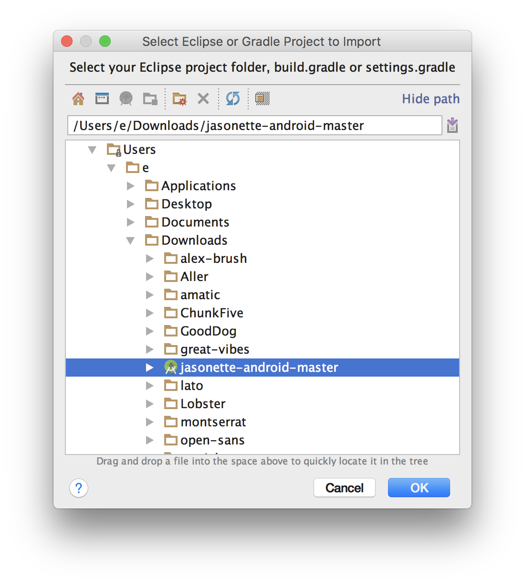
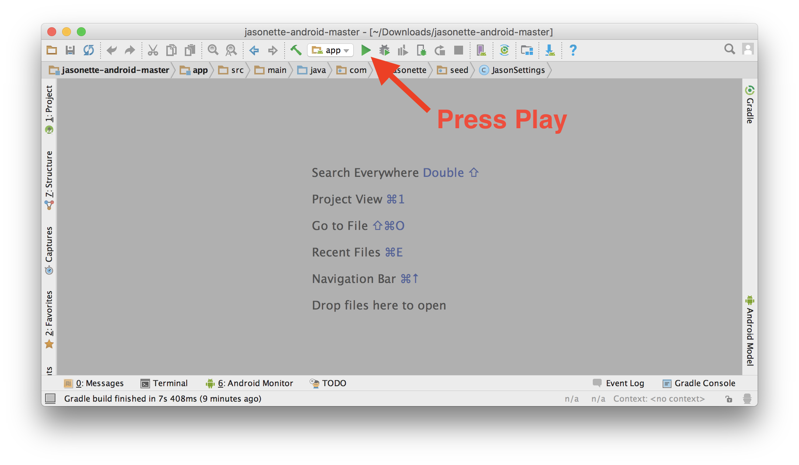
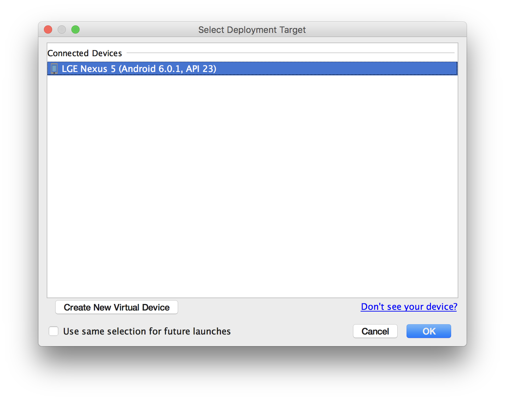
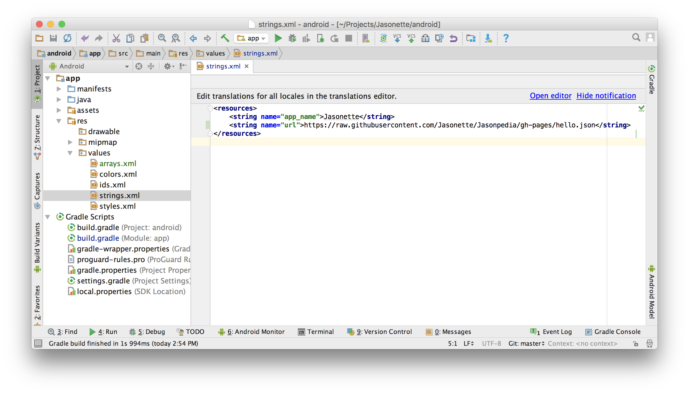
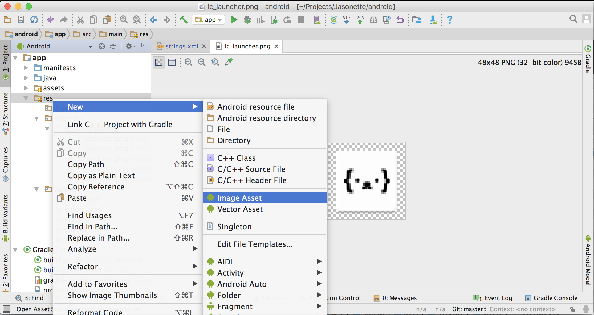
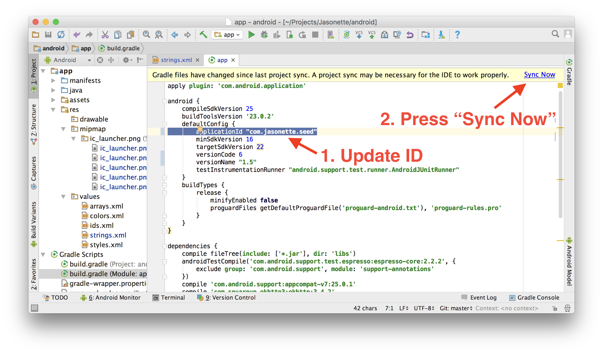
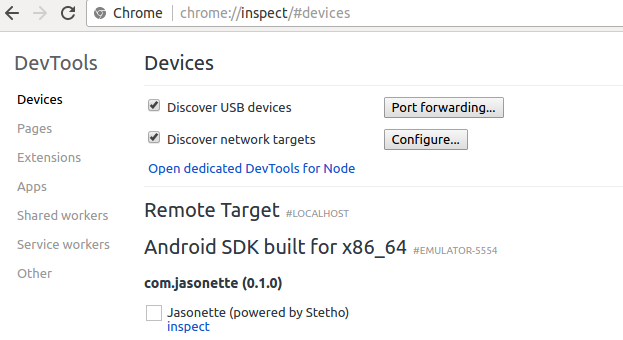
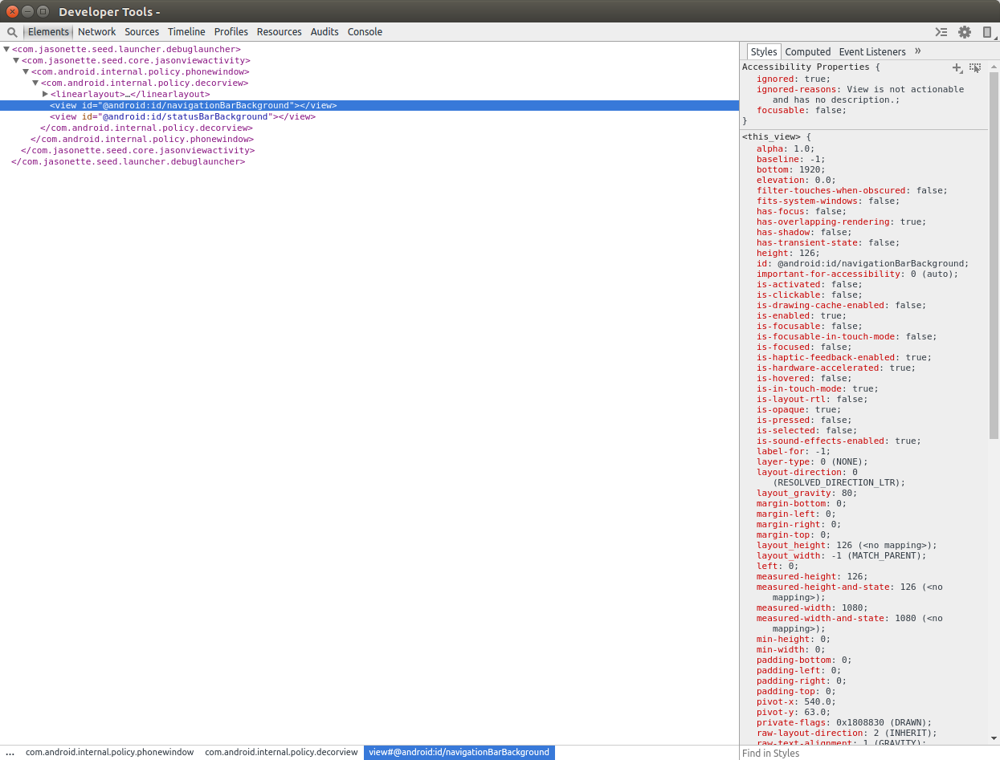

<h1><i class='icon fa-android'></i> Set up Jasonette android</h1>

<div class='banner'>
<i class='icon fa-exclamation-circle'></i> Want to skip the setup and try Jasonette without building your own app? - <a href='../jason'><b>Try Jason.</b></a>
</div>

---

##Step 1. DOWNLOAD AND UNZIP

<div class='well'>
Jasonette itself is a pre-built app.<br>All you need to do is download Jasonette and build with <a href='https://developer.android.com/studio/index.html'>Android Studio</a>.
<br><br>
<a href='https://github.com/Jasonette/JASONETTE-Android/archive/master.zip' class='btn'><i class='fa fa-download'></i> Download Jasonette-Android</a>
</div>


<br>

##Step 2. LAUNCH ANDROID STUDIO

Now launch [Android Studio](https://developer.android.com/studio/index.html), and select "Import project"


##Step 3. IMPORT THE PROJECT

Find the Jasonette folder you just unzipped and press OK.



##Step 4. PRESS PLAY

Jasonette comes with a default demo JSON url embedded. Let's try running it to make sure it works.




##Step 5. CONNECT THE PHONE AND RUN

It will show up a dialog that looks like this.

Here you can either choose to run it on an emulator or a real device.

**To learn how to connect the phone, or how to run it on an emulator, [read this](https://developer.android.com/training/basics/firstapp/running-app.html).**



##Step 6. CUSTOMIZE!

Now let's try changing the JSON url so you can turn it into your own app.

First, click the "Project" tab on the left side.

Then find `app` > `res` > `values` > `strings.xml`.



<br>

### A. Update JSON URL

Update the `url` property inside `strings.xml` to your own JSON url. That's it! Build and run the app and you'll find that it's turned into your own app!

If you don't have a JSON yet, [here are some example apps you can try quickly](/examples)

<br>

### B. Update App name

By default the app is named "Jasonette". You probably want to change this. From the same `strings.xml` file, change the `app_name` value to your desired app name.

<br>

### C. Update App icon


**Step 1. Create new Image Asset**

Select `app` > `res` and right-click to display a context menu. Then select `New` > `Image Asset`.



<br>

**Step 2. Select your image**

Select `image` as Asset Type, and select the `path` to the image you want to use.


<br>

**Step 3. Confirm and finish**

It will display some warning about overwriting existing icon. You're overwriting the default icon with your own so it's natural. Press Finish.
<br>


<br>


### D. Update App ID (Important!)

This is important if you want to submit to the play store, since this is the ID that distinguishes one app from another.

To change this ID, go to: `Gradle Scripts` > `build.gradle (Module: app)`, and find the `applicationId` attribute.

It should be `com.jasonette` by default.

1. Change this to your own unique ID. (In this example I've changed it to `com.jasonette.seed`)
2. Press "Sync Now" at the top right corner, and rebuild.

To learn more, [read this documentation](https://developer.android.com/studio/build/application-id.html).



<br>


---

## ★ Did it work?

<br>

  - ###YES?
    - Congratulations! You're ready to transform this into your OWN app! Go on to the [tutorial](../#step-2-learn).

<br>

  - ###NO?
    - **[Check troubleshoot section](#troubleshoot)**

---

# Submitting to the play store

[Check out this documentation](https://support.google.com/googleplay/android-developer/answer/113469?hl=en) to learn how to submit to the play store.

---

# Debugging

## Stetho

Stetho is a library from Facebook that has been integrated into Debug build types of the Jason app to allow debugging via Chrome Dev Tools.

To use Stetho for debugging:

1. Run the Jason app from Android Studio on either a emulator or connected Andriod device (you can also directly use the debug APK that AS creates in `app/build/outputs/apk/app-debug.apk`)

2. In a Chrome web browser running on a machine on the same network as the Android device or emulator, open the url `chrome://inspect` and you should see under 'Remote Target' an entry labelled `Jasonette (powered by Stetho)`:


3. Click on the `inspect link` and that will open a new Chrome Dev Tools window, connected to your app ready for debugging.



Using the Dev Tools interface you can now inspect the hiearchy of your UI layout, inspect network requests, browse the key-values stored by the Jasonette $global.set and see output from any uses of console.log in your template expressions.

A handy feature in the **Elements** tab of Dev Tools is the UI element running on the Android device will be highlighted when its element is hovered over by the mouse in the Elements tab, just as it would if you were using Dev Tools with a web page.

### Console output

As noted above, a useful feature with Stetho is being able to send debugging output to the Dev Tools console.
When Dev Tools is connected, all logging output, both from Jasonette that would go to logcat will also be displayed int eh DevTools console tab.

You can send log output to the console from using Javascript within template expressions like so:
```
{
  "someaction" : "{{ console.debug('hello debug') }}"
}
```

> *Note:* Dev Tools will disconnect from your app each time it is killed (eg. if you  install an updated APK). When that happens, to close your existing DevTools window and return  'chrome://inspect' to open it again.

> *Note:* Stetho is only included in the **debug**  build type and will **NOT** be included by the gradle config in *release* builds of the APK.

For more details about Stetho please see [its website](http://facebook.github.io/stetho/).
---

# Troubleshoot

## Need more help?

  - **Slack - **  Come ask quick questions and share tips with other Jasonette users. [Join here](https://jasonette.now.sh)

	<script async defer src="https://jasonette.now.sh/slackin.js?large"></script>

  - **Forum - **  Chat messages on Slack tend to flow away, so you may want to ask questions on the forum. Also it's good for future users who may have the same problem. All messages on the forum will be read. Visit here: [https://forum.jasonette.com](https://forum.jasonette.com)
