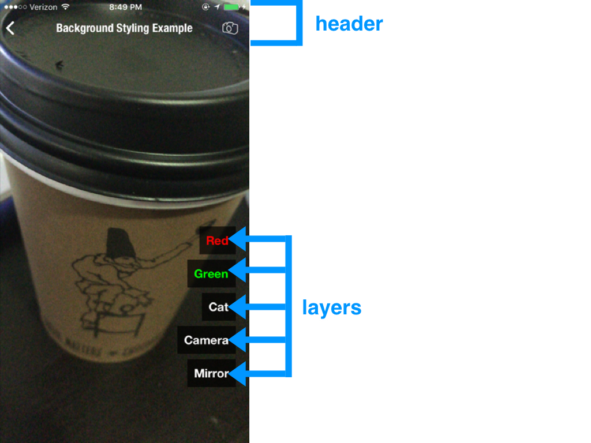
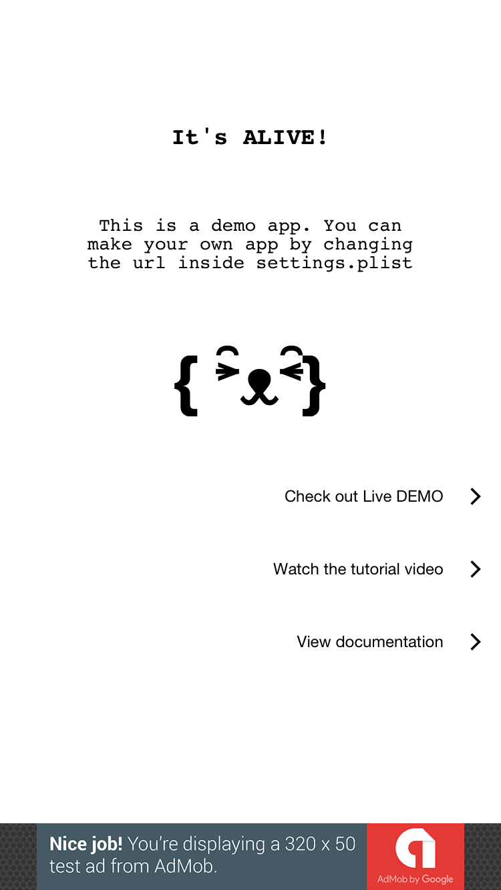
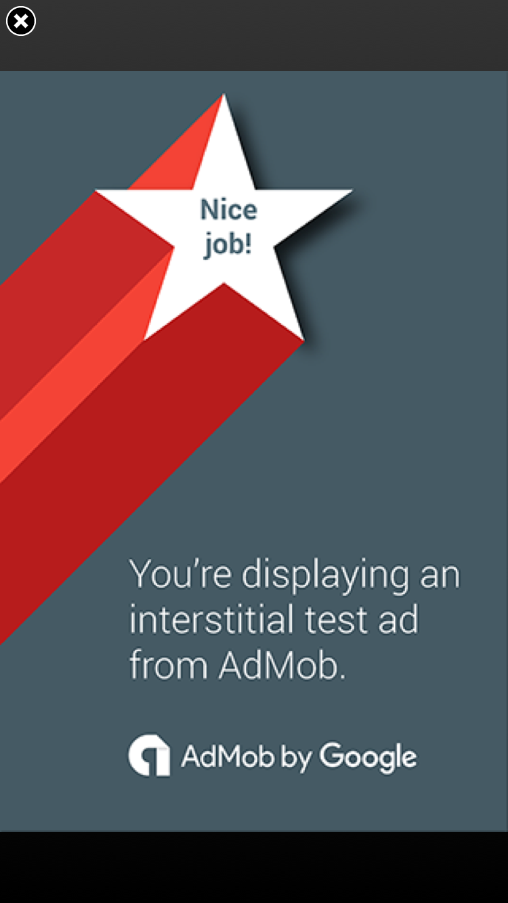
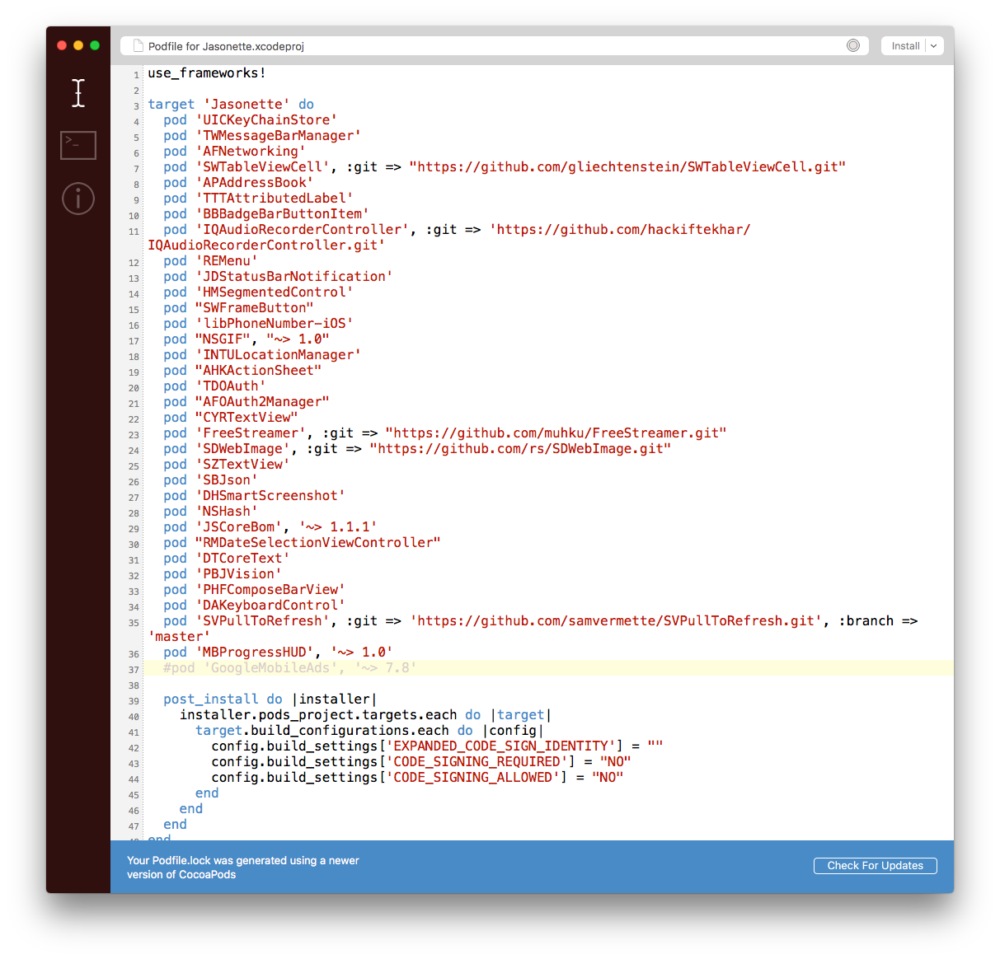
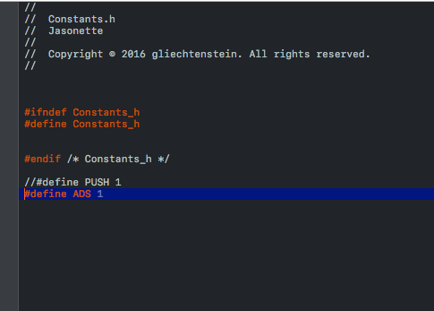
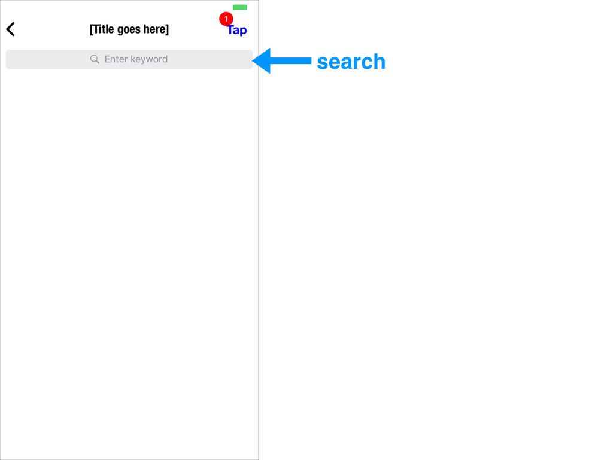
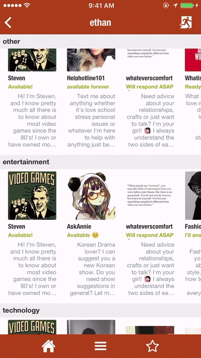
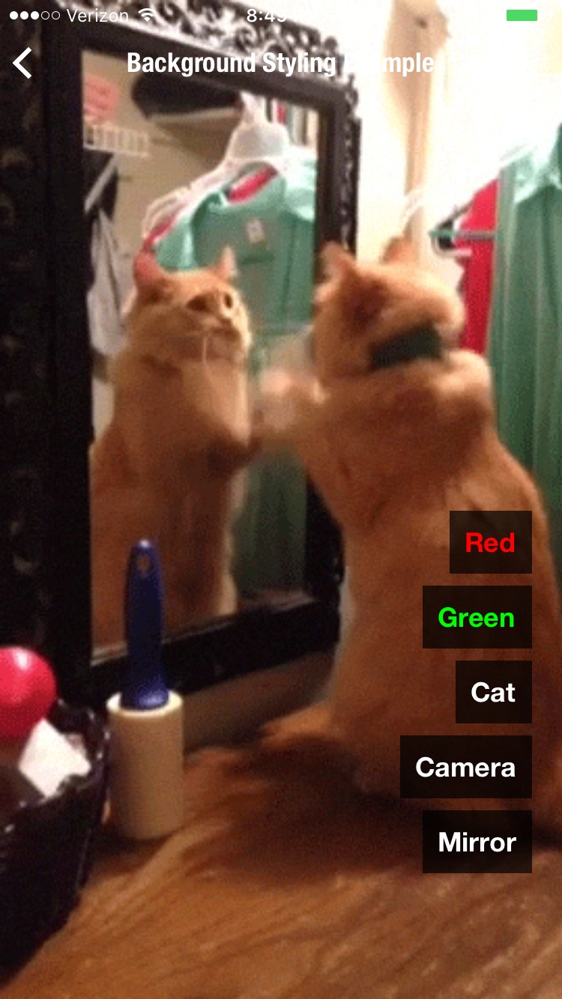

#── $jason ──

A Jason document always starts with `$jason` as its root node, and has two children: `head` and `body`, each of which has multiple children of its own.

---

#── head ──

The head contains a set of metadata that doesn't get displayed directly.  The title attribute is mandatory. Rest of the attributes are optional.

Head can contain the following attributes:

1. title
2. description
3. icon
4. offline
5. styles
6. actions
7. templates
8. data
9. agents

In JSON they look like this:

<pre>{
  "$jason": {
    "head": {
      "title": "...",
      "description": "...",
      "icon": "...",
      "offline": "true",
      "styles": {
        ...
      },
      "actions": {
        ...
      },
      "templates": {
        ...
      },
      "data": {
        ...
      }
    },
    "body": {
      ...
    }
  }
}</pre>

---

#head.title
Title string for your app.

<pre>{
  "$jason": {
    "head": {
      "title": "Hello World",
      ...
    },
    ...
  }
}</pre>

---

#head.description
Description string for your app. Let users find out what the app does, how it works, etc. just by looking at the JSON code.

<pre>{
  "$jason": {
    "head": {
      "title": "Hello World",
      "description": "This app displays 'Hello World' on the screen",
      ...
    },
    ...
  }
}</pre>

---

#head.icon
An icon URL that represents your app.

<pre>{
  "$jason": {
    "head": {
      "title": "Hellow World",
      "description": "This app displays 'Hello World' on the screen",
      "icon": "https://s3.amazonaws.com/jasonclient/hello.png",
      ...
    },
    ...
  }
}</pre>

---

#head.offline
Optional value to cache JSON file for offline use.
Defaults to `true`.
It doesn't matter what you set the value to; due to a quirk of Jasonette, just including it with any value makes it be counted as true.

Here's an example of how to use it:
<pre>{
  "$jason": {
    "head": {
      "title": "Hellow World",
      "description": "This app displays 'Hello World' on the screen",
      "icon": "https://s3.amazonaws.com/jasonclient/hello.png",
      "offline": "true/yes/on",
      ...
    },
    ...
  }
}</pre>

---
#head.styles
Declare commonly used style classes here so you can reuse them later.

Let's take a look at an example to demonstrate how using `head.styles` can be helpful compared to styling UI elements `inline`.

For example here's an example of `inline styling`:

<pre>{
  "$jason": {
    "head": {
      ...
    },
    "body": {
      "sections": [{
        "items": [{
          "type": "label",
          "text": "This is row 1",
          "style": {
            "font": "HelveticaNeue",
            "size": "20",
            "color": "#ff0000",
            "padding": "10"
          }
        }, {
          "type": "label",
          "text": "This is row 2",
          "style": {
            "font": "HelveticaNeue",
            "size": "20",
            "color": "#ff0000",
            "padding": "10"
          }
        }, {
          "type": "label",
          "text": "This is row 3",
          "style": {
            "font": "HelveticaNeue",
            "size": "20",
            "color": "#ff0000",
            "padding": "10"
          }
        }]
      }]
    }
  }
}</pre>

You can see that there's a `style` JSON for each label item. This is called `inline styling` since the style attribute is attached to the UI component directly.

Now if you look closer, you'll see that each item has exactly the same repeating style.

We can get rid of this redundancy by using `head.styles`:

<pre>{
  "$jason": {
    "head": {
      ...
      "styles": {
        "styled_row": {
          "font": "HelveticaNeue",
          "size": "20",
          "color": "#ff0000",
          "padding": "10"
        }
      }
    },
    "body": {
      "sections": [{
        "items": [{
          "type": "label",
          "text": "This is row 1",
          "class": "styled_row"
        }, {
          "type": "label",
          "text": "This is row 2",
          "class": "styled_row"
        }, {
          "type": "label",
          "text": "This is row 3",
          "class": "styled_row"
        }]
      }]
    }
  }
}</pre>

First look at each label item. Now the style attributes are gone, but instead we have a `class` value of `styled_row` for each.

Now let's look under `$jason.head.styles`. You'll see we now have the `styled_row` defined here. The styles registered here will be applied to each UI component whenever its class name is referenced.

### note
Multiple styles can be used in a single `class`. Example: 
`"class": "styled_row color_white background_green"`. 
This can be used for creating complex styles with ease!.

---

#head.actions

**[Using action registry to define actions](actions.md#action-registry)**

You can define actions under the action registry (`head.actions`) and reuse them through the `trigger` keyword.

---

#head.templates

**[Declaring templates](templates.md)**

You can dynamically render any data using templates. Templates are registered under `head.templates`

---

#head.data

**[Using inline data for rendering](templates.md#1-inline-data)**

`head.data` is like an inline database that gets rendered automatically by `body` template if included.

---

#head.agents

Jasonette Agent is a new architecture for building native mobile apps that utilizes JavaScript technologies without sacrificing native peformance and user experience.

The idea is simple:

- User interacts with the native core.
- The core spawns background JavaScript containers for multiple tasks.
- Core and Agents communicate through JSON-RPC.

In short, it's like microservices, but on the frontend.

**[Learn More about Agents](agents.md)**

---

#── body ──

Body contains everything that gets displayed on the screen. A body is made up of the following view elements.

<pre>{
	"$jason": {
		"head": {
			...
		},
		"body": {
			"header": {
				...
			},
			"sections": [
				{ ... },
				{ ... },
				...
			],
			"layers": [
				{ ... },
				{ ... },
				...
			],
			"footer": {
				...
			}
		}
	}
}</pre>

- `header` represents the top area
- `sections` represent a scrollable list of items
- `layers` represent non-scrolling items
- `footer` represents the bottom area

---
#examples

Here's what each part looks like in a real app:  

  

Sections contains a list that can be scrolled.

  

  

Layers are images or labels that stay put on top of everything.

You can also drag/resize/rotate layers depending on how you define them.

---

#body.ads

`body.ads` describes the banner ads and the interstitial ads on the page

---

##■  ads
Use to show banner and interstitial ads.
Currently iOS only, open Android Issue here: [Ad support for Android #22](https://github.com/Jasonette/JASONETTE-Android/issues/22)

### screenshots
#### Banner ad: 

#### Interstitial ad:

### syntax

####• `type`: `"admob"`
####• `options`: Possible options for the ad
  - `type`: `banner` or `interstitial`, for type of ad.
  - `unitID`: AdMob Unit ID. Just a string of letters and numbers, e.g.: `ca-app-pub-6606303247985815/7014816684`
  
### Example

    ...
    "ads": [
      {
        "type": "admob",
        "options": {
          "type": "banner",
          "unitId": "a14dccd0fb24d45"
        }
      },
      {
        "type": "admob",
        "options": {
          "type": "interstitial",
          "unitId": "ca-app-pub-6606303247985815/7014816684"
        }
      }
    ],
    ...

### How to enable ads
Ads aren't enabled by default, so you have to enable them. To enable them, do the following steps:

1. Download the latest version of Jasonette from the `master` branch and unzip: [master branch download](https://github.com/Jasonette/JASONETTE-iOS/archive/master.zip)
2. Download CocoaPods from here: https://cocoapods.org/app
3. Run CocoaPods. From the app menu, open `File > Open Podfile`. Then find the project folder you just unzipped. From the project folder, go into `app` folder and you should see a file called `Podfile`. Select that file and open it from CocoaPods app. You should see this screen:

4. Uncomment `pod 'GoogleMobileAds', '~> 7.8'` (By removing the `#` character) and press the `install` button in the top right corner. The install will start, after that you'll see the following screen:

Notice the green Installing GoogleMobileAds line from above screenshot. That means the library has been successfully installed into the project and you can use it.

5. Now go to the root folder of your project and run Setup, and go through the setup process just like any other Jasonette project.
6. You now need to turn on the Ad feature on Xcode. To do this, open `Jasonette > Config > Constants.h` file from in your Xcode workspace (which should have opened after the setup process), Uncomment `#define ADS 1` by removing the `//`. The result should look something like this:

And that's it! You should now be able to use ads in your project.

---

#body.header

`body.header` describes the top header bar and its components.

---

##■ title
There are two ways to set the title of the header bar:

1. Basic: Simple text
2. Advanced: Can be a text or an image

###Basic title

Simply set the string to change the title on the header bar.

    {
      "$jason": {
        "head": {
          ...
        },
        "body": {
          "header": {
            "title": "[Title goes here]"
          },
          ...
        }
      }
    }

The result:

###Advanced title

You can describe the title in more detail using a `title` object instead of just a simple string. Here's the syntax:

  - `type`: `"label"` or `"image"`
  - `text`: In case it's a `label` type, set the text. Same as using the basic title described above.
  - `url`: In case it's an image, set the image url.
  - `style`: In case it's an image we can set the `width` and the `height`
    - `align`: `"left"` or `"center"` (If not specified, it's `center` by default)
    - `width`: set the width of the image
    - `height`: set the height of the image
    - `top`: Top offset.
    - `left`: Left offset. **ONLY APPLICABLE WHEN `"align": "left"`**
    - `font`: Font name in case `"type": "label"`
    - `size`: Font size in case `"type": "label"`

Here's an example

    {
      "$jason": {
        "head": {
          ...
        },
        "body": {
          "header": {
            "title": {
              "type": "image",
              "style": {
                "width": "94",
                "height": "27"
              },
              "url": "https://raw.githubusercontent.com/Jasonette/Instagram-UI-example/master/images/logo.png"
            }
          },
          ...
        }
      }
    }

The result (See the header title image):

---

##■  search
Search component. Calls an `action` you define when user submits a query.

### attributes

  - `name`
  - `placeholder`
  - `action`
  - `style`
    - `background`: background color
    - `color`: tint color (for placeholder, text & icon)

### example

  1. The search component can trigger an action if you define one.
  2. Also the value inside the search input is automatically stored to the [local variable](actions.md#variable) which you name by setting the `name` attribute.
    - If you are not aware of how local variables work, read the [local variable](actions.md#variable) section first.

Take a look at the following example:

    {
      "$jason": {
        "head": {
          ...
        },
        "body": {
          "header": {
            "search": {
              "name": "query_text",
              "placeholder": "Search something",
              "style": {
                "background": "#000000"
              },
              "action": {
                "type": "$util.alert",
                "options": {
                  "title": "You've entered:",
                  "description": "{{$get.query_text}}"
                }
              }
            }
          }
        }
      }
    }

Here's what's going on:

1. We bind the `search` input with a local variable `query_text` (By setting the `name` attribute under `body.header.search` as `query_text`)
2. The search input then calls the `$util.alert` action when user submits input, utilizing the local variable through `{{$get.query_text}}`

---

##■ menu

- `menu` represents the menu button at the top right corner on the header.
- `menu` can call [actions](actions.md) or [link to another view](href.md).
- `menu` can also have a `badge`.

### attributes

#### ■  `text`: menu button text
#### ■  `image`: menu button icon url
#### ■  `style`
  - `color`: font color or image mask color
  - `font`: font name
  - `size`: font size
#### ■  `href`: [view to transition to when touched](href.md)
#### ■  `action`: [action to trigger when touched](actions.md)
#### ■  `badge`
  - `text`: The text to display inside the badge
  - `style`:
    - `background`: background color for the badge
    - `color`: text color for the badge
    - `top`: x-offset of the badge
    - `left`: y-offset of the badge

###example

    {
      "$jason": {
        "head": {
          ...
        },
        "body": {
          "header": {
            "menu": {
              "text": "Tap me",
              "style": {
                "color": "#0000ff",
                "font": "HelveticaNeue-Bold",
                "size": "17"
              },
              "action": {
                "type": "$util.toast",
                "options": {
                  "text": "Good job!"
                }
              },
              "badge": {
                "text": "3",
                "style": {
                  "background": "#ff0000",
                  "color": "#ffffff"
                }
              }
            }
          }
        }
      }
    }

[View the full code here](http://www.jasonbase.com/things/qp5/edit)

###note
- Choose either `text` or `image` for the menu button, but not both.
- Choose either `href` or `action` for handling tap events, but not both.

---

##■ style
Style the entire header bar.

### attributes
- `font`: the font for `body.header.title`
- `size`: the text size for `body.header.title`
- `background`: the background color for the entire header bar: `body.header`
- `color`: the font color for `body.header.title`

---

#body.sections

The main region, used to display scrollable content.

**Here are the attributes each section can have:**

  - `type`: optional. set to `horizontal` to make it scroll horizontally. Otherwise it's just a regular, vertically scrolling section.
  - `header`: a single item. optional. (doesn't respond to user interaction. display purpose)
  - `items`: array of items (responds to user interaction)
    - Each item can be either a [layout](layout.md) or a [component](components.md)

In most cases one section is enough, if you're displaying just a single collection of similar items.

Use multiple sections if you need to display different types of collections, for example one vertical section and one horizontal section.

 

##■  type
A view can contain multiple sections.

And each section can be either:

###1. vertically scrolling (default)
Just a normal list view that scrolls

---

###2. horizontally scrolling
scrolls from left to right (`"type": "horizontal"`)

###What's going on above:

- The **vertically scrolling section image** above shows a view with **1 vertically scrolling section**

- And the **horizontally scrolling section image** shows a view with **multiple horizontally scrolling sections**

- You can mix and match vertical and horizontal sections too. For example, a view can have a vertical section as the first section, and a horizontal section as the next, so forth.

  
Let's go into more details:

---

### 1. Vertically scrolling section

This is just a regular list view that lets you scroll from top to bottom.

This is the default

    {
      ...
      "sections": [{
        "items": [{
          "type": "label",
          "text": "Item 1"
        }, {
          "type": "label",
          "text": "Item 2"
        }, {
          "type": "label",
          "text": "Item 3"
        }, {
          "type": "label",
          "text": "Item 4"
        }, {
          "type": "label",
          "text": "Item 5"
        }]
      }],
      ...
    }

### 2. Horizontally scrolling section

This type of section lets you scroll from left to right.

To create a horizontal section, set the section's `type` as `horizontal`.

    {
      ...
      "sections": [{
        "type": "horizontal",
        "items": [{
          "type": "label",
          "text": "Item 1"
        }, {
          "type": "label",
          "text": "Item 2"
        }, {
          "type": "label",
          "text": "Item 3"
        }, {
          "type": "label",
          "text": "Item 4"
        }, {
          "type": "label",
          "text": "Item 5"
        }]
      }],
      ...
    }

---

###Section item types

Above we've talked about the types of sections (vertical vs. horizontal).

**Now let's talk about what a section can contain**.

Each section can contain:

  - 0 or 1 [header](#header)
  - 1 or more [items](#items)

 

| Type         | Structure                                |
| ------------ | ---------------------------------------- |
| Horizontal   |  |
| Vertical     |  |

##■ items

An `items` array contains a list of items that users can interact with.

Each Item can be a:

- [Component](components.md): A single basic UI unit (such as a label or an image)
- [Layout](layout.md): A composition of multiple components.

###attributes
Each item can contain the following attributes

  - `type`: `vertical` or `horizontal` in case of layout. A component name in case it's a component item. (for example, `label`, `image`, `button`, etc.)
  - `components`: child components array (only if the type is either `vertical` or `horizontal`. Not applicable when the type is a component)
  - `style`: layout style + item specific style
    - `color`: Set the color of the item's disclosure indicator in case [href](href.md) is used.
    - `height`: Set the height of the item.
    - `z_index`: An integer value (example: `{"z_index": "-1"}`). Set the z-index of the item. (Similar to [CSS z-index](https://developer.mozilla.org/en-US/docs/Web/CSS/z-index))
  - `action`: An [action](actions.md) to trigger when a user taps the item. See [actions reference](actions.md) for details.
  - `href`: An [href](href.md) to trigger when a user taps the item. See [href reference](href.md) for details.

###example

Here's an example:

    {
      ...
      "sections": [{
        "items": [
          {
            "type": "label",
            "text": "Label only item"
          },
          {
            "type": "vertical",
            "components": [
              {
                "type": "image",
                "url": "https://jasonclient.org/img/john.png"
              },
              {
                "type": "label",
                "text": "John"
              },
              {
                "type": "label",
                "text": "Doe"
              }
            ]
          },
          {
            "type": "vertical",
            "components": [
              {
                "type": "image",
                "url": "https://jasonclient.org/img/mary.png"
              },
              {
                "type": "label",
                "text": "Mary"
              },
              {
                "type": "label",
                "text": "Jane"
              }
            ]
          }
        ]
      }]
      ...
    }

####What's going on above:

This section contains 3 items.

The first one is a `label` component item (Displays the text "Label only item")

The second and third are `vertical` layouts, each of which contains one image and two labels.

##■ header
A header is similar to `items`. Visually it looks the same. However there are some differences:

  - A header is for **display purpose** only.
    - Therefore a header cannot have an `href`, `action`, or `menu` attributes.
  - A header functions as a divider between sections.
    - It sticks to the top as you scroll through the items in its section, until you scroll out of the section.
  - You can only have up to 1 header per section.
  - It's optional.

### attributes
Here's a list of attributes a header supports (Same as `items`, with an exception of interactive features):

####■  `type`: `vertical` or `horizontal` in case of layout. A component name in case it's a component item. (for example, `label`, `image`, `button`, etc.)
####■  `components`: child components, in case it's a layout item.
####■  `style`: layout style + item specific style
  - `color`: Set the color of the item's disclosure indicator in case [href](href.md) is used.
  - `height`: Set the height of the item.
  - `z_index`: An integer value (example: `{"z_index": "-1"}`). Set the z-index of the item. (Similar to [CSS z-index](https://developer.mozilla.org/en-US/docs/Web/CSS/z-index))
    - By default, `header` has a higher `z_index` than `items`. That's why the items scroll below the header as they scroll. You can however change that by setting the header's z_index.

---

#body.layers

Layers are floating elements that can be configured to be **resized**, **dragged**, **rotated**, and **react to actions**.

 

 

Currently layers support two types of components:

- label
- image

##■  type:label

Floating labels.

### attributes

  - `type`: `"label"`
  - `text`: the text to display
  - `action`: [action](actions.md) to run on user tap event
  - `style`
    - `width`
    - `height`
    - `padding`
    - `top`: position from the top of the screen
    - `left`: position from the left of the screen
    - `right`: position from the right of the screen
    - `bottom`: position from the bottom of the screen
    - `corner_radius`
    - `font`
    - `size`
    - `background`
    - `color`
    - `align`: text align (`"left"` | `"center"` | `"right"`) Default is `"left"`
    - `resize`: resizable when set to `"true"` (default is false)
    - `move`: can be dragged around when set to `"true"` (default is false)
    - `rotate`: can be rotated when set to `"true"` (default is false)

### example

    {
      "layers": [
        {
          "type": "label",
          "text": "Floating label",
          "style": {
            "top": "100",
            "left": "50%-25",
            "width": "50",
            "padding": "10"
          }
        }
      ]
    }

##■  type:image

Floating images

### attributes

  - `type`: `"image"`
  - `url`: Image url to load
  - `action`: [action](actions.md) to run on user tap event
  - `style`
    - `width`
    - `height`
    - `top`
    - `left`
    - `right`
    - `bottom`
    - `corner_radius`
    - `color`: set the tint color (only for icons)
    - `resize`: resizable when set to `"true"` (default is false)
    - `move`: can be dragged around when set to `"true"` (default is false)
    - `rotate`: can be rotated when set to `"true"` (default is false)

### example

    {
      "layers": [
        {
          "type": "image",
          "url": "https://www.jasonclient.org/img/sticker.png",
          "style": {
            "width": "100",
            "corner_radius": "50",
            "bottom": "100",
            "right": "100"
          }
        }
      ]
    }

---

#body.footer
The footer area of a view

- input: Chat input element
- tabs: Tab element

##■  input
Chat input at the bottom

---

 

### attributes

#### ■ `textfield`

  - `name`: the local variable name connected to this input field.
  - `placeholder`: the placeholder text for this input field
  - `style`
    - `color`: font color
    - `color:placeholder`: placeholder color
    - `background`: background color for the input field

#### ■ `left`: left button (Only allows image)

  - `image`: image URL to display as the left button
  - `action`: action to call when touched
  - `style`
    - `color`: tint color for the image

#### ■ `right`: right button (Only allows label)

  - `text`: text to display as the right button
  - `action`: action to call when touched
  - `style`
    - `color`: font color
    - `color:disabled`: disabled state font color

#### ■ `style`

  - `background`: background color for the root toolbar that contains all of the above

 

### example

    {
      "footer": {
        "input": {
          "style": {
            "background": "#cecece"
          },
          "left": {
            "image": "https://www.jasonclient.org/img/camera.png",
            "style": {
              "color": "#ff0000"
            },
            "action": {
              "type": "$media.camera"
            }
          },
          "textfield": {
            "name": "message",
            "placeholder": "Say something...",
            "style": {
              "background": "#ffffff",
              "color": "#ff0000",
              "color:placeholder": "#ebebeb"
            }
          },
          "right": {
            "text": "Send",
            "style": {
              "color": "#ff0000",
              "color:disabled": "#ebebeb"
            },
            "action": {
              "type": "$network.request",
              "options": {
                "url": "https://jasonchat.org/post.json",
                "method": "post",
                "data": {
                  "message": "{{$get.message}}"
                }
              },
              "success": {
                "type": "$reload"
              }
            }
          }
        }
      }
    }

 

---

 

##■  tabs
Bottom tab bar

 

---

###attributes

####• `items`: an array of tab bar items. Each item can have the following attributes:

  - `text`: tab item text
  - `image`: tab item icon
  - `style`: tab icon style
    - `width`: icon width
    - `height`: icon height
  - `badge`: badge text
  - `url`: the view url to load when tapped.
  - `href`: the view [href](http://docs.jasonette.com/href/) to load when tapped.
  - `action`: an [action](http://docs.jasonette.com/actions/) to run when tapped.

####• `style`: overall style for the tab bar

  - `color`: selected item color
  - `color:disabled`: deselected item color
  - `background`: background color of the entire tab bar

 

###example

    {
      "footer": {
        "tabs": {
          "style": {
            "background": "rgba(255,255,255,0.8)",
            "color:disabled": "#cecece",
            "color": "#009efa"
          },
          "items": [{
            "image": "https://raw.githubusercontent.com/Jasonette/Twitter-UI-example/master/images/home.png",
            "text": "Home",
            "style": {
              "height": "21"
            },
            "url": "https://raw.githubusercontent.com/Jasonette/Twitter-UI-example/master/home.json"
          }, {
            "image": "https://raw.githubusercontent.com/Jasonette/Twitter-UI-example/master/images/notifications.png",
            "text": "Notifications",
            "style": {
              "height": "21"
            },
            "url": "https://raw.githubusercontent.com/Jasonette/Twitter-UI-example/master/notifications.json"
          }, {
            "image": "https://raw.githubusercontent.com/Jasonette/Twitter-UI-example/master/images/moments.png",
            "text": "Moments",
            "style": {
              "height": "21"
            },
            "url": "https://raw.githubusercontent.com/Jasonette/Twitter-UI-example/master/moments.json"
          }, {
            "image": "https://raw.githubusercontent.com/Jasonette/Twitter-UI-example/master/images/messages.png",
            "text": "Messages",
            "style": {
              "height": "21"
            },
            "url": "https://raw.githubusercontent.com/Jasonette/Twitter-UI-example/master/messages.json"
          }, {
            "image": "https://raw.githubusercontent.com/Jasonette/Twitter-UI-example/master/images/me.png",
            "text": "Me",
            "style": {
              "height": "21"
            },
            "url": "https://raw.githubusercontent.com/Jasonette/Twitter-UI-example/master/me.json"
          }]
        }
      }
    }

 

### Troubleshooting Tabs

---

** ⚠️   Troubleshoot 1: **

ONLY Use tabs at the root level (The first view that shows up on launch). Any other usage may introduce unexpected behavior.

---

**  ⚠️  Troubleshoot 2:**

**The first tab MUST have a URL.** Otherwise the view won't load.

---

**  ⚠️  Troubleshoot 3:**

**The first tab's url MUST EXACTLY MATCH the URL of the view it loads from.** Otherwise the view won't load.

For example in the below example, the visible view's URL should match the URL of the "Top Secret" tab. It wouldn't make sense for these two URLs to NOT match anyway.

---

**  ⚠️  Troubleshoot 4:**

`tabs` can have up to 5 items (5 tabs max).

---

**  ⚠️  Troubleshoot 5:**

`tabs` must have at least 2 items (2 tabs min).

---

# body.background

Set the background for the entire view. 

 

> **Quick History:** This used to be `body.style.background` because in the beginning, the background only had color options. But since then it has added a lot of features, so has been promoted to the same level as `sections`, `layers`, `header`, and `footer`.
>
> You can still use the `body.style.background` option but it's been unofficially deprecated.

 

### available values

  - **COLOR CODE** : Here are some examples:
    - `"rgb(144,233,233)"`
    - `"rgba(255,255,255,0.3)"`
    - `"#ff0000"`

  - **Image URL** : If you wish to use an image as background, simply specify the image url

  - **"camera"** : Use basic camera as background

  - **"{"type": "camera"}** : Use advanced camera as background

  - **JSON Web Container**: Lets you embed an entire self-contained web view as a background. Refer to [JSON web container](web.md) to learn more.

 

### example 1. red background

    {
      "$jason": {
        "head": {
          ...
        },
        "body": {
          "background": "#ff0000"
          ...
        }
      }
    }

### example 2. image background

    {
      "$jason": {
        "head": {
          ...
        },
        "body": {
          "background": "http://i.giphy.com/Is0AJv4CEj9hm.gif"
          ...
        }
      }
    }

### example 3. web container background

    {
      "$jason": {
        "head": {
          ...
        },
        "body": {
          "background": {
            "type": "html",
            "text": "<html><head></head><body>...</body></html>",
            "action": {
              "type": "$default"
            }
          }
        }
      }
    }

### example 4. basic camera

    {
      "$jason": {
        "head": {
          ...
        },
        "body": {
          "background": "camera"
          ...
        }
      }
    }

### example 5. advanced camera

Back facing camera

    {
      "$jason": {
        "head": {
          ...
        },
        "body": {
          "background": {
            "type": "camera",
            "options": {
              "device": "back"
            }
          },
          ...
        }
      }
    }

### What they look like

Here's the preview:

 

| color                                    | image                                    | camera                                  | web container | 
| ---------------------------------------- | ---------------------------------------- | --------------------------------------- |---------------|
|  |  |  |  |

### Functional Example

[A demo with all of the above options implemented](https://raw.githubusercontent.com/Jasonette/Jasonpedia/gh-pages/view/background/index.json)

---

# body.style
Styling the body

- border: setting the border color for section items

## ■ border

  - border color for `section` items.
  - Format: `[COLOR CODE]` | `"none"`

### example 1. No border

    {
      "body": {
        ....
        "style": {
          "border": "none"
        },
        ....
      }
    }

### example 2. red border

    {
      "body": {
        ....
        "style": {
          "border": "#ff0000"
        },
        ....
      }
    }
