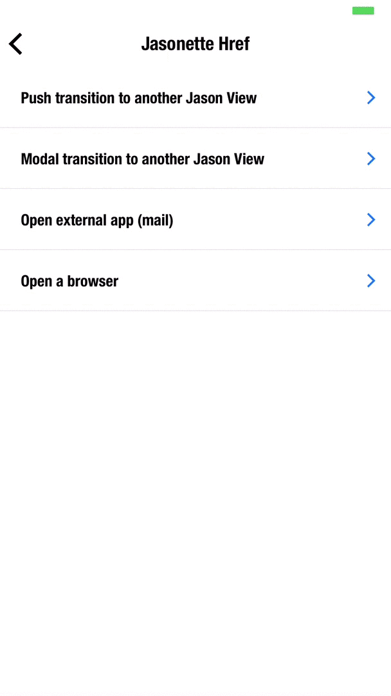

#HREF

To describe links between views, we use `href`. Here are some of its traits:

  - `href` can be attached to various UI elements to allow for interaction. This includes:
    - [header.menu](document.md#menu)
    - [section items](document.md#items)
    - [layers](document.md#bodylayers)
    - and anything that looks interactive: like the [buttons on a chat input](document.md#input).
  - A section item with an `href` attribute will display a disclosure indicator `>` by default, to indicate that there's a next view (Only for [vertically scrolling sections](document.md#1-vertically-scrolling-section))
    - To change the indicator color, you need to set the `color` style attribute of the item.
    - If you want to use `href` but without the disclosure indicator, use the [$href action](actions.md#href) instead.

#HREF ATTRIBUTES
- [url](#url)
- [view](#view)
- [options](#options)
- [transition](#transition)

## ■ url
The url to load in the next view

## ■ view
Type of view to load

###1. "view": "jason"
Jasonette view. Will load JSON. This is the default.

Here's an example:

    {
      "type": "label",
      "text": "Push me",
      "href": {
        "url": "https://www.jasonclient.org/next.json",
        "view": "jason"
      }
    }

Since `jason` is the default, we don't really need to specify it. So we can just write:

    {
      "type": "label",
      "text": "Push me",
      "href": {
        "url": "https://www.jasonclient.org/next.json"
      }
    }

###2. "view": "web"

Web browser view. Will load HTML in an internal browser.

    {
      "type": "label",
      "text": "Open a browser",
      "href": {
        "url": "https://www.twitter.com/gliechtenstein",
        "view": "web"
      }
    }

Above example will result in the following transition:

###3. "view": "app"

Open external apps using url scheme (ex: `sms:`, `mailto:`, `twitter://`)

    {
      "type": "label",
      "text": "Email me",
      "href": {
        "url": "mailto:ethan.gliechtenstein@gmail.com?subject=You%20genius!",
        "view": "app"
      }
    }

Above example will result in the following transition:

## ■ options
Parameters to pass to the next view. Here's how to set and use options:

###Step 1. Set options
Set `options` attribute for `href`.

You can pass any JSON object (as long as it follows the [convention](convention.md))

    {
      ...
      "href": {
        "url": "https://jasonclient.org/forums.json",
        "options": {
          "name": "howto"
        }
      }
      ...
    }

###Step 2. Retrieve options
To use the incoming `options`, we need to render the view dynamically using [templates](templates.md).

When the view transitions to the next, the next view can access the `options` passed in from the previous view using the `$params` object using a template expression, like this:

    {
      ...
      {
        "type": "label",
        "text": "{{$params.name}}"
      },
      ...
    }

Since `$params` is `{"name": "howto"}` at this point, above template will turn into:

    {
      ...
      {
        "type": "label",
        "text": "howto"
      },
      ...
    }

## ■ transition

The way the next view gets presented

- `"push"`: The next view slides in from the right side. (default)
- `"modal"`: The next view opens up as a modal.
- `"replace"`: Replaces the current view with the content, instead of creating a separate view
- `"fullscreen"`: Similar to push, but hides everything inside `footer`
  

  push transition | modal transition
  ----------------|-----------------------
   | 
