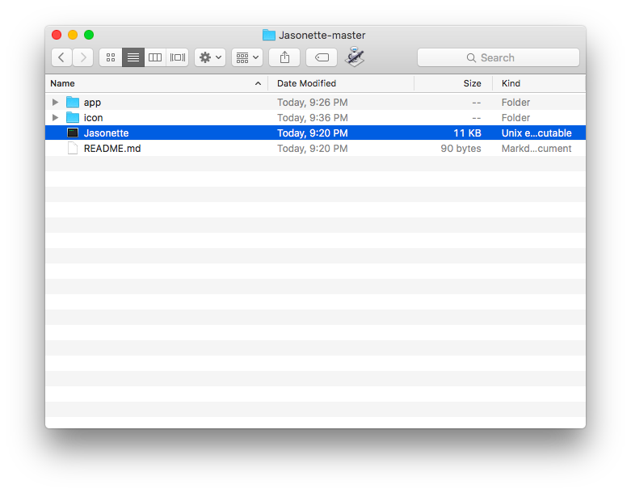
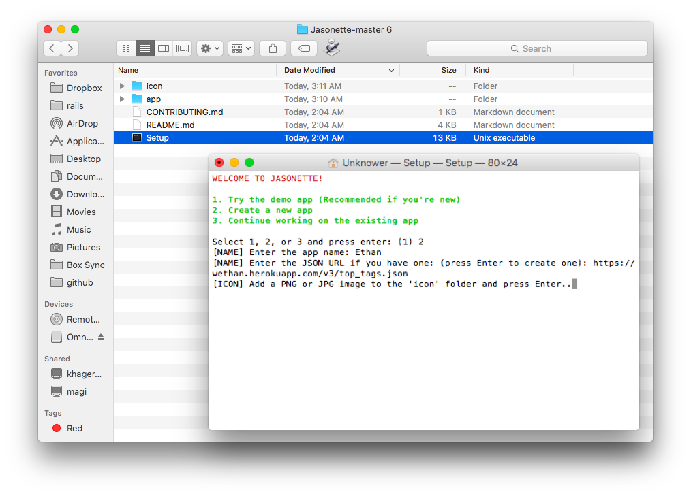
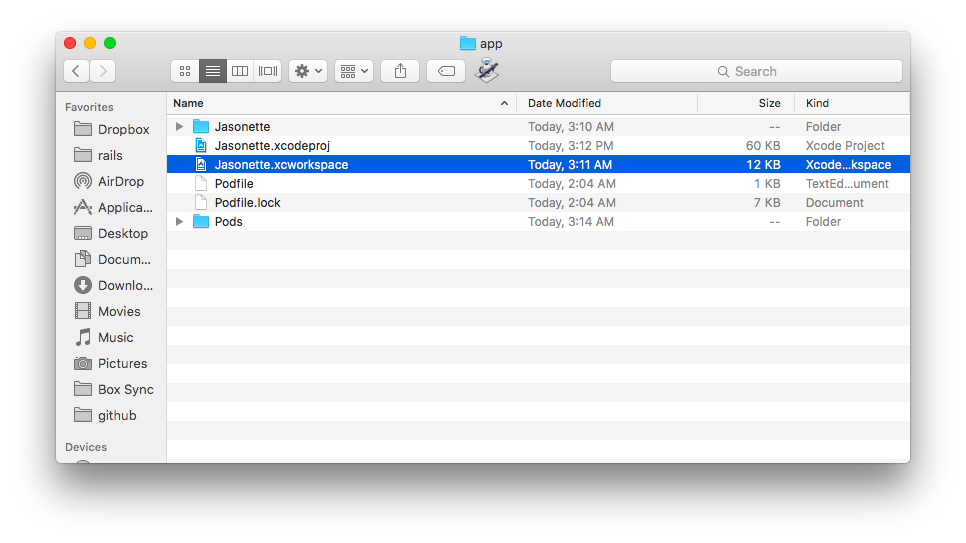
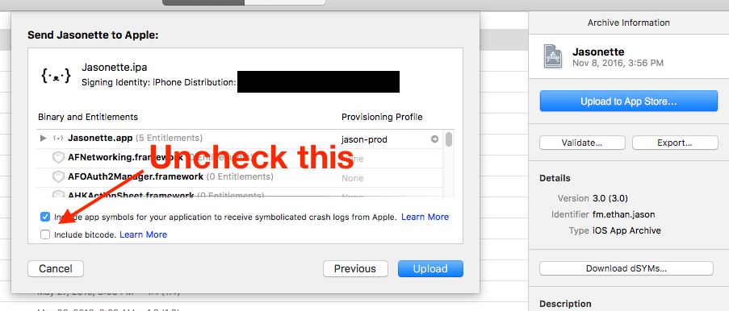
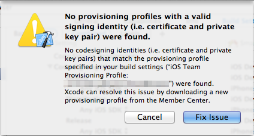
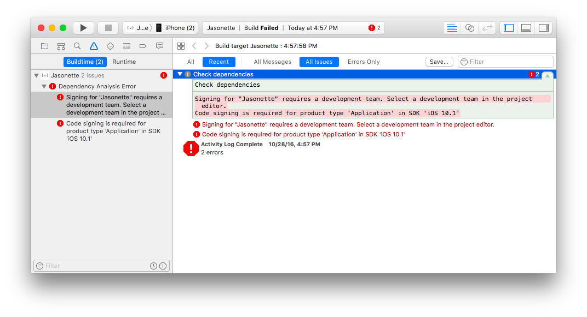
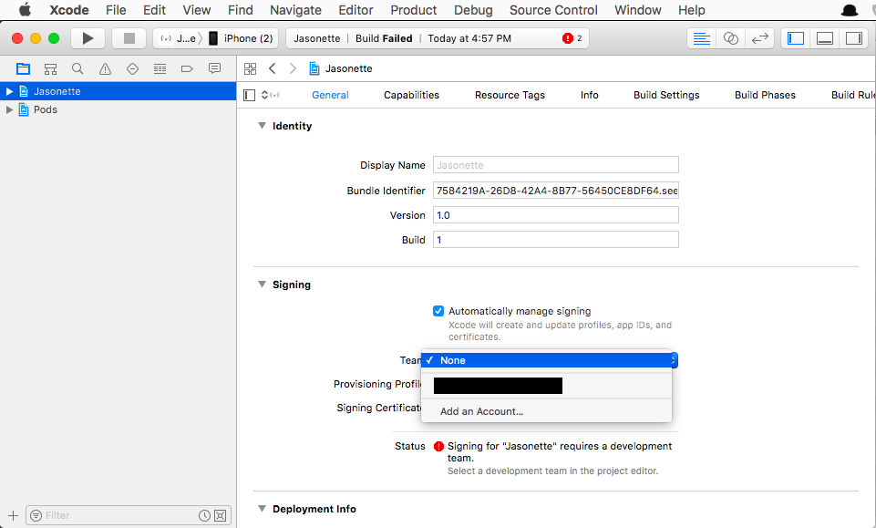

<h1><i class='icon fa-apple'></i> Set up Jasonette iOS</h1>
Ready? Let's get your first Jasonette app on your phone, in 20 seconds! [Interested in manual setup?](#manual-setup)

<i class='icon fa-exclamation-circle'></i> Want to skip the setup and try Jasonette without building your own app? - <a href='../jason'><b>Try Jason.</b></a>

---

##Step 1. DOWNLOAD

Jasonette itself is a pre-built app. All you need to do is download and build with <a href='https://itunes.apple.com/us/app/xcode/id497799835?mt=12'>XCode</a>.
  
Go ahead and download Jasonette, and then unzip.
  
<a href='https://github.com/Jasonette/JASONETTE-iOS/archive/master.zip' class='btn'><i class='fa fa-download'></i> Download Jasonette-iOS</a>

 

##Step 2. SETUP
Initialize by running the `Setup` command.

This command automatically generates icons and sets the title and the url. 

<i class='icon fa-exclamation-circle'></i> <b>BEFORE YOU START:</b> Make sure you have the most recent version of XCode! (At least XCode 8) You can download it <a href='https://itunes.apple.com/us/app/xcode/id497799835?mt=12'>Here</a>.

 
 

##Step 3. PLAY
Connect your phone and click play on XCode. Done!

---

## ★ Did it work?

 

  - ###YES?
    - Congratulations! You're ready to transform this into your OWN app! Go on to the [tutorial](../#step-2-learn)

 

  - ###NO?
    - **[Check troubleshoot section](#troubleshoot)**

---
# Manual setup

It is recommended that you use [the Setup command](#step-2-setup) since it takes care of most of tedious details, but you can also do this manually.

 

###Step 1. Download

[Download Jasonette](https://github.com/Jasonette/JASONETTE-iOS/archive/master.zip) and unzip.

 

###Step 2. Open in XCode
Go into the `app` folder and open `Jasonette.xcworkspace` file. **(warning: Make sure to open the `xcworkspace` file, NOT the `xcodeproj` file!)**

 

###Step 3. Update config attributes and generate icons manually

- **Set App Name:** Under the `Config` group, open the `Info.plist` file and change the `CFBundleName` attribute.
- **Set Root URL:** Under the `Config` group, open the `settings.plist` file and change the `url` attribute.
- **Generate Icon:** You can try generating app icons using online services like [makeappicon.com](https://makeappicon.com/), and [add them manually to the project](https://makeappicon.com/import-icons-into-xcode).

 

###Step 4. Play
Connect your phone and click play on XCode. Done!

---

# Submitting to the app store

There are a couple of things to keep in mind when submitting to the app store.

##1. Sign up as Apple Developer
You can test as much as you want without signing up as a developer, you can even put apps on your phone. However when it comes to actually submitting apps, you need to register as a developer. Google "apple developer" to learn how to do this.

 

##2. Archive and Upload
Assuming you're all ready, you just need to "archive" the app first, and then press "upload to app store".

 

##3. Uncheck "Include bitcode"

When you press "upload to app store", it will show up a confirmation dialog. Uncheck "Include bitcode" option here. We do not need Bitcode because Jasonette is already small due to its modularity, and it actually may become larger. In fact including bitcode doesn't work well with Jasonette, so make sure you uncheck this.

---

# Troubleshoot

## ■ "Unknown property attribute 'class'"

 

 

###This is known to happen in old versions of XCode. Please upgrade your XCode to the [latest version](https://itunes.apple.com/us/app/xcode/id497799835?mt=12)

---

## ■ "No provisioning..." error

 

 

###Just press "Fix Issue" and sign in with your Apple account

**[If that doesn't work, read this post](http://apple.stackexchange.com/a/206130)**

---

## ■ "Signing for "Jasonette" requires a development team. Select a development team in the project editor."
 

 

1. Select the project from XCode.
2. Go to "General" section.
3. Click "Team" under Signing section. Switch it from "None" to your existing team. If you don't have one, select "Add an account" to add your own Apple account.

 

---

## ■ "Code signing is required for product type 'Application' in SDK"
 

 

1. Select the project from XCode.
2. Go to "General" section.
3. Click "Team" under Signing section. Switch it from "None" to your existing team. If you don't have one, select "Add an account" to add your own Apple account.

 

---

## ■ "Untrusted Enterprise Developer"
Keep getting "Untrusted Enterprise Developer" alert when you try to open the installed app?

 

<iframe width="640" height="360" src="https://www.youtube.com/embed/EG9spHluLKg?rel=0" frameborder="0" allowfullscreen></iframe>

 

Or read the Apple Guideline below:

**[Guidelines for installing custom enterprise apps on iOS](https://support.apple.com/en-us/HT204460)**

---

## ■ "Can't be opened because it is from an unidentified developer."

Do you get the following error when you try to execute the `Setup` command?

 

 

**[This article will help you](http://www.iclarified.com/28180/how-to-open-applications-from-unidentified-developers-in-mac-os-x-mountain-lion)**

---

## ■ "... is busy: Processing symbol files"

Do you get this alert when you press the `play` button?

 

 

**Just wait for a bit until the progress bar gets to the end, and then retry.**

---

## ■ "Offline mode"

In the current implementation of Jasonette, this message means either:

1. There's a problem with your network.
2. There's something wrong with your JSON markup and Jasonette is not able to interpret it correctly.

Please first check the network to see other apps are working fine. After that, check your JSON, keep simplifying it down until you find the problematic markup.

---

## Need more help?

  - **Slack - **  Come ask quick questions and share tips with other Jasonette users. [Join here](https://jasonette.now.sh)

	

  - **Forum - **  Chat messages on Slack tend to flow away, so you may want to ask questions on the forum. Also it's good for future users who may have the same problem. All messages on the forum will be read. Visit here: [https://forum.jasonette.com](https://forum.jasonette.com)

