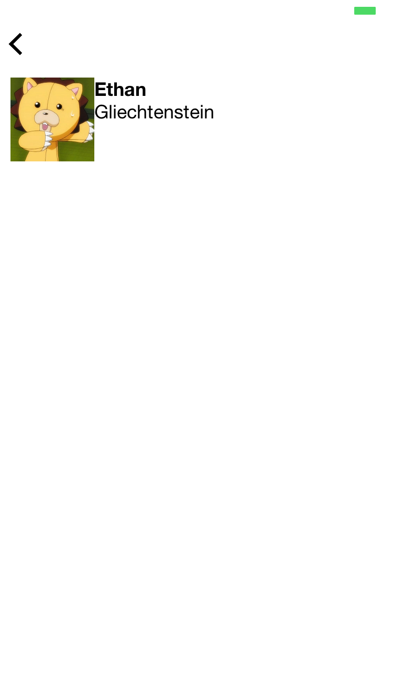
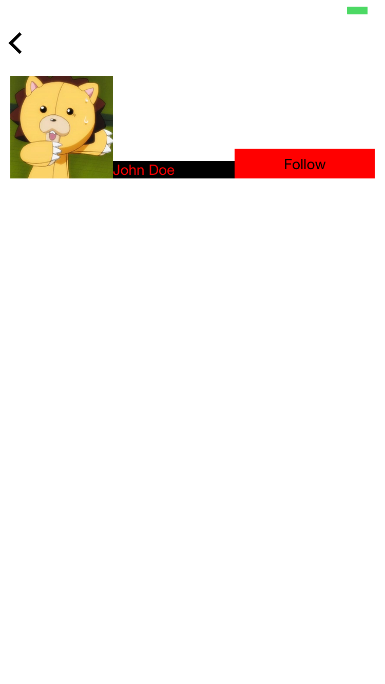

# Types of layout

You can construct all kinds of sophisticated UIs for [section items/headers](document.md#items) by laying out multiple [components](components.md) vertically, horizontally, or through combination of the two.

  - [vertical](#vertical)
  - [horizontal](#horizontal)
  - [nested](#nested-layout)

---

## vertical
In a vertical layout, the item's components flow vertically, from top to bottom.

### Example

    {
      "$jason": {
        "head": {
          "title": "vertical layout demo"
        },
        "body": {
          "sections": [{
            "items": [
              {
                "type": "vertical",
                "components": [{
                  "type": "label",
                  "text": "John Doe"
                }, {
                  "type": "label",
                  "text": "33"
                }, {
                  "type": "label",
                  "text": "A normal guy with a normal name"
                }]
              }
            ]
          }]
        }
      }
    }

Above JSON will render into the following view:

---

## horizontal
In a horizontal layout, the item's components flow horizontally, from left to right.

### Example

    {
      "$jason": {
        "head": {
          "title": "horizontal layout demo"
        },
        "body": {
          "sections": [{
            "items": [{
              "type": "horizontal",
              "components": [{
                "type": "image",
                "url": "https://pbs.twimg.com/profile_images/557061751150112768/eMwi4Xz2.jpeg",
                "style": {
                  "width": "80"
                }
              }, {
                "type": "label",
                "text": "Ethan",
                "style": { "font": "HelveticaNeue-Bold" }
              }]
            }]
          }]
        }
      }
    }

Above JSON will render into the following view:

---

## Nested layout
A layout can also contain another layout as one of its components. This way you can create any type of sophisticated layout you want by nesting one layout inside another.

Here's an example:

    {
      "$jason": {
        "head": {
          "title": "nested layout demo"
        },
        "body": {
          "sections": [{
            "items": [{
              "type": "horizontal",
              "components": [{
                "type": "image",
                "url": "https://pbs.twimg.com/profile_images/557061751150112768/eMwi4Xz2.jpeg",
                "style": {
                  "width": "80"
                }
              }, {
                "type": "vertical",
                "components": [{
                  "type": "label",
                  "text": "Ethan",
                  "style": { "font": "HelveticaNeue-Bold" }
                }, {
                  "type": "label",
                  "text": "Gliechtenstein"
                }]
              }]
            }]
          }]
        }
      }
    }

Above JSON will render into the following view:

---

# Styling a layout

## syntax
### ■  padding
the space surrounding the layout itself, in pixels.

If not specified, the default value is `10`.
### ■  spacing
the space among each immediate children components, in pixels.
### ■  background
background color code (Example: `{"background": "#ff0000"}`, `{"background": "rgba(0,0,0,0.4)"}`)
### ■  z_index
specifies the stack order of the layout, defining whether the layout is displayed on top of another or below. Default is 0. (Example: `{"z_index": "-1"}`
### ■ opacity
opacity (between "0" and "1")
### ■  align
How the children components will be aligned perpendicular to the layout's direction.

  - For vertical layout
    - `left`: align left
    - `center`: align center horizontally
    - `right`: align right

  - For horizontal layout
    - `top`: align top
    - `center`: align center
    - `bottom`: align bottom
    - `fill`: stretch all children vertically to fit the layout height equally

### ■  distribution
Describes how the children components should be distributed in relation to one another.

Normally you don't need to use this property, but this comes in handy when you just want child components to automatically stretch to each have the same size.

  - For vertical layout
    - `"fill"`: The child components stretch to fill the layout (default)
    - `"equalsize"`: The child components have the same size. Use this if you didn't specify height for any of them but want them to just expand to fill the layout each with the same height.

  - For horizontal layout
    - `"fill"`: The child components stretch to fill the layout (default)
    - `"equalsize"`: The child components have the same size. Use this if you didn't specify width for any of them but want them to just expand to fill the layout each with the same width.

##examples
###Example 1. Vertical layout with center align
In case of vertical layout, it describes how the children components should be aligned horizontally.

Below, we see that the vertical layout has `"align": "center"` style.

    {
      "$jason": {
        "head": {
          "title": "center aligned vertical layout"
        },
        "body": {
          "sections": [{
            "items": [{
              "type": "vertical",
              "style": {
                "align": "center"
              },
              "components": [
                {
                  "type": "image",
                  "url": "https://pbs.twimg.com/profile_images/557061751150112768/eMwi4Xz2.jpeg",
                  "style": {
                    "width": "100"
                  }
                },
                {
                  "type": "label",
                  "style": {
                    "color": "#000000",
                    "background": "#ff0000"
                  },
                  "text": "John Doe"
                },
                {
                  "type": "button",
                  "text": "Follow",
                  "style": {
                    "color": "#ff0000",
                    "background": "#000000"
                  }
                }
              ]
            }]
          }]
        }
      }
    }

This would render into the following view:

####Notice how all components--image, label, and button--are center aligned.

---

###Example 2. Horizontal align with bottom align
In case of horizontal layout, `align` describes how the children components should be aligned vertically.

    {
      "$jason": {
        "head": {
          "title": "bottom aligned horizontal layout"
        },
        "body": {
          "sections": [{
            "items": [{
              "type": "horizontal",
              "style": {
                "align": "bottom"
              },
              "components": [
                {
                  "type": "image",
                  "url": "https://pbs.twimg.com/profile_images/557061751150112768/eMwi4Xz2.jpeg",
                  "style": {
                    "width": "100"
                  }
                },
                {
                  "type": "label",
                  "style": {
                    "background": "#000000",
                    "color": "#ff0000"
                  },
                  "text": "John Doe"
                },
                {
                  "type": "button",
                  "style": {
                    "background": "#ff0000",
                    "color": "#000000"
                  },
                  "text": "Follow"
                }
              ]
            }]
          }]
        }
      }
    }

Above JSON will render into:

####Notice how all components--image, label, and button--are bottom aligned.

---

###Example 3. Padding and Spacing

    {
      "$jason": {
        "head": {
          "title": "Padding and spacing demonstration",
          "styles": {
            "label_class": {
              "background": "#ff0000",
              "padding": "10",
              "color": "#ffffff"
            }
          }
        },
        "body": {
          "style": {
            "background": "#00ff00",
            "border": "#000000"
          },
          "sections": [{
            "items": [
              {
                "type": "vertical",
                "components": [{
                  "type": "label",
                  "class": "label_class",
                  "text": "First row"
                }, {
                  "type": "label",
                  "class": "label_class",
                  "text": "Second row"
                }, {
                  "type": "label",
                  "class": "label_class",
                  "text": "Third row"
                }]
              },
              {
                "type": "vertical",
                "style": {
                  "padding": "50"
                },
                "components": [{
                  "type": "label",
                  "class": "label_class",
                  "text": "First row"
                }, {
                  "type": "label",
                  "class": "label_class",
                  "text": "Second row"
                }, {
                  "type": "label",
                  "class": "label_class",
                  "text": "Third row"
                }]
              },
              {
                "type": "vertical",
                "style": {
                  "padding": "50",
                  "spacing": "10"
                },
                "components": [{
                  "type": "label",
                  "class": "label_class",
                  "text": "First row"
                }, {
                  "type": "label",
                  "class": "label_class",
                  "text": "Second row"
                }, {
                  "type": "label",
                  "class": "label_class",
                  "text": "Third row"
                }]
              }
            ]
          }]
        }
      }
    }

Above JSON turns into the following view:

 

---

#### ★ Here's what's going on:

 

#####1. The first row has **NO padding** and **NO spacing** values.
As mentioned above, if no padding is specified, the default is `10`.

That's why we see the small gap between the red label and the edges.

 

#####2. The second row has a padding of `50`.
That's why we see a larger gap (`50` pixels)

 

#####3. The third row has the same padding as #2, but also a `spacing` of `10`.
The `spacing` attribute defines the space in pixels among child components. That's why we now see `10` pixels in between the red labels.
 
