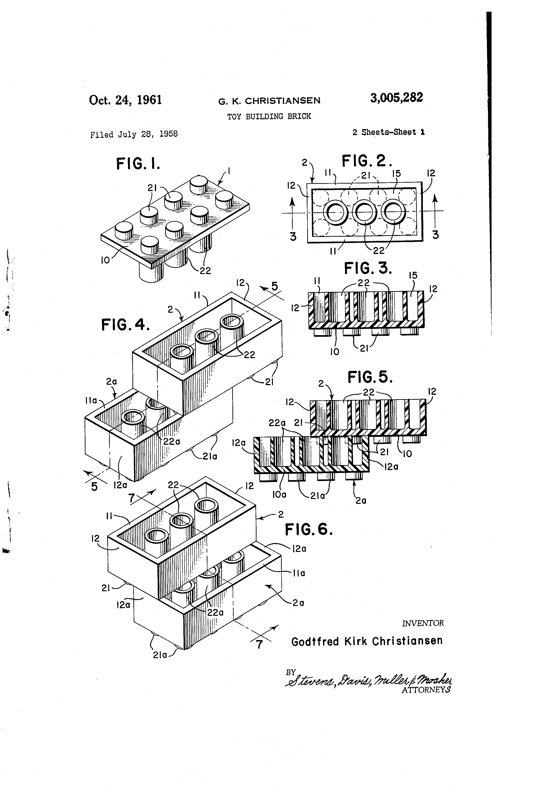

Just like you can build a car, build a castle, or build a spaceship by composing simple lego bricks, you can build an entire application by composing multiple JSON files.

---

##■ Basics

You can use `@` to mix-in a remote JSON object.

Let's say `https://lorem.ipsum/simpsons.json` contains the following content:

    ["Homer", "Marge", "Lisa", "Bart", "Maggie"]

We can mix this into our JSON simply by doing this:

    {
      "the_simpsons": {
        "firstnames": {
          "@": "https://lorem.ipsum/simpsons.json"
        },
        "lastname": "Simpson"
      }
    }

Jasonette fetches the JSON from the URL and simply replaces it with the `@` node.

Here's the result:

    {
      "the_simpsons": {
        "firstnames": ["Homer", "Marge", "Lisa", "Bart", "Maggie"],
        "lastname": "Simpson"
      }
    }

 

##■ How it works

It's useful to understand how this works internally. Whenever Jasonette loads a single JSON file here's what happens:

1. Load JSON from a URL.
2. Jasonette scans the JSON to resolve the mixins if any.
3. Sometimes it's not enough to resolve it once, especially when you mix [remote mixins with local mixins](#mix-remote-and-local-mixins). Jasonette continues mixin resolution until everything is resolved.
4. Jasonette draws the view.
5. The system triggers `$load` / `$show` events.

** Note 1: All mixins resolutions are carried out in parallel, and the rendering starts only when all mixins have resolved (or failed).**

** Note 2: In case an endpoint doesn't respond or returns an error, that part gets resolved as an empty string and silently fails instead of halting everything.**

** Note 3: The order is important. Since the mixin resolution happens BEFORE actual rendering, you can even mix-in a template expression from a remote JSON**

 

##■ Multiple Mixins

You are not limited to a single mixin. You can mix-in as many remote JSON urls as you want. For example:

    {
      "cats": {
        "@": "https://lorem.ipsum/cats.json"
      },
      "dogs": {
        "@": "https://lorem.ipsum/dogs.json"
      },
      "monsters": {
        "@": "https://lorem.ipsum/monsters.json"
      }
    }

Jasonette automatically detects all occurrences of mixins in a JSON file, fetches them in parallel, and attaches them to their corresponding locations.

 

##■ Anywhere in the JSON tree

You can reference URLs anywhere in the JSON tree, as many times as you want. They will all be downloaded in parallel at load time and substituted in automatically.

    {
      "$jason": {
        "head": {
          "data": {
            "users": {
              "@": "https://lorem.ipsum/data.json"
            }
          },
          "templates": {
            "body": {
              "sections": [{
                "items": {
                  "{{#each users}}": {
                    "@": "https://lorem.ipsum/user_item_template.json"
                  }
                }
              }]
            }
          }
        }
      }
    }

You can even create an entire JSON tree with a mixin:

    {
      "@": "https://jasonbase.com/things/3nf.json"
    }

This particular example may seem silly but it becomes powerful when combined with the [override](#overriding-mixed-in-values) feature.

Basically you can use this to mix-in a base JSON you wish to inherit from, and then simply add a small amount of code to customize it. [See "override" section](#overriding-mixed-in-values) for details.

 

##■ Partial Mixin

Sometimes you may want to mix-in only the subtree of a remote JSON file.

In this case, we use the following syntax:

    [JSON_PATH]@[JSON_URL]

For example, let's say we have a "drinks" database at `https://drinks.db/drinks.json`.

    {
      "drinks": {
        "coffee": ["ethiopia", "sumatra", "nigeria"],
        "tea": ["english breakfast", "chai", "green", "oolong", "yerba mate"],
        "sparkling water": ["perrier", "poland spring", "la croix", "s. pellegriono"]
      }
    }

We want to only use the coffee database, how do we do this? 

    {
      "coffee": {
        "@": "drinks.coffee@https://drinks.db/drinks.json"
      }
    }

As you can see, we're prefixing the URL with the path `drinks.coffee` so it assigns only that subtree into the coffee attribute.

 

##■ Overriding mixed in values

Sometimes you may want to mix-in and override certain attributes from the mixed-in JSON.

In this case you simply define the attribute locally and it will automatically override the mixed-in value.

Let's say we have a JSON at `https://jasonbase.com/things/dnf.json` that looks like this:

    {
      "type": "label",
      "text": "this is a placehlder",
      "style": {
        "font": "HelveticaNeue",
        "size": "12"
      }
    }

We may want to use this JSON somewhere but also customize the `text` part so that it doesn't say `this is a placeholder`. Here's how you would do it:

    {
      "items": [{
        "@": "https://jasonbase.com/thing/dnf.json",
        "text": "This is a custom label"
      }]
    }

Here's what happens when Jasonette sees this JSON:

1. It first mixes the referenced JSON in.
2. And then it goes through the rest of the attributes.
3. If there's a collision, it overrides the mixed-in value with the local value.
4. Keep going until all key/value pairs are processed.

In this case it ends up overriding the `text` attribute. The result:

    {
      "items": [{
        "type": "label",
        "text": "This is a custom label",
        "style": {
          "font": "HelveticaNeue",
          "size": "12"
        }
      }]
    }

##■ Self Mixin

Mix-in is not limited to remote JSON files. A JSON can even mix-in itself and its own subtree to another location within itself.

To access the current JSON object, you just need to use the `$document` object.

Here's an example:

    {
      "users": {
        "{{#each users}}": {
          "@": "$document.item"
        }
      },
      "item": {
        "type": "label",
        "text": "{{name}}"
      }
    }

Here, the `$document.item` is equivalent to:

    {
      "type": "label",
      "text": "{{name}}"
    }

After the mix-in resolution finishes, it turns into:

    {
      "users": {
        "{{#each users}}": {
          "type": "label",
          "text": "{{name}}"
        }
      },
      "item": {
        "type": "label",
        "text": "{{name}}"
      }
    }

Another example:

    {
      "custom_templates": {
        "item": {
          "type": "label",
          "text": "{{name}}",
          "style": {
            "color": "#ff0000",
            "size": "12"
          }
        }
      },
      "$jason": {
        "head": {
          "templates": {
            "body": {
              "sections": [{
                "items": {
                  "{{#each $jason.items}}": {
                    "@": "$document.custom_templates.item"
                  }
                }
              }]
            }
          }
        }
      }
    }
      
When parsed, this turns into: 

    {
      "custom_templates": {
        "item": {
          "type": "label",
          "text": "{{name}}",
          "style": {
            "color": "#ff0000",
            "size": "12"
          }
        }
      },
      "$jason": {
        "head": {
          "templates": {
            "body": {
              "sections": [{
                "items": {
                  "{{#each $jason.items}}": {
                    "type": "label",
                    "text": "{{name}}",
                    "style": {
                      "color": "#ff0000",
                      "size": "12"
                    }
                  }
                }
              }]
            }
          }
        }
      }
    }

##■ Mix remote and local mixins

You can do all kinds of things when you combine remote mixins with local mixins.

Let's revisit the above example:

    {
      "custom_templates": {
        "item": {
          "type": "label",
          "text": "{{name}}",
          "style": {
            "color": "#ff0000",
            "size": "12"
          }
        }
      },
      "$jason": {
        "head": {
          "templates": {
            "body": {
              "sections": [{
                "items": {
                  "{{#each $jason.items}}": {
                    "@": "$document.custom_templates.item"
                  }
                }
              }]
            }
          }
        }
      }
    }

We can extract out the `custom_templates` as its own JSON file.

Let's save it at `https://custom.templates/item.json`.

    {
      "item": {
        "type": "label",
        "text": "{{name}}",
        "style": {
          "color": "#ff0000",
          "size": "12"
        }
      }
    }

Then we can update the code like so:

    {
      "custom_templates": {
        "@": "https://custom.templates/item.json"
      },
      "$jason": {
        "head": {
          "templates": {
            "body": {
              "sections": [{
                "items": {
                  "{{#each $jason.items}}": {
                    "@": "$document.custom_templates.item"
                  }
                }
              }]
            }
          }
        }
      }
    }

Let's go deeper. We will save everything under `$jason` into `https://blahblah.blah/view.json`:

    {
      "$jason": {
        "head": {
          "templates": {
            "body": {
              "sections": [{
                "items": {
                  "{{#each $jason.items}}": {
                    "@": "$document.custom_templates.item"
                  }
                }
              }]
            }
          }
        }
      }
    }

Then we can update the original code down to:

    {
      "custom_templates": {
        "@": "https://custom.templates/item.json"
      },
      "@": "https://blahblah.blah/view.json"
    }

There! An entire app in 6 lines of JSON.
