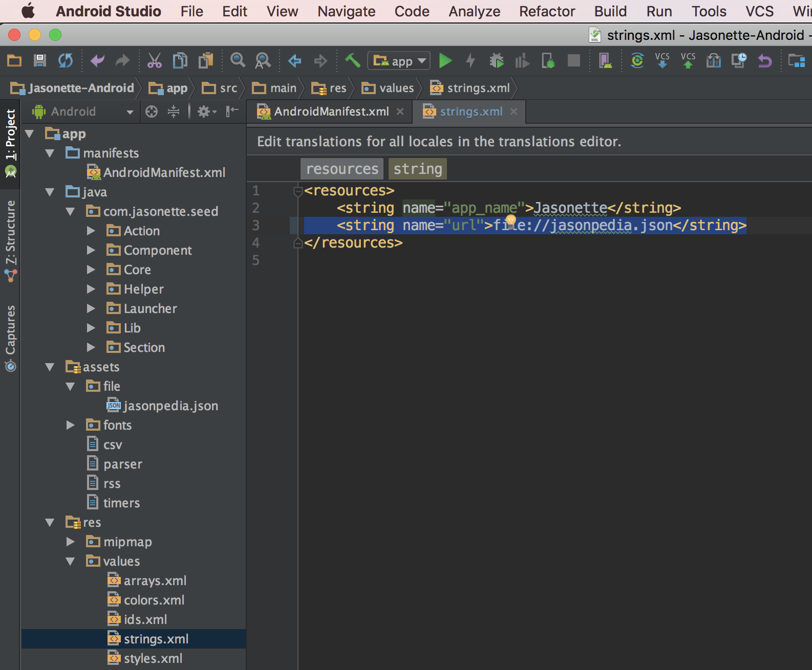
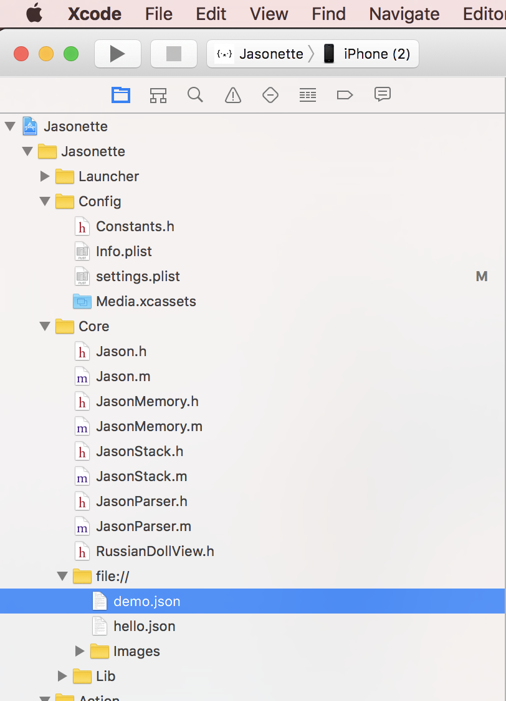
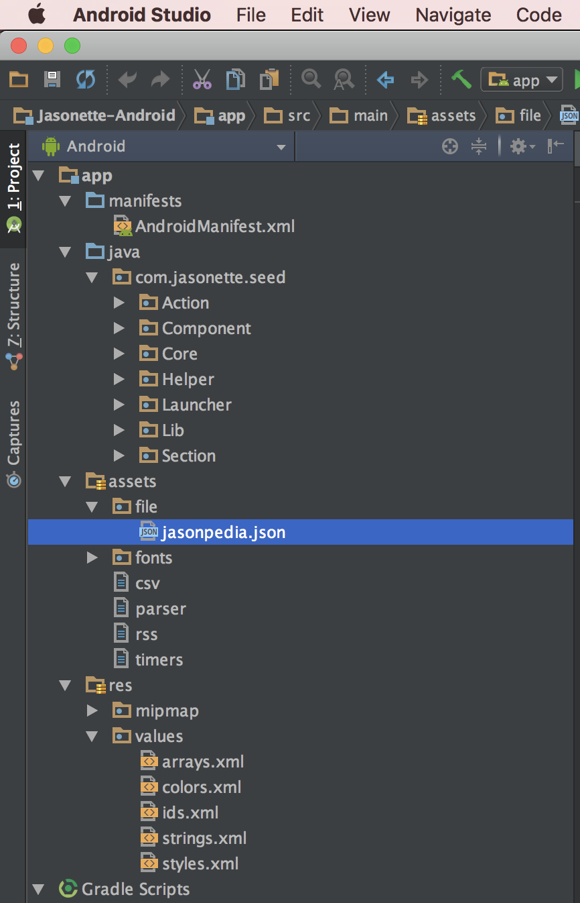
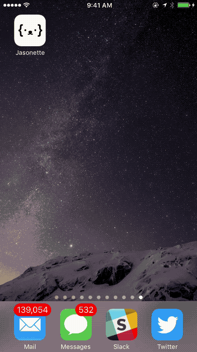
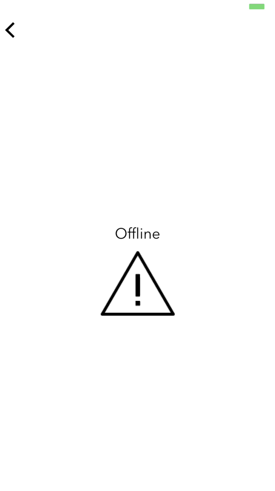

# What does "Offline" mean?

Jasonette supports various offline features.

Note that "offline" doesn't mean your entire app needs to be offline. Parts of your app can be online and parts of it can be offline.

This is because **everything** on Jasonette is described in JSON. You can selectively load your JSON from multiple sources and combine them together. You can do things like:

1. Store the model locally, and load view and controller from remote.
2. Store the view and controller locally, and load model from remote.
3. Store all model, view, controller locally.
4. Etc.

But this is just the basics. Imagine what's possible when you use [mixins](/mixin). You can mix and match different modules from different sources, some online, some offline, to finally construct the final app.

---

# Features


1. [Loading from Local File](#1-loading-from-local-file)
2. [Global Key-value Persistent Store](#2-global-key-value-persistent-store)
3. [Automatic JSON Caching](#3-automatic-json-caching)
4. [Data-uri](#4-data-uri)
5. [Loading Screen](#5-loading-screen)
6. [Error Screen](#6-error-screen)

---

## 1. Loading from Local File

Just like you can fetch remote files over `http` to construct a Jasonette app, you can also use local files packaged with the app, using a file url scheme (`file://`)

<br>

### Using File URL Scheme

<br>

> **A. Home URL **
>
> Instead of setting a remote URL you can point it to a local JSON file.

<br>

> Here's what it looks like on Android:
>
>  <br>
>
>

<br>

> Here's what it looks like on iOS:

>

---

> **B. Offline HREF**

>You can also `href` into local JSON URLs:
```
    {
      "type": "label",
      "text": "Go",
      "href": {
        "url": "file://demo.json"
      }
    }
```

---

> **C. Offline Require**

>You can [$require](/actions/#require) offline JSON URLs:

```
    {
      "type": "$require",
      "options": {
        "items": ["file://item1.json", "file://item2.json"]
      }
    }
```

---

> **D. Offline Mixin**

>You can use file urls with [mixins](/mixin):

```
    {
      "@": "file://mixin.json",
      "items": [],
      ...
    }
```

---

> **E. Offline Images**
>
> Jasonette not only lets you render remote images but also lets you bundle them up on the app locally and load them locally. Just like you can use the [file:// scheme](#2-file-url) to render local JSON objects, you can use the same `file://` scheme to access locally stored images.

```
{
  "type": "image",
  "url": "file://avatar.png"
}
```

> Supported everywhere:

>- [body.background](/document/#background)
>- [header.menu](/document/#menu)
>- [header.title](/document/#title)
>- [footer.tabs](/document/#tabs)
>- [footer.input](/document/#input)
>- [image component](/components/#image)
>- [button component](/components/#button)
>- [image layers](/document/#typeimage)


---

<br>

### Storing files locally

To utilize this feature, you first need to store files under the right folders. Let me show you how:

<br>

**iOS File URL**

1. Open XCode, go to `Jasonette > Core > file://` from the sidebar, and add your files there by drag and dropping.
2. Access using `file://your_filename.json`

<br>



<br>

** Android File URL**

1. Open Android Studio, go to `app > assets > file`. Copy and paste your files there.
2. Access using `file://your_filename.json`

<br>



<br>


---

## 2. Global Key-Value Persistent Store

Normally, variables on Jasonette are sandboxed per URL (local variables and cache).

However, a lot of times you may want to have a global variable that's accessible from all your views.
Also, you probably want them to be persisted so you can use it like a Database.

This is what global key-value store does.

The global key-value store is supported as an **action**. See [$global API section](/actions/#global) to learn more.


---

## 3. Automatic JSON caching

You can have best of both worlds (Stream the app on demand to keep it up-to-date all the time, as well as have the app logic cached locally so it loads instantly) by using the offline caching feature.

<br>

### How JSON caching works

1. The first time the app loads, Jasonette fetches the JSON from your server.

2. If you specify that you want to use offline caching, Jasonette will cache the entire JSON for that view.

3. Next time you open the view, Jasonette will load immediately from the offline cached version.

4. But it doesn't stop there, Jaasonette checks to see if the network is available, and if it is, it re-fetches the JSON and updates the view. The trick is **step 3** comes first, so it will ONLY update if the network is available. Otherwise you'll still have your offline cached version of your app.

<br>

### How to use

Offline caching is managed on a per-view basis. All you need to do to enable is put `"offline": "true"` under `$jason.head`, like this:

    {
      "$jason": {
        "head": {
          "title": "offline test",
          "offline": "true",
          ...
    }

---


## 4. Data-uri

Jasonette supports [data-uri](https://en.wikipedia.org/wiki/Data_URI_scheme) for urls. This means you can store the entire content within the URL itself. It's not always practical but there are several cases where you can get neat effects using this approach.

Try entering a data-url instead of http or https based url. It should work.

---

## 5. Loading Screen

The loading screen is displayed while a view is being loaded. 

It is loaded from `file://loading.json`, which comes with the project, but you can customize it as you like.

<br>



<br>

Remember, this is a full fledged JASON view, which means you can do anything you can do in a regular view.

1. If you don't want a loading view, replace it with an empty view.
2. If you want a simple background colour instead of loading animation, you can do so by setting the background color
3. You can get creative and use the [$global](/actions/#global) and [$env](/env) variables to construct custom loading screens for each view.

---

## 6. Error Screen

The error screen is displayed when the view fails to load because of network connection.

<br>



<br>

It is loaded from `file://error.json`, but you can customize it as you like.

Again, it's a full fledged JASON view, so anything you can do on a regular view is possible in the error view, such as rendering templates, running actions on certain events, etc.

---
