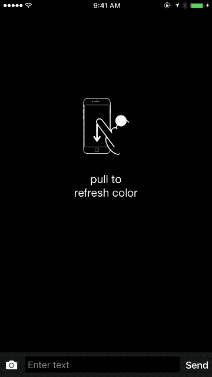
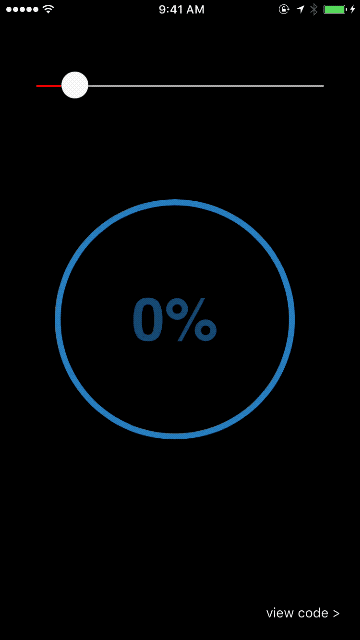
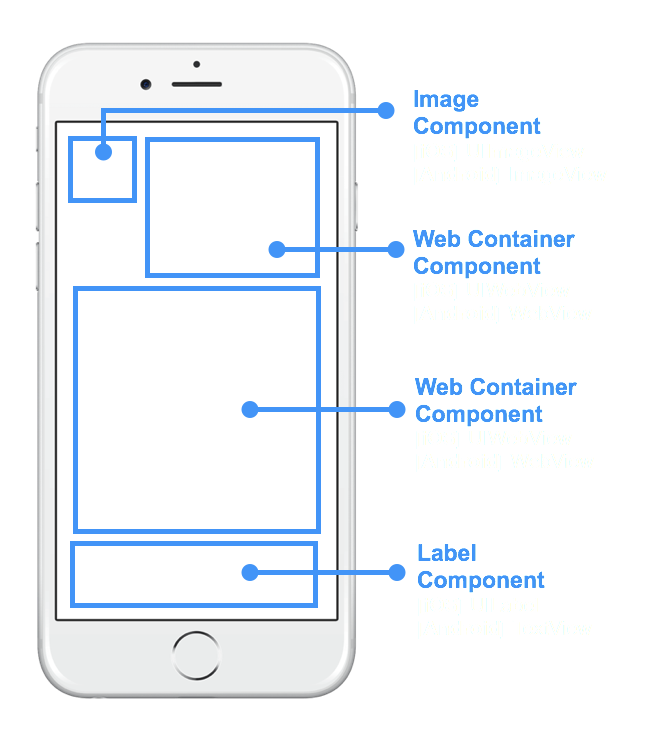
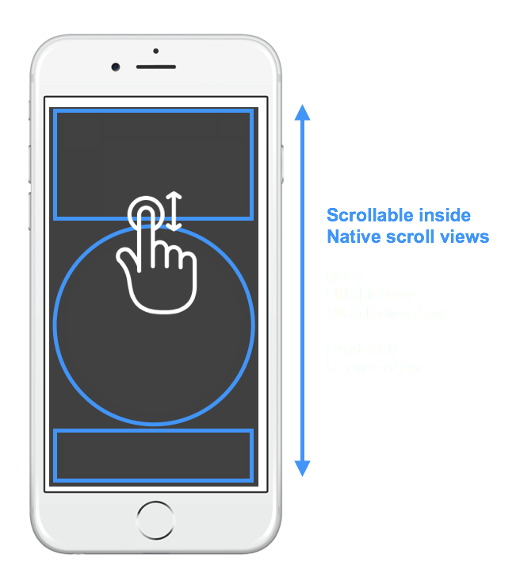
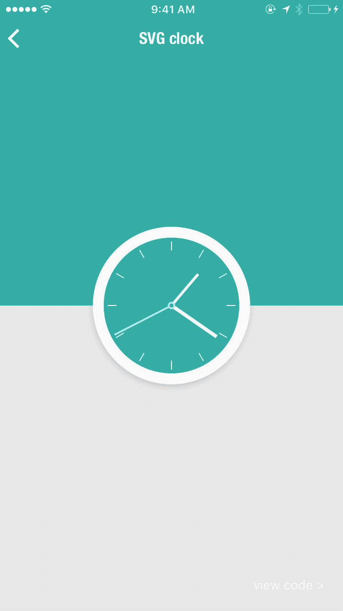
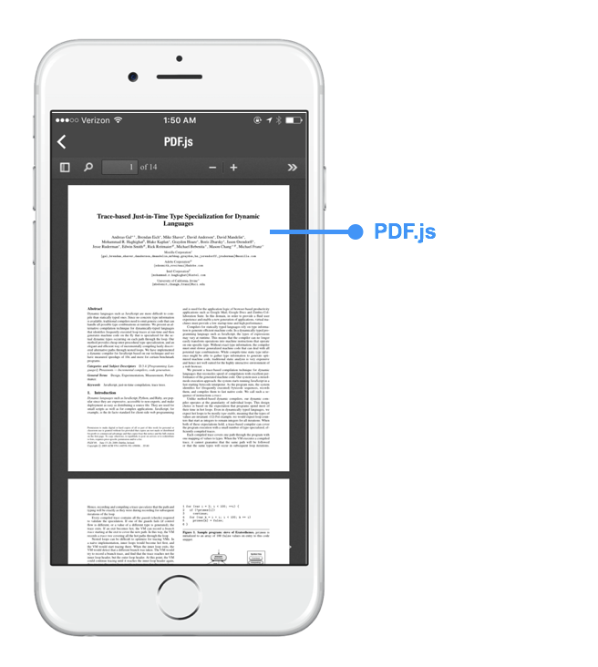
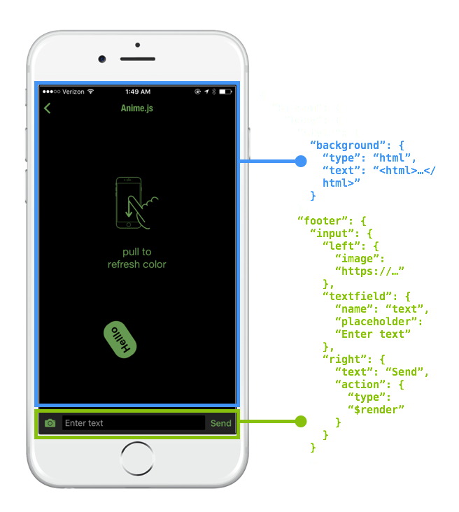

<div class="banner">
<i class="icon fa-exclamation-circle"></i> New to Jasonette? Check out <a href='/'>Getting Started with Jasonette</a> first.
</div>

# JSON Web Container

What if you could take any number of web elements, plug them straight into a native app layout, resize, scroll, interact with, and pretty much treat them just like any other [native components](components.md)?


<br>

Web Containers are self-contained web views that render into native app layout as native components.

Of course, the great part is you can describe them all in JSON, just like the rest of [Jasonette components](components.md).

<br>


<br>

Web containers are designed to be plugged into a native app layout alongside other [native components](components.md).

<br>

As you can see in above example, it's a combination of JSON and HTML.

First, use HTML/CSS/Javascript to describe the internals of the container view.

Then, [plug it into your native app using JSON](#usage) as just another [component](components.md).

<br>
<div class = 'vid'>
  <div class='content'>
    <div class='video-container'>
			<iframe width='1280' height='720' src="https://www.youtube.com/embed/D6Jm_MLnnTE" frameborder="0" allowfullscreen></iframe>
    </div>
  </div>
</div>
<br>

---

# Table of Contents

1. [Notice](#notice)
1. [Web containers in action](#web-containers-in-action)
1. [Features](#features)
1. [What is possible?](#what-is-possible)
1. [Usage](#usage)

<br>

---

# Notice

Before we jump in, just a few things:

1. The web container performs pretty nicely on modern mobile devices, in fact so nicely that sometimes you forget that you're using web containers. But don't go overboard with it. Native will always be more performant and you should use native whenever possible. Try experimenting and you'll reach the sweet spot.

2. A lot of design decisions around Web containers were made specifically for displaying rich dynamic content, which used to be tricky using just native components. Try to think of this as just another [component](components.md) and try not to use the web container to implement app logic. It will most likely result in bad user experience.

3. You can do a lot of cool things with this, such as implementing little animations here and there without having to invent a whole new JSON syntax because you can now just use CSS or Javascript animation. Also you can do things like text overlay over image simply by using CSS positioning. [Please share cool use cases you find](https://forum.jasonette.com).

4. This is just the first draft and intentionally minimal. We may add more features depending on how it goes. Feedback appreciated.

---

# Web Containers in Action

Web containers can be used both as a [fullscreen background](#or-use-as-fullscreen-background) and as an [inline component](#scroll-just-like-other-components). Here are some examples:

<br>

&shy; | &shy; 
--|--
Anime.js (Mix and match with native) | Native feed view + partial web
 | 
D3.js (Native slider controller + Web container output) | Canvas + JS Demo (Background type)
 |  
Anime.js (Animated HTML element inside native scroll view) | Phaser.js (Background type, with user interaction)
| 
Three.js (background type) | Three.js (background type)
| 


---

# Features

<br>
## Use alongside native components
Web containers plug into native layout alongside other native components so seamlessly that you won't even be able to tell the difference in most cases. It's just like any other [component](components.md)! Style and use them together with other native Jasonette components.



---

## Dissolve right into native layout
Same native [layout system](layout.md) you already know. 


---

## Scroll just like other components
Since it's just like any other component, you can use it in a scroll view, and scroll it just like label, button, image, etc.

**[Note] This is possible because of the [design decision](#1-web-container-content-scrolls-only-when-used-as-a-background) made to make the contents inside a web container NOT scrollable when contained within a scroll view (for obvious UX reasons).**



---

## Or use as fullscreen background
Not just for scrolling components. you can use it as a background by setting "html" type for background.


---

## Write once, use anywhere
You can use [mix-ins](mixin.md) to write a single HTML container inside JSON and mix them into any context such as the background or a layout.


---


# What is possible?
Since each Web container is basically a self-contained web view, you can do anything you can do with a browser, which includes any HTML markup, Javascript, and CSS styling.

<br>

## Canvas


---

## SVG & CSS


---

## iframe


---

## Javascript




---

## Interaction between native actions and Web container
[Templates](templates.md) work exactly the same as the rest of Jasonette. So you can use native UI elements as input, set [local variables](http://localhost:8000/actions/#variable), and re-render accordingly using the local variable to dynamically display output onto the web container. 


---

## Mix and match
Jasonette already has most of what you need to build sophisticated native apps, even without the web container.

But web containers can be powerful when seamlessly blended into the rest of the native app to perform things that were hard to do with existing Jasonette api.



---


# Usage

- [Syntax](#syntax)
- [Examples](#examples)
- [Important Tips (MUST READ)](#tips)

<br>

## Syntax

<br>

### 1. As Component

Just like rest of the Jasonette [components](components.md), you can plug it into [layouts](layout.md) and [scroll views(sections)](document.md#bodysections). 

web containers plugged in everywhere | using web container to animate text via JS
------|-----------------
 | 

* `type`: `"html"`
* `text`: A self contained HTML text (`<html>...</html>`), which means everything from `script` tag to `style` tag.
* `style`: **Required. Especially the height**. Web containers should NOT scroll, therefore everything outside of the `style.height` you specify will get cut off. This attribute is about how the web container looks from the outside. To style the HTML elements inside, just include the CSS inside the HTML markup. 
* `action`: (optional) Connect with any [action](actions.md) or a web container specific action: `"type": "$default"`.
    * **[IMPORTANT]** By default, web container content DOES NOT respond to user touch. This means if you click on a link inside the HTML, it won't do anything.
    * In order to override this behavior, attach a `"type": "$default"` action, so the web container knows.
    
```
{
  "items": [{
    "type": "html",
    "text": "<html>....</html>",
		"style": {
			"height": "100"
		},
    "action": {
      "type": "$default"
    }
  }]
}
```
<br>

### 2. As Background 

Web containers can be plugged into `body.style.background` too, which will take up the full screen.

Use any JS library | Interacting with HTML content via touch
------|-----------------
 | 

Same as component usage, except there's no need for `style`, and you can't attache an `action` other than `"type": "$default"`.

* `type`: `"html"`
* `url`: URL to load (`http://`, `https://`, `file://` supported)
* `text`: A self contained HTML text (`<html>...</html>`), which means everything from `script` tag to `style` tag.
* `style`: styling the web container
    * **background**: Background color
    * **progress**: The progressbar color. The background web container comes with a progressbar which displays the loading progress whenever a web page loads. Use this property to change its color (Ex: `"#ff0000"`, `rgb(255,0,0)`, `rgba(255,0,0,0.5)`)
* `action`: (optional) Connect with `"type": "$default"` in order to let the web container handle the touch event. Otherwise not needed.
    * **[IMPORTANT]** By default, web container content DOES NOT respond to user touch. This means if you click on a link inside the HTML, it won't do anything.
    * In order to override this behavior, attach a `"type": "$default"` action, so the web container knows.
    
Using a raw html text approach:

```
{
  "body": {
    "background": {
      "type": "html",
      "text": "<html>....</html>",
      "action": {
        "type": "$default"
      }
    }
  }
}
```

```
{
  "body": {
    "background": {
      "type": "html",
      "url": "https://www.google.com",
      "action": {
        "type": "$default"
      }
    }
  }
}
```

---

## In-Depth on Background web container

The background web container is a different beast than the component web containers.

Whereas [component web containers](#1-as-component) are purely meant for display purposes, the background web container can do a lot of things.

## 1. Background Web Container is an Agent

The background web container (`$jason.body.background`) is an agent. It's a special type of agent, but it's still powered by the same [agent](/agents) engine.

This means you can make JSON-RPC calls into the web container and let it have seamless 2-way communications with native Jasonette core.

<br>

But first, if you aren't aware of how agents work, check out the [agent](/agents) documentation and come back.

<br>

Back? A couple of things to note that makes web containers special:

1. Unlike other agents which are invisible, web container is visible (Obviously. That's what web containers are for)
2. Web container is a special type of agent. There can be only ONE per view (the `$jason.body.background`)
3. Unlike other "virtual" agents where you declare them under `$jason.head.agents`, you declare them just like any other body background. (`$jason.body.background`)
4. Other agents require an `id`, which you set under `$jason.head.agents`. Web container doesn't require an ID. It's automatically set to `$webcontainer`.
5. This means when you're making JSON-RPC calls into the web container, you will use `$webcontainer` as its ID, like this:

```
{
	"$jason": {
		"head": {
			"title": "Web Container Agent Demo",
			"actions": {
				"$load": {
					"type": "$agent.request",
					"options": {
						"id": "$webcontainer",
						"method": "add",
						"params": ["a", "b"]
					}
				}
			}
		},
		"body": {
			"background": {
				"type": "html",
				"url": "file://app.html"
			}
		}
	}
}
```

## 2. User Interaction

Depending on what you specify as the `action` attribute, you can make your web container behave in many different ways.

### A. Block user interaction

By default (if you don't specify any `action` attribute) users can't interact with web containers. In this case, you use it for view only purposes.

This may be necessary if

- you just want to use web container as a "display" and don't want users to interact with it.
- you don't want any scrolling behavior within the web container. This may conflict with the native view's own scroll view.

### B. Intercept URL visits

To intercept URL visits, you simply need to define an `action` attribute.

When you do so,

1. users can interact with the web container.
2. any attempt of the user trying to navigate away from the view (by clicking a link for example) will be intercepted.
3. When intercepted, it will make the action call specified under `body.background.action` instead of actually navigating away.
4. When the action is called, the web container will pass the following payload:

```
{
	"$jason": {
		"url": [The link the user was trying to navigate to]
	}
}
```

Here's an example:

```
{
	"$jason": {
		"head": {
			"title": "Web Container Agent",
			"actions": {
				"notify": {
					"type": "$utill.alert",
					"options": {
						"title": "Link Clicked",
						"description": "You just clicked {{$jason.url}}"
					}
				}
			}
		},
		"body": {
			"background": {
				"type": "html",
				"url": "file://app.html",
				"id": "app",
				"action": {
					"trigger": "notify"
				}
			}
		}
	}
}
```

In this case, the `body.background` has an `action` attribute, so it means users can interact with the web container.

When the user clicks any link on the page, it will trigger an action called `"notify"`.

The `notify` action (specified under `$jason.head.actions.notify`) will open an alert displaying the URL the user tried to navigate to.


### C. Or don't intercept.

Or you may want users to interact with the web container, but instead of intercepting, just let it behave like a plain web browser (just letting users visit new links)

You can do this by setting the action to `"type": "$default"`


```
{
	"type": "$agent.connect",
	"options": {
		"url": "file://app.html",
		"id": "app",
		"action": {
			"type": "$default"
		}
	}
}
```


### Intercepting a URL visit and doing a native transition

Using the interception approach you can intercept a user's intent to visit a link, and instead of doing a clumsy web-like page refresh, you can native transition into another Jason view with another web page contained in a web container.


```

file://native_transition.json

{
	"$jason": {
		"head": {
			"title": "Web Container Native Transition",
			"actions": {
				"$load": {
					"type": "$set",
					"options": {
						"url": [{
							"{{#if $params && 'url' in $params}}": "{{$params.url}}"
						}, {
							"{{#else}}": "https://www.google.com"
						}]
					},
					"success": {
						"type": "$render"
					}
				},
				"navigate": {
					"type": "$href",
					"options": {
						"url": "file://native_transition.json",
						"options": {
							"url": "{{$jason.url}}"
						}
					}
				}
			},
			"templates": {
				"body": {
					"background": {
						"type": "html",
						"url": "{{$get.url}}",
						"action": {
							"trigger": "navigate"
						}
					}
				}
			}
		}
	}
}
```

With the agent and its URL interception feature, now you can have a seamless interaction between the web container and its parent native app.

Normally when you click a link in an HTML document, it refreshes the page to send you to the linked page. This is in fact one of the primary reasons why HTML5 hybrid app approaches feel so clunky.

But now HTML documents loaded within a web container can:

1. **Trigger a native action**
2. **Make a native transition to another view**


---

## Example

<br>

### Display scrolling H1 elements

```
{
	"$jason": {
		"head": {
			"title": "Scrolling Web Container"
			"data": {
				"colors": [{
					"code": "#ff0000"
				}, {
					"code": "rgba(0,0,0,0.3)"
				}, {
					"code": "#00ff00"
				}, {
					"code": "rgb(130,43,32)"
				}]
			},
			"templates": {
				"body": {
					"sections": [{
						"items": {
							"{{#each colors}}": {
								"type": "html",
								"style": {
									"height": "50"
								},
								"text": "<html><head><style>h1{font-size: 30px; color: {{code}};}</style></head><body><h1>Hello World</h1></body></html>"
							}
						}
					}]
				}
			}
		}
	}
}
```

<br>

### iframe as background

```
{
  "$jason": {
    "head": {
      "title": "pdf.js"
    },
    "body": {
      "background": {
        "type": "html",
        "text": "<html><head><style>html{padding:0;margin:0;margin-top: 64px;} body,iframe{width:100%;height:100%;padding:0;margin:0;border:0;}</style><body><iframe src='https://mozilla.github.io/pdf.js/web/viewer.html'/></body></html>"
      }
    }
  }
}
```

<br>

### three.js as background

```
{
  "$jason": {
	"head": {
		"title": "pdf.js"
	},
	"body": {
    "background": {
      "type": "html",
      "text": "<html> <head> <style> body { margin: 0; padding: 0; background: #111; overflow: hidden; } .dg{visibility: hidden;}</style> </head> <body> <script src='https://cdnjs.cloudflare.com/ajax/libs/dat-gui/0.6.2/dat.gui.min.js'></script><script src='https://cdnjs.cloudflare.com/ajax/libs/jquery/2.1.3/jquery.min.js'></script><script src='https://cdnjs.cloudflare.com/ajax/libs/three.js/r50/three.min.js'></script><script> window.onload = function(){ var $container = $('#container'); var renderer = new THREE.WebGLRenderer({antialias: true}); var camera = new THREE.PerspectiveCamera(80,window.innerWidth/window.innerHeight,0.1,10000); var scene = new THREE.Scene(); var mouseX = 0, mouseY = 0; scene.add(camera); renderer.setSize(window.innerWidth, window.innerHeight); $container.append(renderer.domElement); window.addEventListener( 'resize', onWindowResize, false ); var Controls = function() { this.speed = 2; this.rotation = 0; }; var text = new Controls(), gui = new dat.GUI(); gui.add(text, 'speed', 0, 10); gui.add(text, 'rotation',0,15); var normalMaterial = new THREE.MeshNormalMaterial({}); function Torus(f){ this.b = new THREE.Mesh(new THREE.TorusGeometry( 160, 75, 2, 13),normalMaterial); this.b.position.x = 57*Math.cos(f); this.b.position.y = 57*Math.sin(f); this.b.position.z = f*1.25; this.b.rotation.z = f*0.03; } var numTorus = 80; var tabTorus = []; for(var i=0; i<numTorus; i++){ tabTorus.push(new Torus(-i*13)); scene.add(tabTorus[i].b); }  function update(){ for(var i=0; i<numTorus; i++){ tabTorus[i].b.position.z+=text.speed; tabTorus[i].b.rotation.z+=i*text.rotation/10000; if(tabTorus[i].b.position.z>0) { tabTorus[i].b.position.z=-1000; } } } function onWindowResize() { windowHalfX = window.innerWidth / 2; windowHalfY = window.innerHeight / 2; camera.aspect = window.innerWidth / window.innerHeight; camera.updateProjectionMatrix(); renderer.setSize( window.innerWidth, window.innerHeight ); } function onDocumentMouseMove(event) { mouseX = ( event.clientX - windowHalfX ); mouseY = ( event.clientY - windowHalfY ); } function render() { requestAnimationFrame( render); camera.position.x += ( mouseX - camera.position.x ) * .05; camera.position.y += ( - mouseY - camera.position.y ) * .05; renderer.render(scene, camera); update(); } render(); }; </script> <div id='container'></div> </body> </html>"
    },
		"style": {
			"border": "none",
			"color": "rgba(0,0,0,0)"
    }
  }
}
```

---


## Tips

** ⚠️  ⚠️  ⚠️  ⚠️  ⚠️  IMPORTANT. READ ALL!!!!     ⚠️  ⚠️  ⚠️  ⚠️  ⚠️  **

<br>

### 1. Web container content scrolls ONLY when used as a background

When you use a web container [as a background](#2-as-background), it scrolls just fine, and behaves like you would expect.

However when you use a web container [as a component inside a scrolling view](#1-as-component), the content inside **does not scroll** because the container itself is supposed to scroll. 


Which brings us to:

<br>

### 2. For component web containers: Must specify height when in scroll view

This applies only to component web containers. Every web container must have a fixed height when inside a scroll view (sections).

This is so that there exists no scrolling view within a scroll view, which is a bad user experience.

```
{
	...
	"sections": [{
		"items": [{
			"type": "html",
			"text": "<html>....</html>",
			"style": {
				"height": "100"
			},
			"action": {
				"type": "$default"
			}
		}, {
			...
		}],
		...
	}]
}
```

<br>

### 3. Use single quotes
Obviously, an entire HTML markup can be a long text. Sometimes it will contain double quotes and some characters that need to be escaped.

Since we're trying to package an entire HTML markup into a text attribute, you'll either need to escape these characters or use single quotes instead of double quotes.

<br>

### 4. Wrap all script content inside `window.onload = function() { ... }`

Because of the way native scroll views recycle their child items, you need to make sure your javascript lines are run AFTER the container has loaded.

To do this, wrap your Javascript inside `window.onload`. Here's an example:


```
{
  "type": "html",
  "text": "<html><head><style>.square{background: red; width: 50px; height: 50px;}</style><script src='https://cdnjs.cloudflare.com/ajax/libs/animejs/2.0.0/anime.min.js'></script><script>var x=200; var move = function() {var el = document.querySelector('#domNode .el'); var domNode = anime({ targets: el, translateX: x, translateY: x}); x=200-x;}; document.addEventListener('DOMContentLoaded', function(event) { setInterval(move, 1000); }); </script><body><div id='domNode'><div class='large square el'></div></div></body></html>"
}
```


<br>

### 5. By default, the HTML content does NOT respond to user input

HTML content inside a web container is NOT interactive by default. This means NOTHING will happen when you touch the contents inside, even if it's a link. (Especially if it's a link, because it would be weird to have a small portion of a native app redirect to a completely different web page)

<br>

The interaction is disabled by default because the web container is designed as a **dynamic output method** and **NOT as an input method**.

<br>

Web containers are very useful when it comes to **displaying rich dynamic content**, and this is the primary purpose of the web container. Also, in most cases we want to trigger native actions instead of letting the HTML content handle events. If we allowed HTML to handle user touch for example, then we wouldn't have a way to take advantage of Jasonette's [native actions](actions.md).

<br>

So whenever possible, use native components such as [textarea](components.md#textarea) or [textfield](components.md#textfield) to receive user input instead of trying to use the HTML`<form>` element. 

Also, keep in mind pure native components generally perform better too. Just use it wisely.

<br>

That said, there are some cases where it does make sense to let the HTML handle events. In which case you could:

<br>


## Technical Details

Under the hood, each web container is a containerized instance of web view. Here are some details:

- iOS
    - Component type web containers use [UIWebView](https://developer.apple.com/reference/uikit/uiwebview) because it's better for usage in a scrollview.
    - Background web containers use [WKWebView](https://developer.apple.com/documentation/webkit/wkwebview). It uses the same engine as [agents](/agents)
- Android
    - Both component type and background type web containers use [WebView](https://developer.android.com/reference/android/webkit/WebView.html)


Component type web containers get recycled when you scroll just like rest of the native components so it's pretty efficient.
